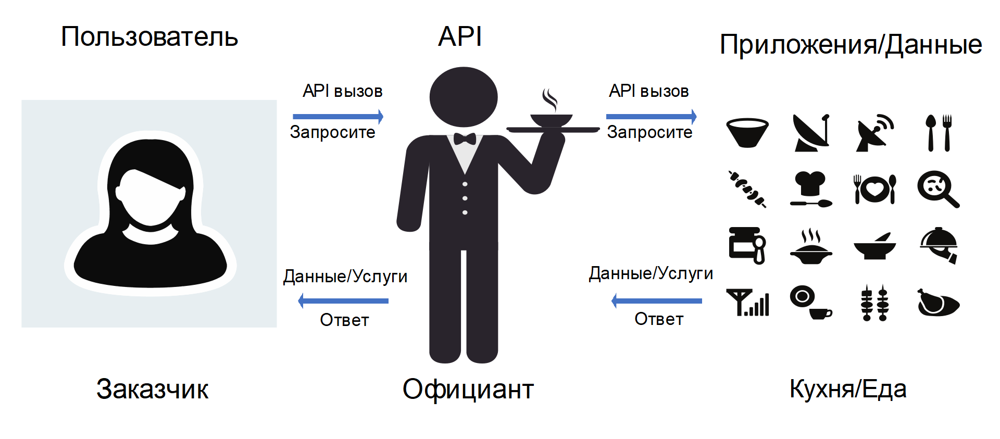
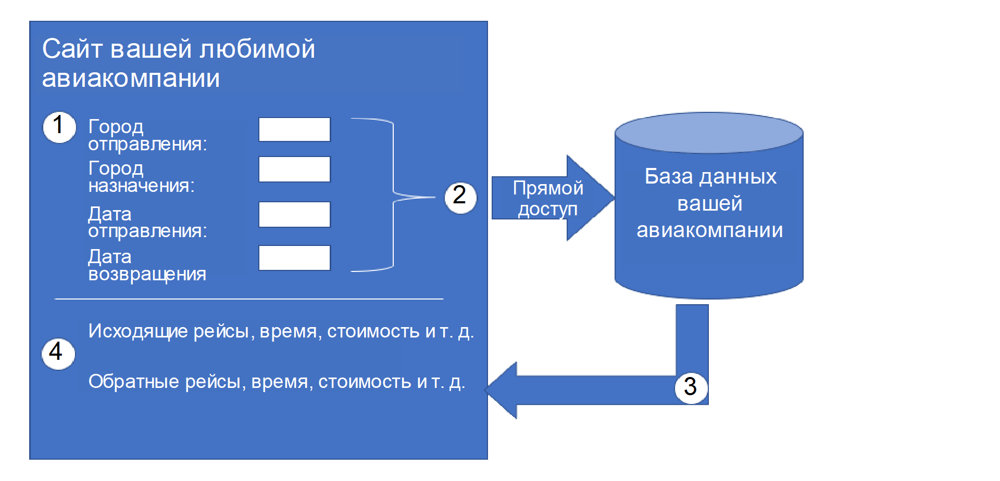
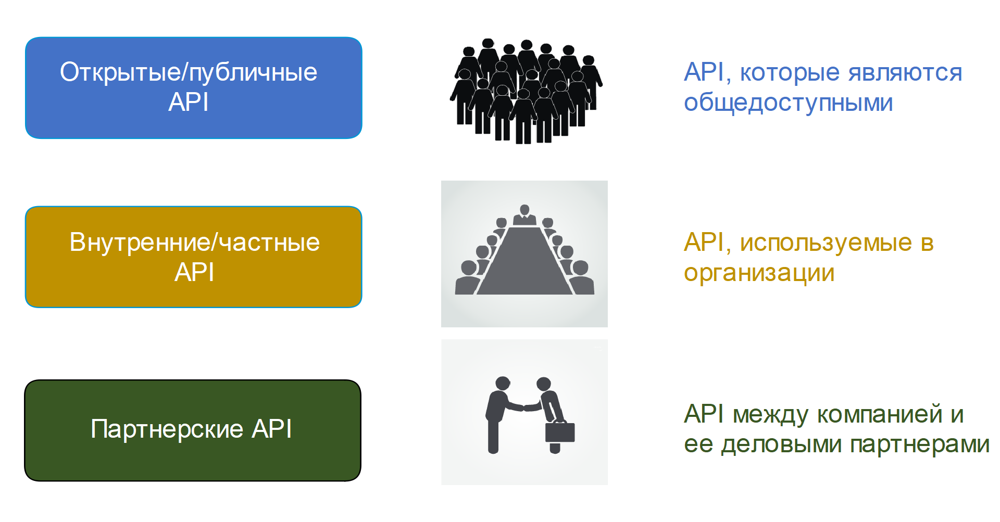

<!-- 14.3.1 -->
## Видео - API

Форматы данных, совместно используемые интеллектуальными устройствами, часто используют интерфейс прикладного программирования Application Programming Interface (API). Как вы узнаете в этом разделе, API - это программное обеспечение, которое позволяет другим приложениям получать доступ к его данным или службам.

Нажмите кнопку воспроизведения в видео, чтобы узнать о API.

<!-- 14.3.2 -->
## Основы API

API встречаются практически везде. Веб-службы Amazon, Facebook и устройства домашней автоматизации, такие как термостаты, холодильники и беспроводные системы освещения, используют API. Они также используются для построения программируемых сетей автоматизации.

API - это программное обеспечение, которое позволяет другим приложениям получать доступ к его данным или услугам. Это набор правил, описывающих, как одно приложение может взаимодействовать с другим, и инструкции, позволяющие этому взаимодействию происходить. Пользователь отправляет запрос API на сервер, запрашивая конкретную информацию, и получает в ответ API от сервера вместе с запрошенной информацией.

API похож на официанта в ресторане, как показано на следующем рисунке. Клиент в ресторане хотел бы, чтобы на стол доставили еду. Еда находится на кухне, где ее готовят. Официант - это курьер, похожий на API. Официант (API) - это человек, который принимает заказ клиента (запрос) и говорит кухне, что делать. Когда еда будет готова, официант доставит еду (ответ) обратно клиенту.

<!-- /courses/ensa-dl/ae8eb39a-34fd-11eb-ba19-f1886492e0e4/aeb686ec-34fd-11eb-ba19-f1886492e0e4/assets/c72fd2b0-1c46-11ea-af56-e368b99e9723.svg -->

<!--
На рисунке показано, как API похож на официанта в ресторане. Пользователь - это клиент, официант - это API, а кухня - это приложения и данные. Клиент/пользователь делает вызов или запрос API. Официант/API принимает этот запрос и передает его на кухню/в приложение. Затем кухня/приложение отправляет обратно данные/услугу или ответ. Официант получает его из кухни/приложения, а затем передает его клиенту/пользователю.
-->

Ранее вы видели запрос API к серверу, который возвращал текущую широту и долготу Международной космической станции. Это был API (Open Notify), который предоставляет доступ к данным из веб-браузера в Национальном управлении по аэронавтике и исследованию космического пространства (NASA).

<!-- 14.3.3 -->
## Пример API

Чтобы действительно понять, как можно использовать API для предоставления данных и услуг, мы рассмотрим два варианта бронирования авиабилетов. Первый вариант использует веб-сайт конкретной авиакомпании, как показано на рисунке. Используя веб-сайт авиакомпании, пользователь вводит информацию, чтобы сделать запрос на бронирование. Веб-сайт напрямую взаимодействует с собственной базой данных авиакомпании и предоставляет пользователю информацию, соответствующую запросу пользователя.

<!-- /courses/ensa-dl/ae8eb39a-34fd-11eb-ba19-f1886492e0e4/aeb686ec-34fd-11eb-ba19-f1886492e0e4/assets/c7309602-1c46-11ea-af56-e368b99e9723.svg -->

<!--
На рисунке показан пример использования API для бронирования авиабилетов. В примере четыре шага. Первым шагом является ввод информации на сайте авиакомпании, чтобы сделать запрос на бронирование. Показаны параметры: город отправления, город назначения, дата отправления и дата возвращения. Второй шаг - прямой доступ/взаимодействие с базой данных авиакомпании. Третий шаг - возврат информации, соответствующей запросу пользователя. Четвертый отображает информацию для пользователя, такую как исходящие рейсы, обратные рейсы, время, стоимость и т. д.
-->

Вместо использования отдельного веб-сайта авиакомпании, который имеет прямой доступ к своей собственной информации, существует второй вариант. Пользователи могут использовать сайт путешествий для доступа к этой же информации не только конкретной авиакомпании, но и множества авиакомпаний. В этом случае пользователь вводит аналогичную информацию о бронировании. Веб-сайт туристического сервиса взаимодействует с различными базами данных авиакомпаний, используя API, предоставляемые каждой авиакомпанией. Служба путешествий использует API каждой авиакомпании для запроса информации от этой конкретной авиакомпании, а затем отображает информацию от всех авиакомпаний на своей веб-странице, как показано на рисунке.

<!-- /courses/ensa-dl/ae8eb39a-34fd-11eb-ba19-f1886492e0e4/aeb686ec-34fd-11eb-ba19-f1886492e0e4/assets/c7315952-1c46-11ea-af56-e368b99e9723.svg -->

<!--
На рисунке показан другой пример использования API для бронирования авиабилетов. В примере четыре шага. Первым шагом является ввод информации на сайте туристической службы, чтобы сделать запрос на бронирование. Показаны параметры: город отправления, город назначения, дата отправления и дата возвращения. Второй шаг, сайт путешествий взаимодействует с различными базами данных авиакомпаний, используя API, предоставляемые каждым сайтом. На третьем этапе авиакомпании возвращают информацию, соответствующую запросу. Четвертый отображает информацию для пользователя, такую как названия авиакомпаний, исходящие рейсы, обратные рейсы, время, стоимость и т. д.
-->

API действует как своего рода мессенджер между запрашивающим приложением и приложением на сервере, который предоставляет данные или услугу. Сообщение от запрашивающего приложения серверу, на котором находятся данные, называется вызовом API.

<!-- 14.3.4 -->
## Открытые, внутренние и партнерские API

При разработке API важно учитывать различие между открытым, внутренним и партнерским API:

* **Открытые API или публичные API -**  Эти API общедоступны и могут использоваться без ограничений. API Международной космической станции является примером публичного API. Поскольку эти API являются общедоступными, многие поставщики API, такие как Google Maps, требуют, чтобы пользователь получил бесплатный ключ или токен перед использованием API. Это помогает контролировать количество запросов API, которые они получают и обрабатывают. Найдите в Интернете список общедоступных API.
* **Внутренние или частные API -** это API, которые используются организацией или компанией для доступа к данным и услугам только для внутреннего использования. Примером внутреннего API является предоставление авторизованным продавцам доступа к внутренним данным о продажах на своих мобильных устройствах.
* **Партнерские API-интерфейсы -** Это API-интерфейсы, которые используются между компанией и ее деловыми партнерами или подрядчиками для облегчения деловых отношений между ними. Деловой партнер должен иметь лицензию или другую форму разрешения на использование API. Туристический сервис, использующий API авиакомпании, является примером партнерского API.

<!-- /courses/ensa-dl/ae8eb39a-34fd-11eb-ba19-f1886492e0e4/aeb686ec-34fd-11eb-ba19-f1886492e0e4/assets/c7321ca2-1c46-11ea-af56-e368b99e9723.svg -->

<!--
Рисунок показывает различие между открытым, внутренним и партнерским API. Открытые/публичные API - это общедоступные API. На рисунке изображена большая группа людей. Внутренние/частные API используются внутри организации. На рисунке изображена группа людей, сидящих за столом на собрании. Партнерские API - это API-интерфейсы между компанией и ее деловыми партнерами. На рисунке изображены две деловые фигуры, пожимающие друг другу руки.
-->

<!-- 14.3.5 -->
## Типы веб-сервисов API

Веб-сервис - это сервис, доступный через Интернет с использованием Всемирной паутины. Существует четыре типа  веб-сервисов API:

* Simple Object Access Protocol (SOAP) 
* Representational State Transfer (REST) 
* eXtensible Markup Language-Remote Procedure Call (XML-RPC) 
* JavaScript Object Notation-Remote Procedure Call (JSON-RPC) 

| Характеристика | SOAP | Архитектура REST | XML-RPC | JSON-RPC |
| --- | --- | --- | --- | --- |
| Формат данных | XML | JSON, XML, YAML и другие | XML | JSON |
| Первый выпуск | 1998 | 2000 | 1998 | 2005 |
| Сильные стороны | Хорошо зарекомендовавший себя | Гибкое форматирование, наиболее широко используемый | Хорошо зарекомендовавший себя, простота | Простота |

SOAP - это протокол обмена сообщениями со структурированной XML-информацией, чаще всего по протоколу HTTP или SMTP. Разработанные Microsoft в 1998 году API-интерфейсы SOAP считаются медленными для разбора, сложными и жесткими.

Это привело к разработке более простой среды REST API, которая не требует XML. REST использует HTTP, менее многословен и более прост в использовании, чем SOAP. REST относится к стилю архитектуры программного обеспечения, он стал популярным благодаря своей производительности, масштабируемости, простоте и надежности.

REST - наиболее часто используемая веб-служба API, на ее долю приходится более 80% всех используемых типов API. REST будет дополнительно обсуждаться в этом модуле.

RPC - это когда одна система запрашивает другую, чтобы та выполнила некоторый код и вернула информацию. Это делается без необходимости разбираться в деталях сети. Это работает так же, как REST API, но есть различия, касающиеся форматирования и гибкости. XML-RPC - это протокол, разработанный до SOAP, а затем развившийся в то, что стало SOAP. JSON-RPC - это очень простой протокол, похожий на XML-RPC.

<!-- 14.3.6 -->
<!-- quiz -->

