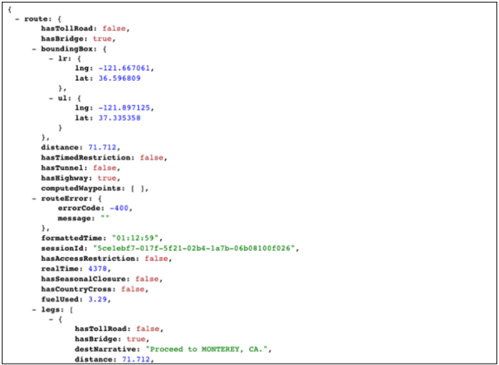
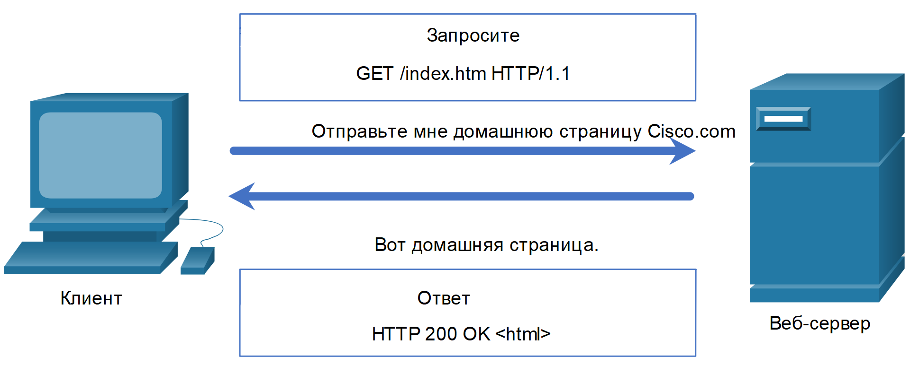
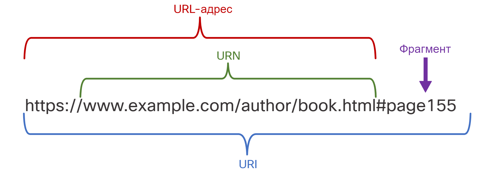
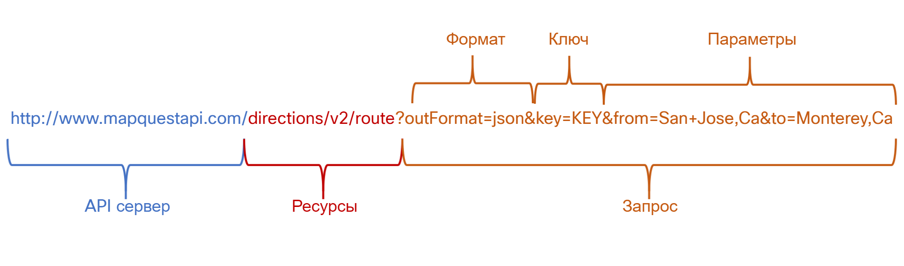
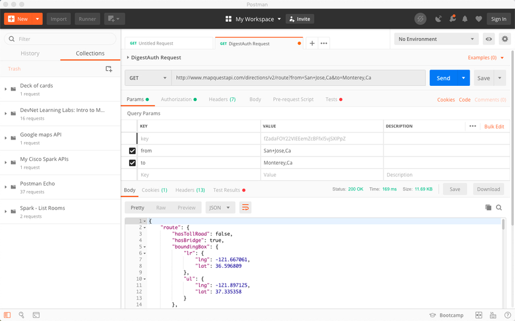

<!-- 14.4.1 -->
## Видео: REST

Как вы только что узнали, REST в настоящее время является наиболее широко используемым API. Эта тема описывает REST более подробно.

Нажмите кнопку воспроизведения в видео, чтобы узнать подробнее о REST.


<!-- 14.4.2 -->
## REST и RESTful API

Веб-браузеры используют HTTP или HTTPS для запроса (GET) веб-страницы. При успешном запросе (код состояния HTTP 200) веб-серверы отвечают на запросы GET веб-страницей в кодировке HTML, как показано на рисунке.


<!-- /courses/ensa-dl/ae8eb39a-34fd-11eb-ba19-f1886492e0e4/aeb686ee-34fd-11eb-ba19-f1886492e0e4/assets/c7346692-1c46-11ea-af56-e368b99e9723.svg -->

<!--
На рисунке показан клиент, использующий запрос GET для веб-сайта и ответ веб-сервера. Клиентский ПК отправляет GET-запрос на веб-сервер для домашней страницы cisco.com. Запрос GET /index.html HTTP/1.1. Затем сервер отправляет данные домашней страницы обратно клиенту. Ответ HTTP 200 OK <html>.
-->

REST - это архитектурный стиль для разработки приложений веб-сервисов. Это относится к стилю веб-архитектуры, которая имеет множество базовых характеристик и управляет поведением клиентов и серверов. Проще говоря, REST API - это API, который работает поверх протокола HTTP. Он определяет набор функций, которые разработчики могут использовать для выполнения запросов и получения ответов по протоколу HTTP, например, GET и POST.

Соответствие ограничениям архитектуры REST обычно называется «RESTful». API можно считать «RESTful», если он имеет следующие функции:

* **Клиент-Сервер (Client-Server)** - Клиент  управляет интерфейсом (front end), а сервер - обработкой данных (back end). Каждый может быть заменен независимо друг от друга 
* **Без сохранения состояния (Stateless)** -  Никакие клиентские данные не хранятся на сервере между запросами.  Состояние сессии сохраняется на клиенте. 
* **Кешируемый (Cacheable)** \- Клиент может кешировать запрос для улучшения производительности. 

<!-- 14.4.3 -->
## Реализация RESTful 

Веб-сервисы RESTful реализованы с использованием HTTP. Это набор ресурсов с четырьмя определенными аспектами:

* Базовый унифицированный идентификатор ресурса (URI) для веб-службы, такой как http://example.com/resources.
* Формат данных, поддерживаемый веб-сервисом. Это часто JSON, YAML или XML, но это может быть любой другой формат данных, который является допустимым стандартом гипертекста.
* Набор операций, поддерживаемых веб-сервисом с использованием методов HTTP.
* API должен быть управляемым гипертекстом.

API RESTful используют общие методы HTTP, включая POST, GET, PUT, PATCH и DELETE. Как показано в следующей таблице, они соответствуют операциям RESTful: создание, чтение, обновление и удаление (Create, Read, Update,  Delete или CRUD).

| Метод HTTP | Операция RESTful |
| --- | --- |
| POST | Create |
| GET | Чтение |
| PUT/PATCH | Update |
| DELETE | Delete |

На рисунке HTTP-запрос запрашивает данные в формате JSON. Если запрос успешно создан в соответствии с документацией API, сервер ответит данными JSON. Эти данные JSON могут использоваться веб-приложением клиента для отображения данных. Например, приложение для определения местоположения смартфонов показывает местоположение Сан-Хосе, штат Калифорния.


<!-- /courses/ensa-dl/ae8eb39a-34fd-11eb-ba19-f1886492e0e4/aeb686ee-34fd-11eb-ba19-f1886492e0e4/assets/c734b4b4-1c46-11ea-af56-e368b99e9723.svg -->

<!--
The figure shows JSON data from a smartphone map app. The figure is driving directions from San Jose, California for a map application in JSON format. The code lists the latitude and longitude, whether the route has toll roads, bridges or tunnels. It also lists the time, fuel used and the narration text.
-->


<!-- /courses/ensa-dl/ae8eb39a-34fd-11eb-ba19-f1886492e0e4/aeb686ee-34fd-11eb-ba19-f1886492e0e4/assets/c734dbc2-1c46-11ea-af56-e368b99e9723.svg -->

<!--
На рисунке показан клиент, использующий запрос GET для веб-сайта и ответ веб-сервера. Клиентский ПК отправляет GET-запрос на веб-сервер для домашней страницы cisco.com. Запрос GET /index.html HTTP/1.1. Затем сервер отправляет данные домашней страницы обратно клиенту. Ответ HTTP 200 OK <html>.
-->

<!-- 14.4.4 -->
## URI, URN и URL

Веб-ресурсы и веб-службы, такие как RESTful API, идентифицируются с помощью URI. URI - это строка символов, которая идентифицирует конкретный сетевой ресурс. Как показано на рисунке, URI имеет две специализации:

* **Единое имя ресурса (Uniform Resource Name - URN)** - идентифицирует только пространство имен ресурса (веб-страница, документ, изображение и т. д.) без ссылки на протокол.
* **Унифицированный указатель ресурса (Uniform Resource Locator - URL)** - определяет сетевое местоположение конкретного ресурса в сети. HTTP или HTTPS URL обычно используются в веб-браузерах. Другие протоколы, такие как FTP, SFTP, SSH и другие, могут использовать URL. URL с использованием SFTP может выглядеть так: sftp://sftp.example.com.

Это части URI, как показано на рисунке:

* **Протокол/Схема - (Protocol/scheme)** – HTTPS или другие протоколы, такие как FTP, SFTP, mailto и NNTP
* **Имя хоста** \- www.example.com
* **Путь и имя файла** - /author/book.html
* **Фрагмент**  - #page155

**Parts of a URI**


<!-- /courses/ensa-dl/ae8eb39a-34fd-11eb-ba19-f1886492e0e4/aeb686ee-34fd-11eb-ba19-f1886492e0e4/assets/c73529e3-1c46-11ea-af56-e368b99e9723.svg -->

<!--
На рисунке показаны части универсального идентификатора ресурса (URI). На рисунке показан URI https://www.example.com/author/book.html#page155. URL  - универсального идентификатора ресурса (URI): https://www.example.com/author/book.html. URN часть: example.com/author/book.html#page155. Фрагмент: #page155.
-->

<!-- 14.4.5 -->
## Анатомия запроса RESTful 

В веб-службе RESTful запрос к URI ресурса вызовет ответ. Ответом будет полезная нагрузка, обычно отформатированная в JSON, но может быть HTML, XML или каким-либо другим форматом. На рисунке показан URI для API направлений MapQuest. Запрос API для указания направления из Сан-Хосе, штат Калифорния в Монтерей, штат Калифорния.

**Части запроса API**


<!-- /courses/ensa-dl/ae8eb39a-34fd-11eb-ba19-f1886492e0e4/aeb686ee-34fd-11eb-ba19-f1886492e0e4/assets/c735c622-1c46-11ea-af56-e368b99e9723.svg -->

<!--
На рисунке показаны части запроса API. На рисунке используется URI http://www.mapquestapi.com/directions/v2/route?outFormat=json&key=KEY&from=San+Jose,Ca&to=Monterey,Ca. Серверная часть API URI:: http://www.mapquestapi.com. Ресурсная часть URI:: directions/v2/route. Часть запроса URI: ?outFormat=json&key=KEY&from=San+Jose,Ca&to=Monterey,Ca. Формат: outFormat=json&. Ключ: key=KEY& and the parameters is from=San+Jose,Ca&to=Monterey,Ca.
-->

На рисунке показана часть ответа API. В этом примере это направление MapQuest из Сан-Хосе в Монтерей в формате JSON.

**Частичная полезная нагрузка JSON, полученная из запроса API**


<!--
The figure shows MapQuest directions from San Jose to Monterey in JSON format. The code lists the latitude and longitude, whether the route has toll roads, bridges or tunnels. It also lists the time, fuel used and the narration text.
-->

Выделяют следующие части запроса API:

* **Сервер API** - это URL-адрес сервера, который отвечает на запросы REST. В данном примере это сервер API MapQuest.
* **Ресурсы** - Определяют API, который запрашивается. В этом примере это API направлений MapQuest.
* **Запрос** - Определяет формат данных и информацию, которую клиент запрашивает у службы API.  Запросы могут включать в себя:
    * **Формат** – Обычно это JSON, но может быть YAML или XML. В этом примере запрашивается JSON.
    * **Ключ** - Ключ для авторизации, если требуется. MapQuest требует ключ для своих направлений API. В приведенном выше URI вам потребуется заменить «KEY» на действительный ключ, чтобы отправить действительный запрос.
    * **Параметры** - Параметры используются для отправки информации, относящейся к запросу. В этом примере параметры запроса включают информацию о направлениях, которые нужны API, чтобы он знал, какие направления возвращать: "from=San+Jose,Ca" и "to=Monterey,Ca".

Многие API-интерфейсы RESTful, включая общедоступные API, требуют ключа. Ключ используется для определения источника запроса. Вот несколько причин, по которым провайдеру API может потребоваться ключ:

* Для проверки подлинности источника необходимо убедиться, что он авторизован для использования API.
* Ограничить число людей, использующих API.
* Ограничить количество запросов на пользователя.
* Для лучшего сбора и отслеживания данных, запрашиваемых пользователями.
* Для сбора информации о людях, использующих API.

**Примечание**: Если вы хотите использовать API MapQuest, для API требуется ключ. Найдите в Интернете URL-адрес, чтобы получить ключ MapQuest. Используйте параметры поиска: developer.mapquest. Вы также можете найти в Интернете текущий URL, который описывает политику конфиденциальности MapQuest.

<!-- 14.4.6 -->
## Приложения RESTful API

Многие веб-сайты и приложения используют API для доступа к информации и предоставления услуг своим клиентам. Например, для работы своего веб-сайта туристическая служба использует API различных авиакомпаний для предоставления пользователю информации об авиакомпании, отеле и другой информации.

Некоторые запросы RESTful API можно выполнить, введя URI в веб-браузере. API направлений MapQuest является примером этого. Запрос RESTful API также может быть сделан другими способами.

**Веб-сайт разработчика**

Разработчики часто поддерживают веб-сайты, которые включают информацию об API, информацию о параметрах и примеры использования. Эти сайты также могут позволять пользователю выполнять запрос API на веб-странице разработчика, вводя параметры и другую информацию. На следующем рисунке показан пример веб-страницы API MapQuest Directions.


**Postman**

Postman - это приложение для тестирования и использования REST API. Он доступен в виде приложения для браузера или отдельной установки. Он содержит все необходимое для построения и отправки запросов REST API, включая ввод параметров запроса и ключей. Postman позволяет собирать и сохранять часто используемые вызовы API в истории или в виде коллекций. Postman является отличным инструментом для изучения того, как создавать запросы API, и для анализа данных, возвращаемых из API. На следующем рисунке показан пример использования API MapQuest с Postman.



**Python**

API также можно вызывать из программы Python. Это учитывает возможную автоматизацию, настройку и интеграцию приложения с API. На следующем рисунке показан пример части программы на Python, используемой для отправки запросов в API MapQuest.


**Сетевые операционные системы**

Используя такие протоколы, как NETCONF (NET CONFiguration) и RESTCONF, сетевые операционные системы начинают предоставлять альтернативный метод для конфигурации, мониторинга и управления. Например, следующий вывод может быть ответом от маршрутизатора после того, как пользователь установил сеанс NETCONF в командной строке. Однако работа в командной строке не автоматизирует сеть. Вместо этого сетевой администратор может использовать скрипты Python или другие средства автоматизации, такие как Cisco DNA Center, для программного взаимодействия с маршрутизатором.

```
$ ssh admin@192.168.0.1 -p 830 -s netconf 
admin@192.168.0.1's password: 
<hello xmlns="urn:ietf:params:xml:ns:netconf:base:1.0"> 
<capabilities> 
  <capability>urn:ietf:params:netconf:base:1.1</capability> 
  <capability>urn:ietf:params:netconf:capability:candidate:1.0</capability> 
  <capability>urn:ietf:params:xml:ns:yang:ietf-netconf-monitoring</capability> 
  <capability>urn:ietf:params:xml:ns:yang:ietf-interfaces</capability> 
  [output omitted and edited for clarity] 
</capabilities> 
<session-id>19150</session-id></hello> 
```

<!-- 14.4.7 -->
<!-- quiz -->

