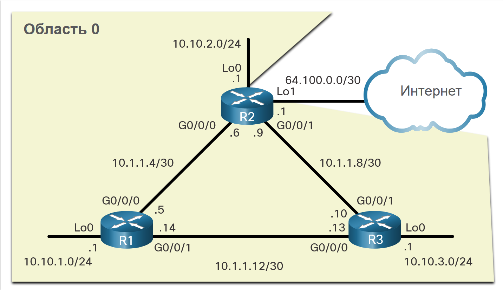
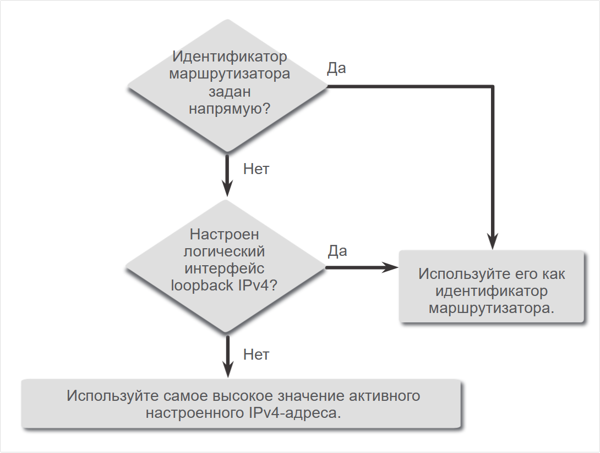
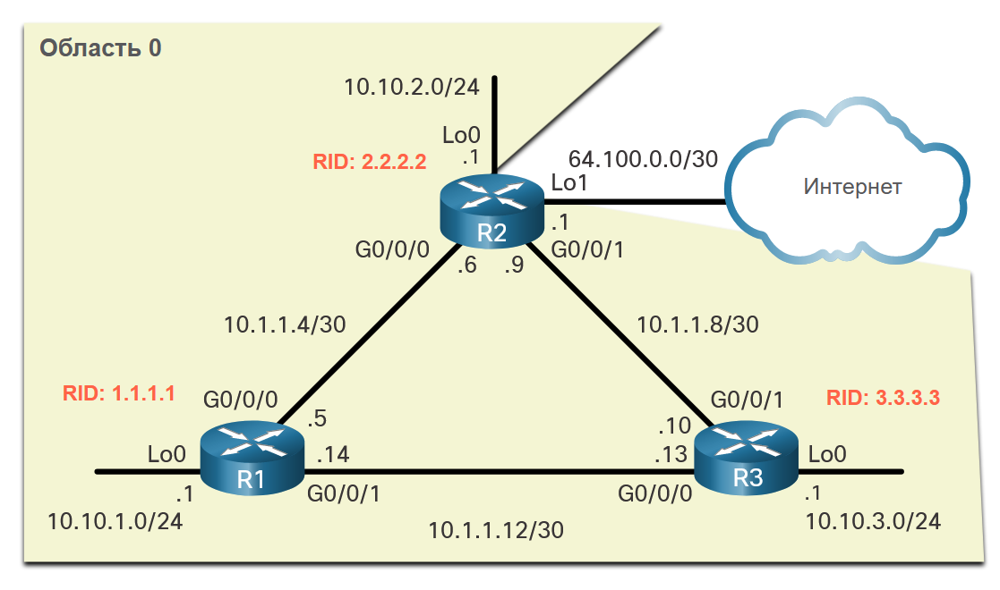

<!-- 2.1.1 -->
## Справочная топология OSPF
Для начала работы в этом разделе рассматривается основа, на которой OSPF строится весь процесс, а именно идентификатор маршрутизатора OSPF.

На этом рисунке показана топология, используемая для настройки OSPFv2 в данном модуле. Маршрутизаторы в топологии имеют начальную конфигурацию, включая адреса интерфейсов. В настоящее время ни на одном из маршрутизаторов не настроена статическая или динамическая маршрутизация. Все интерфейсы на маршрутизаторах R1, R2 и R3 (за исключением интерфейса loopback на маршрутизаторе R2) находятся в пределах магистральной области OSPF. Маршрутизатор ISP используется в качестве шлюза домена маршрутизации в Интернет.

**Примечание**: В этой топологии интерфейс loopback используется для имитации канала WAN с Интернетом и локальной сети, подключенной к каждому маршрутизатору. Это позволяет дублировать эту топологию в демонстрационных целях на маршрутизаторах, имеющих только два интерфейса Gigabit Ethernet.



<!-- 2.1.2 -->
## Режим конфигурации маршрутизатора OSPF
OSPFv2 включается с помощью команды режима глобальной настройки **router ospf** process-id. Значение process-id представляет собой число от 1 до 65535 и выбирается сетевым администратором. Значение process-id имеет только локальное значение, то есть оно не обязательно должно совпадать со значением на других маршрутизаторах OSPF для установления отношений смежности с такими соседними маршрутизаторами. Рекомендуется использовать один и тот же process-id на всех маршрутизаторах OSPF.

После ввода команды **router ospf** process-id маршрутизатор переходит в режим настройки маршрутизатора, как указано знаком **R1(config-router)#** . Введите знако вопроса (**?** ), чтобы просмотреть все команды, доступные в этом режиме. Список команд, показанный здесь, был изменен для отображения только тех команд, которые относятся к этому модулю.
```
R1(config)# router ospf 10
R1(config-router)# ?
  area                   OSPF area parameters
  auto-cost              Calculate OSPF interface cost according to bandwidth
  default-information    Control distribution of default information
  distance               Define an administrative distance
  exit                   Exit from routing protocol configuration mode
  log-adjacency-changes  Log changes in adjacency state
  neighbor               Specify a neighbor router
  network                Enable routing on an IP network
  no                     Negate a command or set its defaults
  passive-interface      Suppress routing updates on an interface
  redistribute           Redistribute information from another routing protocol
  router-id              router-id for this OSPF process
R1(config-router)#
```

<!-- 2.1.3 -->
## Идентификатор маршрутизатора (Router ID)
Идентификатор маршрутизатора OSPF — это 32-разрядное значение, представленное в формате адреса IPv4. Идентификаторы маршрутизаторов служат уникальным обозначением маршрутизаторов OSPF Все пакеты OSPF включают идентификатор маршрутизатора отправляющего маршрутизатора. Для включения в домен маршрутизации OSPF всем маршрутизаторам требуется идентификатор. Идентификатор маршрутизатора задаётся администратором или автоматически назначается маршрутизатором. Маршрутизатор с поддержкой протокола OSPF использует идентификатор в следующих целях:

1. **Участие в синхронизации баз данных OSPF** — во время состояния Exchange маршрутизатор с самым высоким идентификатором маршрутизатора будет отправлять пакеты дескриптора базы данных (DBD).
2. **Участие в выборе назначенного маршрутизатора (DR)** . В среде коллективного доступа LAN маршрутизатор с наивысшим идентификатором маршрутизатора выбирается как DR. Устройство маршрутизации со следующим значением идентификатора выбирается как маршрутизатор BDR.

**Примечание**: Процесс выборов в DR и BDR более подробно рассматривается ниже в этом модуле .

<!-- 2.1.4 -->
## Порядок идентификаторов маршрутизаторов по приоритету
Однако каким образом маршрутизатор определяет значение идентификатора? Как показано на рисунке, маршрутизаторы Cisco выводят идентификатор маршрутизатора на основе одного из трёх критериев в следующем порядке предпочтения:

1. Идентификатор задается с помощью команды **router-id** rid, выполняемой в режиме конфигурации маршрутизатора OSPF представляет собой любое 32-разрядное число в формате адреса IPv4. Данный метод является рекомендуемым для назначения идентификатора маршрутизатора.
2. Если идентификатор маршрутизатора не настроен напрямую, маршрутизатор выбирает самое высокое значение IPv4-адреса любого из настроенных интерфейсов loopback. Это второй способ назначения идентификатора маршрутизатора.
3. При отсутствии настроенных интерфейсов loopback маршрутизатор выбирает самое высокое значение активного IPv4-адреса любого из своих физических интерфейсов. Данный метод не рекомендуется использовать, так как в этом случае администратору сложнее различать маршрутизаторы.



<!-- 2.1.5 -->
## Настройка интерфейса loopback в качестве идентификатора маршрутизатора
В эталонной топологии настроены и активны только физические интерфейсы. Интерфейсы loopback не были настроены. Когда на маршрутизаторе включена маршрутизация OSPF, маршрутизаторы будут выбирать в качестве идентификатора маршрутизатора следующий самый старший активный настроенный IPv4 адрес.

    R1: 10.1.1.14 (G0/0/1)
    R2: 10.1.1.9 (G0/0/1)
    R3: 10.1.1.13 (G0/0/0)

**Примечание**: OSPF не требуется включать на интерфейсе, чтобы этот интерфейс был выбран в качестве идентификатора маршрутизатора.

Вместо того, чтобы полагаться на физический интерфейс, идентификатор маршрутизатора может быть назначен интерфейсу loopback. Как правило, адрес IPv4 для этого типа интерфейса loopback должен быть настроен с использованием 32-разрядной маски подсети (255.255.255.255). Таким образом создаётся маршрут узла. 32-битный маршрут узла не объявляется в качестве маршрута для других маршрутизаторов OSPF.

В примере показано, как настроить интерфейс loopback на R1. Если идентификатор маршрутизатора не был явно настроен или ранее не был изучен, R1 будет использовать IPv4 адрес 1.1.1.1 в качестве идентификатора маршрутизатора. Предположим, что R1 еще не узнал идентификатор маршрутизатора.

```
R1(config-if)# interface Loopback 1
R1(config-if)# ip address 1.1.1.1 255.255.255.255
R1(config-if)# end
R1# show ip protocols | include Router ID
  Router ID 1.1.1.1
R1#
```

<!-- 2.1.6 -->
## Явная конфигурация Router ID
На рисунке топология была обновлена, чтобы показать идентификатор маршрутизатора для каждого маршрутизатора:

    R1 использует router ID 1.1.1.1
    R2 использует router ID 2.2.2.2
    R3 использует router ID 3.3.3.3



Используйте команду режима конфигурации **router-id** *rid* router, чтобы вручную назначить идентификатор маршрутизатора. В этом примере router ID 1.1.1.1 назначается на R1. Используйте команду **show ip protocols** для проверки идентификатора маршрутизатора.

```
R1(config)# router ospf 10
R1(config-router)# router-id 1.1.1.1
R1(config-router)# end
*May 23 19:33:42.689: %SYS-5-CONFIG_I: Configured from console by console
R1# show ip protocols | include Router ID
Router ID 1.1.1.1
R1#
```

<!-- 2.1.7 -->
## Изменение идентификатора маршрутизатора
После того, как маршрутизатор выбирает идентификатор маршрутизатора, активный маршрутизатор OSPF не позволяет изменять идентификатор маршрутизатора, пока маршрутизатор не будет перезагружен или процесс OSPF не будет сброшен.

В примере R1 настроенный идентификатор маршрутизатора был удален, а маршрутизатор перезагружен. Обратите внимание, что текущий идентификатор маршрутизатора — 10.10.1.1, который является IPv4-адресом loopback 0. Маршрутизатор должен иметь идентификатор 1.1.1.1. Поэтому R1 настраивается с помощью команды **router-id 1.1.1.1**.

Теперь обратите внимание на информационное сообщение, в котором указано, что процесс OSPFv2 должен быть сброшен, или маршрутизатор — перезагружен. Это обусловлено тем, что маршрутизатор R1 уже установил отношения смежности с другими соседними устройствами, используя идентификатор маршрутизатора 10.10.1.1. Эти отношения смежности должны быть снова согласованы с использованием нового идентификатора маршрутизатора 1.1.1.1. Используйте команду **clear ip ospf process** для сброса смежности. Затем можно убедиться в том, что R1 использует новый router ID с командой **show ip protocols** с фильтром для отображения только раздела идентификатора маршрутизатора.

Перезапуск процесса OSPF является предпочтительным методом сброса идентификатора маршрутизатора.

```
R1# show ip protocols | include Router ID
Router ID 10.10.1.1
R1# conf t
Enter configuration commands, one per line.  End with CNTL/Z.
R1(config)# router ospf 10 
R1(config-router)# router-id 1.1.1.1
% OSPF: Reload or use "clear ip ospf process" command, for this to take effect
R1(config-router)# end
R1# clear ip ospf process
Reset ALL OSPF processes? [no]: y
*Jun  6 01:09:46.975: %OSPF-5-ADJCHG: Process 10, Nbr 3.3.3.3 on GigabitEthernet0/0/1 from FULL to DOWN, Neighbor Down: Interface down or detached
*Jun  6 01:09:46.975: %OSPF-5-ADJCHG: Process 10, Nbr 2.2.2.2 on GigabitEthernet0/0/0 from FULL to DOWN, Neighbor Down: Interface down or detached
*Jun  6 01:09:46.981: %OSPF-5-ADJCHG: Process 10, Nbr 3.3.3.3 on GigabitEthernet0/0/1 from LOADING to FULL, Loading Done
*Jun  6 01:09:46.981: %OSPF-5-ADJCHG: Process 10, Nbr 2.2.2.2 on GigabitEthernet0/0/0 from LOADING to FULL, Loading Done
R1# show ip protocols | include Router ID
Router ID 1.1.1.1
R1#
```

**Примечание**: Примечание. Предпочтительнее использовать команду **router-id**. Но некоторые старые версии IOS не распознают команду **router-id**, поэтому на этих маршрутизаторах лучше задавать идентификатор через интерфейс обратной петли.

<!-- Тут проверка синтаксиса 2.1.8 -->


<!-- Тут квиз 2.1.9 --> 