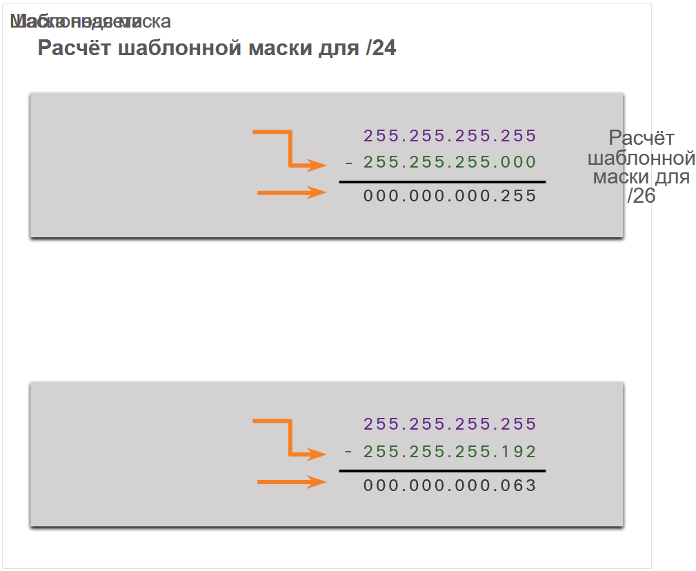
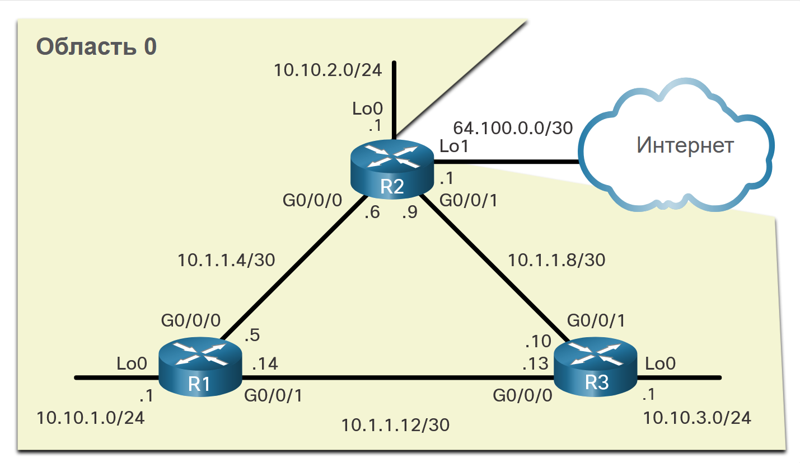
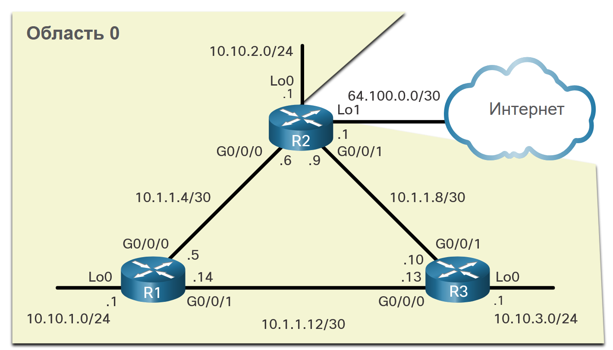

<!-- 2.2.1 -->
## Синтаксис команд
Одним из типов сети, использующей OSPF, является сеть «точка-точка». Можно указать интерфейсы, принадлежащие сети «точка-точка», определив команду **network**. Вы также можете настроить OSPF непосредственно на интерфейсе с помощью команды **ip ospf**, как мы увидим позже.

Обе команды используются для определения того, какие интерфейсы участвуют в процессе маршрутизации для области OSPFv2. Базовый синтаксис команды **network** выглядит следующим образом:

```
Router(config-router)# network network-address wildcard-mask area area-id
```

Команда * Синтаксис шаблонной маски сетевого адреса используется для включения OSPF на интерфейсах. Любые интерфейсы на маршрутизаторе, соответствующие сетевому адресу в сети, включаются для отправки и получения пакетов OSPF. Синтаксис команды **area** area-id связан с областью OSPF. ри настройке OSPF для одной области, команда **network** должна быть настроена с одинаковым значением area-id на всех маршрутизаторах. Несмотря на то что может использоваться любой идентификатор области, в случае OSPFv2 для одной области рекомендуется использовать идентификатор области 0. Применение этого соглашения упростит возможный в будущем переход на сеть с OSPFv2 для нескольких областей.

<!-- 2.2.2 -->
## Шаблонная маска
Шаблонная маска обычно является обратной маской подсети, настроенной на этом интерфейсе. В маске подсети двоичное значение 1 равно совпадению, а двоичное значение 0 не является совпадением. В отношении шаблонной маски верно обратное, как показано далее:

**Бит 0 шаблонной маски** — совпадает с соответствующим значением бита в адресе.
**Бит 1 шаблонной маски** — игнорирует соответствующее значение бита в адресе.

Простейший способ рассчитать шаблонную маску — вычесть маску подсети из 255.255.255.255, как показанной на примере для масок /24 и /26.



<!-- Тут проверка 2.2.3 -->
## Проверьте ваше понимание темы - шаблонные маски

<!-- 2.2.4 -->
## Настройка OSPF с помощью команды network
В режиме конфигурации маршрутизации существует два способа определения интерфейсов, которые будут участвовать в процессе маршрутизации OSPFv2. На рисунке показана топология.



В первом примере шаблонная маска определяет интерфейс на основе сетевых адресов. Любой активный интерфейс, настроенный с адресом IPv4, принадлежащим этой сети, будет участвовать в процессе маршрутизации OSPFv2.

```
R1(config)# router ospf 10
R1(config-router)# network 10.10.1.0 0.0.0.255 area 0
R1(config-router)# network 10.1.1.4 0.0.0.3 area 0
R1(config-router)# network 10.1.1.12 0.0.0.3 area 0
R1(config-router)#
```

**Примечание**: В некоторых версиях IOS можно указать маску подсети вместо шаблонной маски. После этого IOS преобразовывает маску подсети в формат шаблонной маски.

В качестве альтернативы во втором примере показано, как можно включить OSPFv2, указав точный адрес IPv4 интерфейса с помощью шаблонной маски из четырех нулей. При вводе команды **network 10.1.1.5 0.0.0.0 area 0** на маршрутизаторе R1 маршрутизатор получает указание включить интерфейс Serial0/0/0 для процесса маршрутизации. В результате процесс OSPFv2 объявляет сеть, подключенную к этому интерфейсу (172.16.3.0/30).

```
R1(config)# router ospf 10
R1(config-router)# network 10.10.1.1 0.0.0.0 area 0
R1(config-router)# network 10.1.1.5 0.0.0.0 area 0
R1(config-router)# network 10.1.1.14 0.0.0.0 area 0
R1(config-router)#
```

Преимуществом определения интерфейса является то, что нет необходимости в расчёте шаблонной маски. Обратите внимание, что во всех случаях **area** аргумент указывает область 0.

<!-- Тут проверка синтаксиса 2.2.5 -->

<!-- 2.2.6 -->
## Настройка OSPF с помощью команды ip ospf
Вы также можете настроить OSPF непосредственно на интерфейсе, а не с помощью команды **network**. Чтобы настроить OSPF непосредственно на интерфейсе, используйте команду конфигурации интерфейса **ip ospf**. Синтаксис может выглядеть следующим образом:

```
Router(config-if)# ip ospf process-id area area-id
```

Для R1 удалите команды объявления сетей, используя форму **no** команды **network**. Затем перейдите к каждому интерфейсу и используйте команду **ip ospf**, как показано в окне команд.

```
R1(config)# router ospf 10
R1(config-router)# no network 10.10.1.1 0.0.0.0 area 0
R1(config-router)# no network 10.1.1.5 0.0.0.0 area 0
R1(config-router)# no network 10.1.1.14 0.0.0.0 area 0
R1(config-router)# interface GigabitEthernet 0/0/0
R1(config-if)# ip ospf 10 area 0
R1(config-if)# interface GigabitEthernet 0/0/1 
R1(config-if)# ip ospf 10 area 0
R1(config-if)# interface Loopback 0
R1(config-if)# ip ospf 10 area 0
R1(config-if)#
```

<!-- Тут проверка синтаксиса 2.2.7 -->

<!-- 2.2.8 -->
## Пассивный интерфейс
По умолчанию сообщения OSPF пересылаются из интерфейсов с включённым OSPF. Однако, на самом деле, необходимо, чтобы эти сообщения отправлялись только из интерфейсов, подключенных к другим маршрутизаторам, использующим протокол OSPF.

См. топологию на рисунке. Сообщения OSPFv2 пересылаются через три loopback интерфейса, даже если в этих имитированных локальных сетях не существует соседа OSPFv2. В производственной сети эти замыкания будут физическими интерфейсами к сетям с пользователями и трафиком. Отправка ненужных сообщений в сеть LAN имеет следующие последствия для сети:

1. **Неэффективное использование пропускной способности** — доступная пропускная способность потребляется для передачи ненужных сообщений.
2. **Неэффективное использование ресурсов** — все устройства в сети LAN должны обработать сообщение и впоследствии удалить его.
3. **Повышенный риск безопасности** — без дополнительных конфигураций безопасности OSPF сообщения OSPF можно перехватывать с помощью программного обеспечения для перехвата пакетов. Обновления маршрутизации можно изменить и отправить обратно на маршрутизатор, что вызывает повреждение таблицы маршрутизации из-за ложных метрик, которые неверно направляют трафик.



<!-- 2.2.9 -->
## Настройка пассивных интерфейсов
Используйте команду режима конфигурации маршрутизатора **passive-interface**, чтобы запретить передачу сообщений маршрутизации посредством интерфейса маршрутизатора и при этом разрешить объявление этой сети для других маршрутизаторов, как показано на рис. 1. Конфигурация определяет интерфейс loopback 0/0/0 маршрутизатора R1 как пассивный.

Затем команда **show ip protocols** используется для проверки того, что интерфейс Loopback 0 указан как пассивный. Интерфейс по-прежнему указан под заголовком «Маршрутизация на интерфейсах, настроенных явно (область 0)», что означает, что эта сеть по-прежнему включена в качестве записи маршрута в обновления OSPFv2, которые отправляются в R2 и R3.

```
R1(config)# router ospf 10
R1(config-router)# passive-interface loopback 0
R1(config-router)# end
R1#
*May 23 20:24:39.309: %SYS-5-CONFIG_I: Configured from console by console
R1# show ip protocols
*** IP Routing is NSF aware ***
(output omitted)
Routing Protocol is "ospf 10"
  Outgoing update filter list for all interfaces is not set
  Incoming update filter list for all interfaces is not set
  Router ID 1.1.1.1
  Number of areas in this router is 1. 1 normal 0 stub 0 nssa
  Maximum path: 4
  Routing for Networks:
  Routing on Interfaces Configured Explicitly (Area 0):
    Loopback0
    GigabitEthernet0/0/1
    GigabitEthernet0/0/0
  Passive Interface(s):
    Loopback0
  Routing Information Sources:
    Gateway         Distance      Last Update
    3.3.3.3              110      01:01:48
    2.2.2.2              110      01:01:38
  Distance: (default is 110)
R1#
```

<!-- Тут проверка синтаксиса 2.2.10 -->

<!-- 2.2.11 -->
## Сети OSPF типа «точка-точка»
По умолчанию маршрутизаторы Cisco выбирают DR и BDR на интерфейсах Ethernet, даже если на канале имеется только одно другое устройство. Это можно проверить с помощью команды **show ip ospf interface**, как показано в примере для G0/0/0 R1.

```
R1# show ip ospf interface GigabitEthernet 0/0/0
GigabitEthernet0/0/0 is up, line protocol is up 
  Internet Address 10.1.1.5/30, Area 0, Attached via Interface Enable
  Process ID 10, Router ID 1.1.1.1, Network Type BROADCAST, Cost: 1
  Topology-MTID    Cost    Disabled    Shutdown      Topology Name
        0           1         no          no            Base
  Enabled by interface config, including secondary ip addresses
  Transmit Delay is 1 sec, State BDR, Priority 1
  Designated Router (ID) 2.2.2.2, Interface address 10.1.1.6
  Backup Designated router (ID) 1.1.1.1, Interface address 10.1.1.5
  Timer intervals configured, Hello 10, Dead 40, Wait 40, Retransmit 5
    oob-resync timeout 40
    Hello due in 00:00:08
  Supports Link-local Signaling (LLS)
  Cisco NSF helper support enabled
  IETF NSF helper support enabled
  Index 1/2/2, flood queue length 0
  Next 0x0(0)/0x0(0)/0x0(0)
  Last flood scan length is 1, maximum is 1
  Last flood scan time is 0 msec, maximum is 0 msec
  Neighbor Count is 1, Adjacent neighbor count is 1 
    Adjacent with neighbor 2.2.2.2  (Designated Router)
  Suppress hello for 0 neighbor(s)
R1#
```

R1 — BDR, а R2 — DR. Процесс выборов DR/BDR не нужен, так как в сети точка-точка между R1 и R2 может быть только два маршрутизатора. Обратите внимание на вывод, что маршрутизатор назначил тип сети BROADCAST. Чтобы изменить это на сеть «точка-точка», используйте команду конфигурации интерфейса **ip ospf network point-to-point** на всех интерфейсах, где требуется отключить процесс выбора DR/BDR. В приведенном ниже примере показана эта конфигурация для R1. Состояние смежности OSPF будет уменьшаться в течение нескольких миллисекунд.

```
R1(config)# interface GigabitEthernet 0/0/0
R1(config-if)# ip ospf network point-to-point
*Jun  6 00:44:05.208: %OSPF-5-ADJCHG: Process 10, Nbr 2.2.2.2 on GigabitEthernet0/0/0 from FULL to DOWN, Neighbor Down: Interface down or detached
*Jun  6 00:44:05.211: %OSPF-5-ADJCHG: Process 10, Nbr 2.2.2.2 on GigabitEthernet0/0/0 from LOADING to FULL, Loading Done
R1(config-if)# interface GigabitEthernet 0/0/1
R1(config-if)# ip ospf network point-to-point 
*Jun  6 00:44:45.532: %OSPF-5-ADJCHG: Process 10, Nbr 3.3.3.3 on GigabitEthernet0/0/1 from FULL to DOWN, Neighbor Down: Interface down or detached
*Jun  6 00:44:45.535: %OSPF-5-ADJCHG: Process 10, Nbr 3.3.3.3 on GigabitEthernet0/0/1 from LOADING to FULL, Loading Done
R1(config-if)# end
R1# show ip ospf interface GigabitEthernet 0/0/0
GigabitEthernet0/0/0 is up, line protocol is up 
  Internet Address 10.1.1.5/30, Area 0, Attached via Interface Enable
  Process ID 10, Router ID 1.1.1.1, Network Type POINT_TO_POINT, Cost: 1
  Topology-MTID    Cost    Disabled    Shutdown      Topology Name
        0           1         no          no            Base
  Enabled by interface config, including secondary ip addresses
  Transmit Delay is 1 sec, State POINT_TO_POINT
  Timer intervals configured, Hello 10, Dead 40, Wait 40, Retransmit 5
    oob-resync timeout 40
    Hello due in 00:00:04
  Supports Link-local Signaling (LLS)
  Cisco NSF helper support enabled
  IETF NSF helper support enabled
  Index 1/2/2, flood queue length 0
  Next 0x0(0)/0x0(0)/0x0(0)
  Last flood scan length is 1, maximum is 2
  Last flood scan time is 0 msec, maximum is 1 msec
  Neighbor Count is 1, Adjacent neighbor count is 1 
    Adjacent with neighbor 2.2.2.2
  Suppress hello for 0 neighbor(s)
R1#
```

Обратите внимание, что интерфейс Gigabit Ethernet 0/0/0 теперь отображает тип сети как POINT\ _TO\ _POINT и что на канале нет DR или BDR.

<!-- 2.2.12 -->
## Loopback и сети точка-точка
Мы используем Loopback для предоставления дополнительных интерфейсов для различных целей. В этом случае мы используем интерфейсы loopback для моделирования большего количества сетей, чем может поддерживать оборудование. По умолчанию интерфейсы loopback объявляются как хост-маршруты /32. Например, R1 будет объявлять сеть 10.10.1.0/24 как 10.10.1.1/32 R2 и R3.

```
R2# show ip route | include 10.10.1 
O        10.10.1.1/32 [110/2] via 10.1.1.5, 00:03:05, GigabitEthernet0/0/0
```

Для имитации реальной локальной сети интерфейс Loopback 0 настроен как сеть точка-точка, так что R1 будет объявлять полную сеть 10.10.1.0/24 R2 и R3.

```
R1(config-if)# interface Loopback 0
R1(config-if)# ip ospf network point-to-point
```

Теперь R2 получает более точный, имитированный сетевой адрес 10.10.1.0/24.

```
R2# show ip route | include 10.10.1
O        10.10.1.0/24 [110/2] via 10.1.1.5, 00:00:30, GigabitEthernet0/0/0
```

**Примечание**: На момент написания этой статьи Packet Tracer не поддерживает команду ip ospf network point-to-point на интерфейсах Gigabit Ethernet. Тем не менее, он поддерживается на интерфейсах Loopback.

<!-- 2.2.13 -->
## Packet tracer — конфигурация OSPFv2 для одной области с сетями «точка-точка»
В этом задании Packet Tracer вы настраиваете OSPFv2 для одной области следующим образом:

1. Явная конфигурация Router ID Команда Configure the **network** на *R1* с использованием маски подсети, основанной на маске подсети. Команда Configure the **network** на *R2* с использованием шаблонной маски из четырех нулей.
2. команда **ip ospf** interface на R3.
3. Настройте пассивные интерфейсы. Команды * Проверьте работу OSPF с помощью **show ip protocols** и **show ip route** .

[конфигурация OSPFv2 для одной области с сетями «точка-точка»](./assets/2.2.13-packet-tracer---point-to-point-single-area-ospfv2-configuration_ru-RU.pdf)

[Скачать файл для Packet Tracer](./assets/2.2.13-packet-tracer---point-to-point-single-area-ospfv2-configuration_ru-RU.pka)