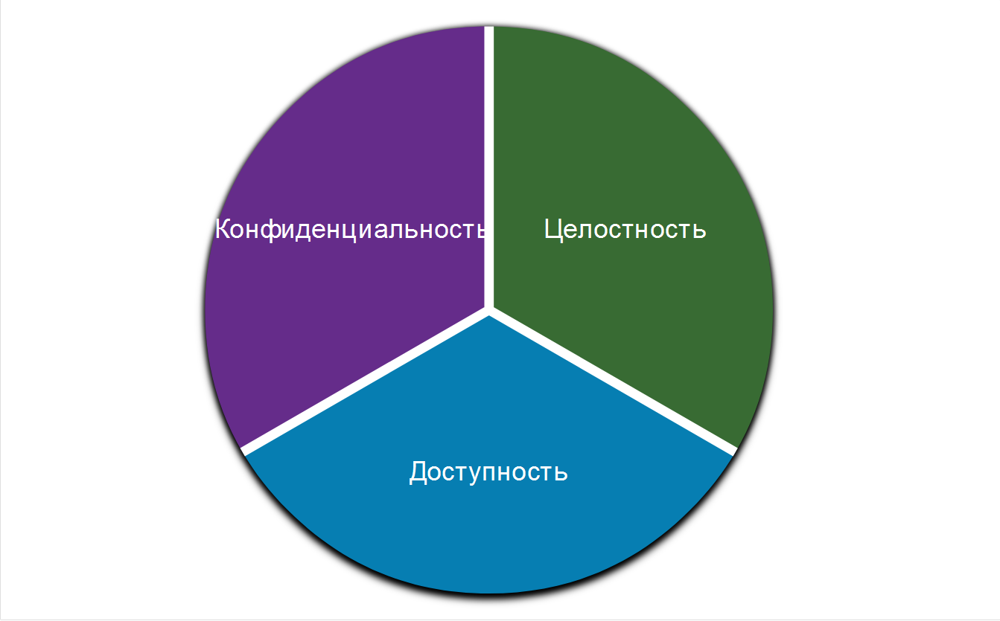
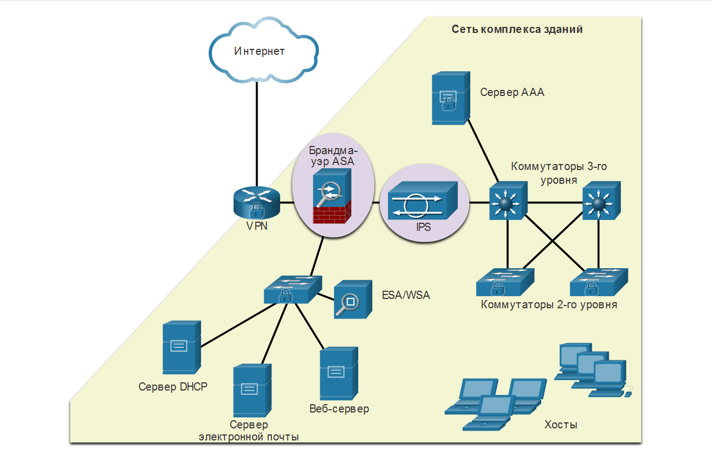
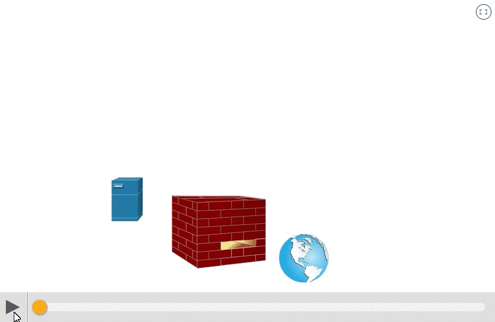
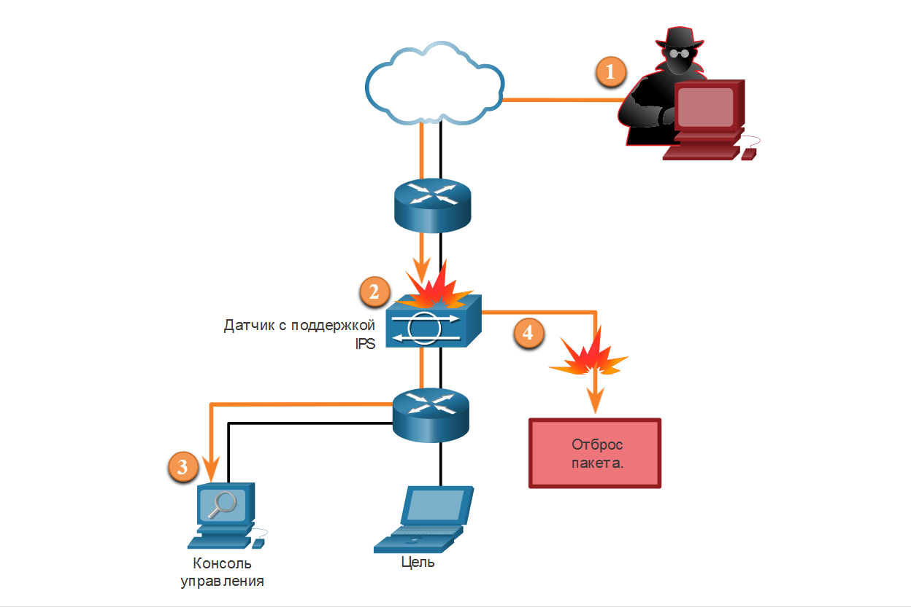
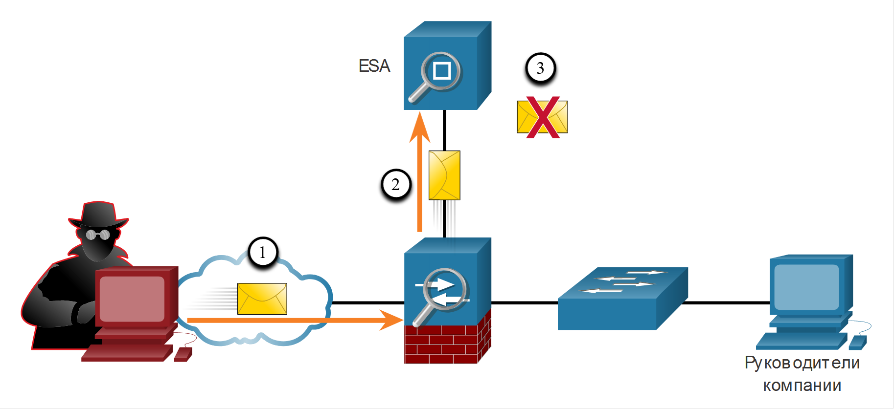
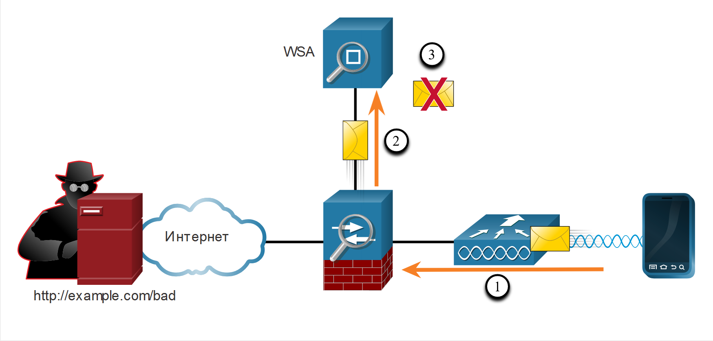

# Практические рекомендации по обеспечению сетевой безопасности

<!-- 3.9.1 -->
## Конфиденциальность, целостность и доступность
На самом деле список сетевых атак очень большой. Но существует множество практических рекомендаций по обеспечению сетевой безопасности, о которых вы узнаете в этой главе.

Информационная безопасность занимается защитой информации и информационных систем от несанкционированного доступа, использования, раскрытия, повреждения, изменения или уничтожения.

Большинство организаций придерживается триады КЦД, состоящей из трех компонентов информационной безопасности.
**Конфиденциальность** - только авторизованные лица, объекты или процессы могут получить доступ к конфиденциальной информации. Для шифрования и дешифрования данных может потребоваться использование алгоритмов криптографического шифрования, таких как AES.

**Целостность** - защита данных от несанкционированного изменения. Это требует использования криптографических алгоритмов хеширования, таких как SHA.

**Доступность** - авторизованные пользователи должны иметь непрерывный доступ к важным ресурсам и данным. Это требует внедрения резервных сервисов, шлюзов и каналов связи.

**CIA Triad**

<!-- 3.9.2 -->
## Углубленный подход к защите
Для безопасного обмена данными через общедоступные и частные сети в первую очередь необходимо обеспечить защиту устройств, включая маршрутизаторы, коммутаторы, серверы и хосты. Организации используют углубленный подход к защите сети. Его еще называют уровневым подходом. Такой подход предполагает совместную работу сетевых устройств и сервисов. Рассмотрим сеть на рисунке.

**Защита от сетевых атак**

Для защиты пользователей и активов организации от угроз TCP/IP реализовано несколько устройств и служб безопасности.

**VPN** - Маршрутизатор используется для предоставления защищенных сервисов VPN с корпоративными сайтами и поддержки удаленного доступа для удаленных пользователей, использующих защищенные зашифрованные туннели.

**ASA Firewall** - Это выделенное устройство предоставляет сервисы межсетевого экрана с сохранением состояния. Это гарантирует, что внутренний трафик может выходить и возвращаться, но внешний трафик не может инициировать соединения с внутренними узлами.

**IPS** - Система предотвращения вторжений (IPS) отслеживает входящий и исходящий трафик на наличие вредоносных программ, сигнатур сетевых атак и многого другого. Если он распознает угрозу, он может немедленно оставить её.

**ESA/WSA** - Устройство защиты электронной почты (ESA) фильтрует спам и подозрительные электронные письма. Устройство веб-безопасности трафика фильтрует известные и подозрительные сайты с интернет-вредоносным ПО.

**AAA Server** - Этот сервер содержит защищенную базу данных о том, кто авторизован для доступа и управления сетевыми устройствами. Сетевые устройства аутентифицируют административных пользователей, используя эту базу данных.

Все сетевые устройства, включая маршрутизатор и коммутаторы, защищены, что означает, что они не дадут злоумышленникам получить доступ к устройствам и вмешаться в их работу.

Далее необходимо обеспечить защиту данных, пересылаемых по различным каналам. К таким данным может относиться внутренний трафик, но более важной задачей является защита данных, которые передаются за пределами организации филиалам, удаленным сотрудникам и партнерам.

<!-- 3.9.3 -->
## Межсетевые экраны
Межсетевой экран — это система или группа систем, реализующая политику управления доступом между сетями. Нажмите кнопку Воспроизведение на рисунке, чтобы посмотреть, как работает межсетевой экран.

**Firewall Operation**

Все межсетевые экраны обладают некоторыми общими свойствами.

Межсетевые экраны устойчивы к сетевым атакам.

Межсетевые экраны представляют собой единственную транзитную точку между внутренними корпоративными сетями и внешними сетями, так как весь трафик проходит через межсетевой экран.

Межсетевые экраны применяют политики управления доступом.

Далее приведены некоторые из преимуществ использования межсетевого экрана в сети.

Предотвращение доступа неавторизованных пользователей к конфиденциальным хостам, ресурсам и приложениям.

Санация потока протокола для предотвращения использования уязвимостей протокола.

Блокирование вредоносных данных от серверов и клиентов.

Снижение сложности управления безопасностью за счет распределения большинства функций контроля доступа к сети по нескольким межсетевым экранам, имеющимся в сети.

Межсетевые экраны также имеют некоторые ограничения.

Неправильно настроенный межсетевой экран может привести к серьезным последствиям для сети, например стать единой точкой отказа.

Данные из многих приложений могут не передаваться через межсетевые экраны надежным образом.

Пользователи могут по собственной инициативе искать пути обхода межсетевого экрана для получения заблокированного материала, что подвергает сеть риску потенциальных атак.

Может снижаться производительность сети.

Неавторизованный трафик может туннелироваться или маскироваться под трафик, которому разрешено проходить через межсетевой экран.

<!-- 3.9.4 -->
## IPS
Для защиты от быстрых и развивающихся атак вам могут потребоваться экономически эффективные системы обнаружения и предотвращения, такие как системы обнаружения вторжений (IDS) или более масштабируемые системы предотвращения вторжений (IPS). В сетевой архитектуре эти решения применяются в точках входа в сеть и выхода из сети.

Технологии IDS и IPS имеют несколько общих характеристик, как показано на рисунке. Технологии IDS и IPS реализуются в сети посредством сенсоров. Сенсорами IDS или IPS могут быть разные устройства:

маршрутизатор, на который установлено программное обеспечение IPS Cisco IOS;
специализированное устройство, выполняющее функции IDS или IPS;
сетевой модуль, установленный в многофункциональном устройстве обеспечения безопасности (ASA), коммутаторе или маршрутизаторе.

**Действие системы предотвращения вторжений (IPS)**

На рисунке показано, как IPS управляет запрещенным трафиком.
1. Злоумышленник посылает пакет, предназначенный целевому хосту.
2. IPS перехватывает трафик и оценивает его относительно угроз и сконфигурированных политик.
3. IPS пересылает сообщения журнала на консоль управления.
4. IPS отбрасывает пакет.

Для выявления шаблонов в сетевом трафике в технологиях IDS и IPS используют сигнатуры. Сигнатура — это набор правил, с помощью которого технология IDS или IPS выявляет вредоносные действия. Сигнатуры можно использовать для выявления серьезных нарушений безопасности, обнаружения типичных сетевых атак и для сбора информации. Технологии IDS и IPS могут обнаруживать атомарные шаблоны сигнатур (один пакет) или составные шаблоны сигнатур (несколько пакетов).

<!-- 3.9.5 -->
## Устройство управления безопасностью контента
Устройства защиты контента включают детальный контроль над электронной почтой и просмотром веб-страниц для пользователей организации.

**Cisco Email Security Appliance (ESA)**

Cisco ESA - это устройство, предназначенное для мониторинга SMTP-протокола. Устройство Cisco ESA постоянно обновляется, используя информационные каналы в режиме реального времени от группы Talos Cisco, которая обнаруживает и сопоставляет угрозы, используя всемирную систему мониторинга баз данных. Эти данные об угрозах извлекаются устройствами Cisco ESA каждые три-пять минут.

На рисунке злоумышленник посылает фишинговое электронное письмо.

1. Злоумышленник отправляет фишинговую атаку на выжный хост в сети.
2. Межсетевой экран пересылает всю электронную почту в ESA.
3. ESA анализирует электронную почту, регистрирует ее, и отбрасывает ее.

**Cisco Web Security Appliance (WSA)**

Устройство защиты веб-трафика Cisco (Web Security Appliance - WSA) - это технология нейтрализации веб-угроз. Вместе они позволяют решить задачи, связанные с защитой и контролем веб-трафика. WSA предоставляет защиту от вредоносного ПО, мониторинг и контроль функционирования приложений, а также средства управления политиками допустимого использования, создания отчетов.

Cisco WSA обеспечивает полный контроль над доступом пользователей к сети Интернет. Некоторые функции и приложения, такие как чат, обмен сообщениями, видео и аудио, могут быть разрешены, ограничены по времени и полосе пропускания или заблокированы в соответствии с требованиями организации. WSA может выполнять внесение в черный список URL-адресов, фильтрацию URL-адресов, сканирование на наличие вредоносных программ, категоризацию URL-адресов, фильтрацию веб-приложений, а также шифрование и дешифрование веб-трафика.

На рисунке внутренний корпоративный сотрудник попытаться подключиться к помещенному в черный список сайту.

1. Пользователь пытается подключиться в веб-сайту.
2. Межсетевой экран направляет запрос веб-сайта в WSA.
3. WSA оценивает URL-адрес и определяет, что это известный черный список сайтов. WSA отбрасывает пакет и отправляет сообщение об отказе в доступе пользователю.

<!-- 3.9.6 -->
## Проверьте ваше понимание темы - Практические рекомендации по обеспечению сетевой безопасности
<!-- Тут  квиз 3.9.6 -->