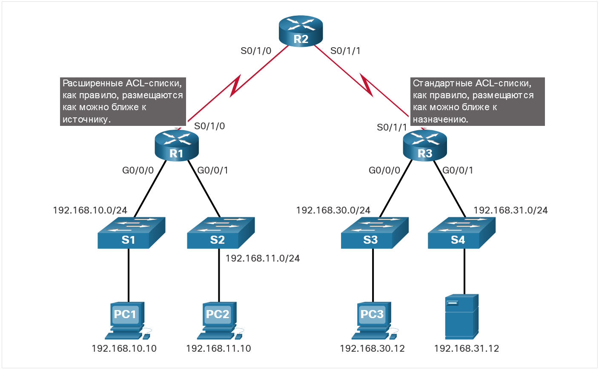

# Типы списков контроля доступа для IPv4

<!-- 4.4.1 -->
## Стандартные и расширенные списки контроля доступа

Предыдущие темы касались назначения ACL и руководства по созданию ACL. Этот раздел будет посвящен стандартным и расширенным ACL, именным и нумерованным ACL, а также примерам размещения этих ACL.

Типы списков контроля доступа для IPv4:

- **Стандартные списки ACL** — разрешают или запрещают пакеты, основанные только на исходном IPv4-адресе.
- **Расширенные списки ACL** — разрешают или запрещают пакеты, основанные на адресе IPv4 источника и адресе назначения IPv4, типе протокола, TCP-или UDP-портах источника и назначения и т. д.

Например, обратитесь к следующей команде стандартного ALC.

    R1(config)# access-list 10 permit 192.168.10.0 0.0.0.255
    R1(config)#

ACL 10 разрешает хостам в исходной сети 192.168.10.0/24. Из-за неявного правила deny any в конце списка этот список контроля доступа блокирует весь трафик, за исключением трафика из сети 192.168.10.0/24.

В следующем примере расширенный ACL 100 разрешает трафик, исходящий от любого хоста в сети 192.168.10.0/24, в любую сеть IPv4, если порт хоста назначения равен 80 (HTTP).

    R1(config)# access-list 100 permit tcp 192.168.10.0 0.0.0.255 any eq www
    R1(config)#

Обратите внимание, что стандартный ACL 10 способен фильтровать только по адресу источника, в то время как расширенный ACL 100 фильтрует информацию о источнике и месте назначения уровня 3 и уровня 4 (например, TCP).

**Примечание**: Полная конфигурация ACL обсуждается в другом модуле.

<!-- 4.4.2 -->
## Нумерованные и именованные списки контроля доступа

### Нумерованые ACL

ACL от 1 до 99 или от 1300 до 1999 являются стандартными ACL, в то время как ACL от 100 до 199 или от 2000 до 2699 являются расширенными ACL, как показано в выходных данных.

    R1(config)# access-list ?
      <1-99>       IP standard access list
      <100-199>    IP extended access list
      <1100-1199>  Extended 48-bit MAC address access list
      <1300-1999>  IP standard access list (expanded range)
      <200-299>    Protocol type-code access list
      <2000-2699>  IP extended access list (expanded range)
      <700-799>    48-bit MAC address access list
      rate-limit   Simple rate-limit specific access list
      template     Enable IP template acls
    R1(config)# access-list

### Именованые ACL

Именованные списки ACL являются предпочтительным методом для использования при настройке списков ACL. В частности, стандартные и расширенные списки ACL могут быть названы для предоставления сведений о назначении ACL. Например, именование расширенного ACL FTP-FILTER намного лучше, чем присвоение нумерованного ACL 100.

Команда глобальной конфигурации `ip access-list` используется для создания именованного списка ACL, как показано в следующем примере.

    R1(config)# ip access-list extended FTP-FILTER
    R1(config-ext-nacl)# permit tcp 192.168.10.0 0.0.0.255 any eq ftp
    R1(config-ext-nacl)# permit tcp 192.168.10.0 0.0.0.255 any eq ftp-data
    R1(config-ext-nacl)#

Ниже приведены правила, которым необходимо следовать для именованных списков ACL.

- Имя присваивается для определения списка контроля доступа.
- Имена могут содержать буквенно-цифровые символы.
- В именах не допускается наличие пробелов или знаков препинания.
- Рекомендуется вводить имя, используя ЗАГЛАВНЫЕ БУКВЫ.
- Записи списка контроля доступа можно добавлять или удалять.

<!-- 4.4.3 -->
## Где следует размещать ACL-списки

Каждый список контроля доступа (ACL) должен быть размещен там, где он может демонстрировать максимальную эффективность.

На рисунке показано, где стандартные и расширенные списки ACL должны располагаться в корпоративной сети. Предположим, цель состоит в том, чтобы предотвратить трафик, исходящий из сети 192.168.10.0/24, в сеть 192.168.30.0/24.

Расширенные списки контроля доступа следует располагать как можно ближе к источнику фильтруемого трафика. Таким образом, нежелательный трафик отклоняется близко к сети-источнику, не пересекая инфраструктуру сети.

Стандартные списки контроля доступа следует размещать как можно ближе к месту назначения. Если стандартный список контроля доступа размещен на источнике трафика, то трафик разрешается или отклоняется на основе данного адреса источника, независимо от места назначения трафика.

Размещение списка контроля доступа и, как следствие, тип списка контроля доступа могут также зависеть от ряда факторов.

Факторы, влияющие на размещение ACL | Описание
---------------------|---------------------------------------
Степень контроля сетей данной организации | Размещение ACL может зависеть от того, имеет ли организация управление над сетями источника и назначения.
Пропускная способность участвующих сетей | Возможно, желательно отфильтровать нежелательный трафик на источнике, чтобы предотвратить передачу трафика, потребляющего полосу пропускания.
Простота настройки конфигурации | - Возможно, проще реализовать ACL в месте назначения, но трафик будет использовать пропускную способность без необходимости.  - Расширенный ACL-список можно применить на каждом маршрутизаторе, с которого идет трафик. Это позволит сэкономить пропускную способность, фильтруя трафик по адресу источник, но это потребует создания расширенных списков ACL на нескольких избыточных маршрутизаторов.

<!-- 4.4.4 -->
## Пример размещения стандартного списка контроля доступа

Следуя рекомендациям по размещению ACL, стандартные ACL должны быть расположены как можно ближе к месту назначения.

На рисунке администратор желает запретить трафику из сети 192.168.10.0/24 попадать в сеть 192.168.30.0/24.

Следуя основным рекомендациям по размещению, администратор разместил стандартный список ACL на маршрутизаторе R3. Существует два возможных интерфейса на R3 для применения стандартного ACL:

- **Интерфейс R3 S0/1/1 (входящий)** — стандартный ACL может применяться для входящего трафика на интерфейсе R3 S0/1/1 для запрета трафика из сети .10. Однако он также фильтрует трафик .10 в сеть 192.168.31.0/24 (в данном примере .31). Поэтому стандартный ACL не должен применяться к этому интерфейсу.
- **Интерфейс R3 G0/0 (исходящий)** — стандартный ACL может быть применен исходящий на интерфейсе R3 G0/0/0. Применение данного списка не повлияет на другие сети, доступные для R3. Пакеты из сети .10 все равно смогут добраться до сети .31. Это лучший интерфейс для размещения стандартного списка ACL в соответствии с требованиями трафика.

<!-- 4.4.5 -->
## Пример размещения расширенного списка контроля доступа

Расширенный ACL должен быть расположен как можно ближе к источнику. Соблюдение данного правила позволяет предотвратить отправку нежелательного трафика на первоначальном этапе, а не после прохождения нескольких сетей.

Однако организация может размещать списки ACL только на устройствах, которые они контролируют. Поэтому место размещения определяется, исходя из пределов сферы контроля сетевого администратора.

На рисунке, например, компания A хочет запретить трафик Telnet и FTP в сеть 192.168.30.0/24 компании B из их сети 192.168.11.0/24, разрешая при этом весь другой трафик.

Существует несколько способов достижения этих целей. Расширенный ACL на R3 выполнил бы эту задачу, но администратор не контролирует R3. Кроме того, при таком решении нежелательный трафик сможет проходить через всю сеть только для того, чтобы оказаться заблокированным по достижении места назначения. Это оказывает влияние на общую эффективность сети.

Решение заключается в том, чтобы поместить расширенный список ACL на R1, который определяет адреса источника и назначения.

Рисунок показывает два интерфейса маршрутизатора R1, на которых возможно применение расширенного списка контроля доступа.

- **R1 S0/1/0 Интерфейс (исходящий)** - Расширенный ACL может быть применен исходящий на интерфейсе S0/1/0. Однако это решение будет обрабатывать все пакеты, оставляющие R1, включая пакеты из 192.168.10.0/24.
- **R1 G0/0/1 Интерфейс (входящий)** - расширенный ACL может применяться во входящем напрвлении на G0/0/1, и только пакеты из сети 192.168.11.0/24 подлежат обработке ACL на R1. Поскольку фильтр ограничивается только пакетами, покидающими сеть 192.168.11.0/24, применение расширенного списка контроля доступа на G0/1 — оптимальное решение.

<!-- тут должен быть квиз 4.4.6 -->