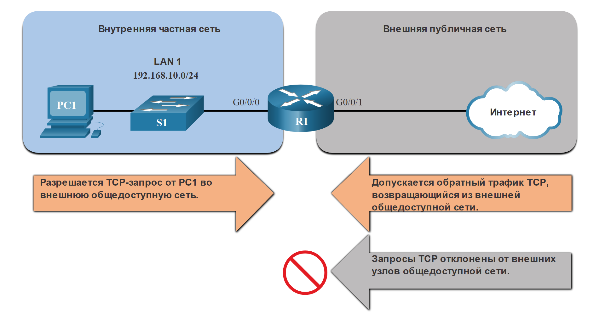
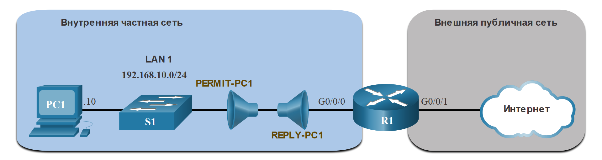

<!-- 5.4.1 -->
## Расширенные списки контроля доступа
В предыдущих разделах рассказывалось о настройке и изменении стандартных списков ACL, а также о защите портов VTY со стандартным ACL IPv4. Стандартные ACL-списки выполняют фильтрацию только на основе адреса источника. Для более точного контроля над фильтрацией трафика управления можно создать расширенные списки контроля доступа IPv4.

Расширенные списки контроля доступа используются чаще, чем стандартные, поскольку они обеспечивают больший объем контроля. Они могут фильтровать по адресу источника, адресу назначения, протоколу (например, IP, TCP, UDP, ICMP) и номеру порта. Это обеспечивает более широкий спектр критериев, на которых можно строить ACL-список. Например, один расширенный список контроля доступа может разрешать трафик электронной почты из сети к определенному месту назначения и одновременно запрещать передачу файлов и просмотр веб-страниц.

Как и стандартные списки ACL, расширенные списки ACL могут быть созданы как:

* **Команда глобальной конфигурации расширенного списка ACL**  - созданы с помощью **access-list**  _access-list-number_.
* **Именованный расширенный список доступа**  - созданы с помощью **ip access-list extended**  _access-list-name_.

<!-- 5.4.2 -->
## Синтаксис стандартного нумерованного списка контроля доступа (ACL) IPv4
Последовательность шагов настройки расширенных списков контроля доступа такая же, как при настройке стандартных списков контроля доступа. Расширенный список контроля доступа сначала настраивается, а затем применяется на интерфейсе. При этом следует учитывать, что синтаксис команды и параметры представляют большую сложность для поддержки дополнительных функций, предоставляемых расширенными списка контроля доступами.

Чтобы создать расширенный список ACL с нумерацией, используйте следующую команду глобальной конфигурации:

```
Router(config)# access-list access-list-number {deny | permit | remark text} protocol source source-wildcard [operator {port}] destination destination-wildcard [operator {port}] [established] [log]
```

Используйте команду глобальной конфигурации **no ip access-list** **extended** _access-list-name_, чтобы удалить расширенный список ACL.

Хотя для расширенных ACL существует много ключевых слов и параметров, нет необходимости использовать их все при настройке расширенного ACL. Таблица содержит подробное описание синтаксиса для расширенного ACL-списка.

| **Параметр** | **Описание** |
| --- | --- |
| *access-list-number* |  <ul><li>Это десятичное число ACL. </li><li>Расширенный диапазон номеров ACL составляет от 100 до 199 и от 2000 до 2699.</li></ul>  |
| **deny** | Запрещает доступ при совпадении условий. |
| **permit** | Разрешает доступ при совпадении условий. |
| **remark** text | <ul><li>(Необязательно) Добавляет текстовую запись для целей документации.</li><li>Длина комментария ограничена 100 символами.</li></ul> |
| *protocol* | <ul><li>Имя или номер протокола IP. </li><li>Типичные ключевые слова: **ip**, **tcp**, **udp** и **icmp**.</li><li>Ключевое слово **ip** соответствует всем протоколам IP.</li></ul>  |
| *source* | <ul><li>Определяет исходный адрес сети или узла для фильтрации.</li><li>Используйте ключевое слово **any** для определения всех сетей.</li><li>Используйте ключевое слово **host** *ip-address* или просто введите *ip-адрес* (без ключевого слова **host**) для идентификации конкретного IP-адреса.</li></ul>  |
| *source-wildcard* | (Опционально). 32-битная шаблонная маска должна применяться к адресу источника. |
| *destination* | <ul><li>Это определяет сеть назначения или адрес узла для фильтрации.</li><li>Используйте ключевое слово **any** для определения всех сетей.</li><li>Используйте **ключевое слово** *ip-address* узла или *ip-address*. </li></ul> |
| *destination-wildcard* | (Опционально). 32-битная шаблонная маска должна применяться к адресу получателя. |
| *operator* | <ul><li>(Опционально). Сравнивает порты источника и назначения. </li><li>Возможные операнды включают **lt** (меньше чем), **gt** (больше чем), **eq** (равно), **neq** (не равно) и **диапазон**(включая диапазон).</li></ul>  |
| *port* | (Опционально). Десятичный номер или имя порта TCP или UDP. |
| **established** | <ul><li>(Необязательно) Только для протокола TCP.</li><li>Это функция брандмауэра 1-го поколения.</li></ul>  |
| **log** | <ul><li>(Необязательно) Это ключевое слово генерирует и отправляет информационное сообщение всякий раз, когда ACE совпадает с пакетом.</li><li>Это сообщение включает номер ACL, совпадающее условие (т. е. разрешено или запрещено), адрес источника и количество пакетов.</li><li>Сообщение генерируется для первого совпадающего пакета.</li><li>Это ключевое слово должно быть реализовано только для устранения неполадок или обеспечения безопасности сети.</li></ul> |

```
Router(config-if)# ip access-group {access-list-number | access-list-name} {in | out}
```

Чтобы удалить список ACL из интерфейса, сначала введите команду конфигурации интерфейса **no ip access-group.** Чтобы удалить список ACL с маршрутизатора, используйте команду глобальной конфигурации **no access-list**.

**Примечание:** Внутренний алгоритм для упорядочения записей стандартного списка контроля доступа не применяется для расширенных списков контроля доступа. Записи отображаются и обрабатываются в том порядке, в котором они вводились в процессе настройки.

<!-- 5.4.3 -->
## Протоколы или порты
Расширенные списки ACL могут фильтровать множество различных типов интернет-протоколов и портов.

**Параметры протокола**

Четыре выделенных протокола являются наиболее популярными вариантами.

**Примечание:** используйте, **?** чтобы получить справку при вводе сложного ACE.

**Примечание:** если интернет-протокол не указан, может быть указан номер IP-протокола. Например, протокол ICMP номер 1, TCP — 6, UDP — 17.

```
R1(config)# access-list 100 permit ? 
<0-255>       An IP protocol number
ahp           Authentication Header Protocol
dvmrp         dvmrp
eigrp         Cisco's EIGRP routing protocol
esp           Encapsulation Security Payload
gre           Cisco's GRE tunneling
icmp          Internet Control Message Protocol
igmp          Internet Gateway Message Protocol
ip            Any Internet Protocol
ipinip        IP in IP tunneling
nos           KA9Q NOS compatible IP over IP tunneling
object-group  Service object group
ospf          OSPF routing protocol
pcp           Payload Compression Protocol
pim           Protocol Independent Multicast
tcp           Transmission Control Protocol
udp           User Datagram Protocol
R1(config)# access-list 100 permit 
```
**Параметры ключевых слов порта**

Выбор *protocol* влияет на параметры *port*. Например, выбрав:

* протокол **tcp** обеспечит параметры портов, связанных с TCP;
* протокол **udp** обеспечит специфические параметры портов UDP;
* протокол **icmp** будет предоставлять ICMP связанные порты (т. е. сообщения) параметры.

Опять же обратите внимание на то, сколько вариантов TCP-портов доступно. Выделенные порты являются популярными вариантами.

```
R1(config)# access-list 100 permit tcp any any eq ? 
<0-65535>    Port number
bgp          Border Gateway Protocol (179)
chargen      Character generator (19)
cmd          Remote commands (rcmd, 514)
daytime      Daytime (13)
discard      Discard (9)
domain       Domain Name Service (53) 
echo         Echo (7)
exec         Exec (rsh, 512)
finger       Finger (79)
ftp          File Transfer Protocol (21) 
ftp-data     FTP data connections (20) 
gopher       Gopher (70)
hostname     NIC hostname server (101)
ident        Ident Protocol (113)
irc          Internet Relay Chat (194)
klogin       Kerberos login (543)
kshell       Kerberos shell (544)
login        Login (rlogin, 513)
lpd          Printer service (515)
msrpc        MS Remote Procedure Call (135)
nntp         Network News Transport Protocol (119)
onep-plain   Onep Cleartext (15001)
onep-tls     Onep TLS (15002)
pim-auto-rp  PIM Auto-RP (496)
pop2         Post Office Protocol v2 (109)
pop3         Post Office Protocol v3 (110) 
smtp         Simple Mail Transport Protocol (25) 
sunrpc       Sun Remote Procedure Call (111)
syslog       Syslog (514)
tacacs       TAC Access Control System (49)
talk         Talk (517)
telnet       Telnet (23) 
time         Time (37)
uucp         Unix-to-Unix Copy Program (540)
whois        Nicname (43)
www          World Wide Web (HTTP, 80) 
```

<!-- 5.4.4 -->
## Примеры конфигурации протоколов и номеров портов
Расширенные списки ACL могут фильтровать различные номера порта и параметры имени порта. В этом примере настраивается расширенный список ACL 100 для фильтрации HTTP-трафика. Первый ACE использует **www** имя порта. Второй ACE использует **80** номер порта. Оба ACE достигают точно одинакового результата.

```
R1(config)# access-list 100 permit tcp any any eq www
R1(config)#  !or...
R1(config)# access-list 100 permit tcp any any eq 80 
```

Настройка номера порта требуется, если в списке нет конкретного имени протокола, например SSH (номер порта 22) или HTTPS (номер порта 443), как показано в следующем примере.

```
R1(config)# access-list 100 permit tcp any any eq 22
R1(config)# access-list 100 permit tcp any any eq 443
R1(config)#
```

<!-- 5.4.5 -->
## Применение нумерованного расширенного списка ACL IPv4
Топология на рисунке будет использоваться для демонстрации настройки и применения пронумерованных и именованных расширенных списков ACL IPv4 к интерфейсу. В этом первом примере показана пронумерованная расширенная реализация ACL IPv4.


<!-- /courses/ensa-dl/ae8e8c84-34fd-11eb-ba19-f1886492e0e4/aeb46404-34fd-11eb-ba19-f1886492e0e4/assets/c6267902-1c46-11ea-af56-e368b99e9723.svg -->

<!--
новая топология. показывает маршрутизатор R2 с тремя сетевыми интерфейсами: G0/0 подключен к облаку ISP, S0/1/0 подключен к маршрутизатору R1 и S0/1/1 подключен к R3. Маршрутизатор R1 имеет два дополнительных интерфейса LAN: G0/0/0, подключенный к коммутатору LAN 1, и G0/0/1, подключенный к коммутатору LAN 2. Маршрутизатор R3 имеет дополнительный интерфейс G0/0/0, подключенный к локальной сети 3
-->

В этом примере ACL разрешает трафик HTTP и HTTPS из сети 192.168.10.0 в любой пункт назначения.

Расширенные списки ACL могут применяться в различных местах. Однако они обычно применяются близко к источнику. Таким образом ACL 110 был применен входящий на интерфейсе R1 G0/0/0.

```
R1(config)# access-list 110 permit tcp 192.168.10.0 0.0.0.255 any eq www
R1(config)# access-list 110 permit tcp 192.168.10.0 0.0.0.255 any eq 443
R1(config)# interface g0/0/0
R1(config-if)# ip access-group 110 in
R1(config-if)# exit
R1(config)#
```

<!-- 5.4.6 -->
## TCP established для расширенного ACL
TCP также может выполнять основные службы брандмауэра с сохранением состояния, используя ключевое слово TCP **established**. Ключевое слово позволяет внутреннему трафику выйти из внутренней частной сети и позволяет возвращенному ответному трафику войти во внутреннюю частную сеть, как показано на рисунке.


<!-- /courses/ensa-dl/ae8e8c84-34fd-11eb-ba19-f1886492e0e4/aeb46404-34fd-11eb-ba19-f1886492e0e4/assets/c626ee33-1c46-11ea-af56-e368b99e9723.svg -->

<!--
диаграмма показывает маршрутизатор R1 с 2 сетевыми интерфейсами: G0/0/0, подключаемый к внутренней частной сети, и G0/0/1, подключаемый к внешней общедоступной сети. Транспортный трафик изнутри наружу разрешен, а также разрешается возвратный трафик, но трафик, инициированный извне, запрещен
-->

Тем не менее трафик TCP, генерируемый внешним узлом и попытка взаимодействия с внутренним узлом, отклоняется.

Ключевое слово **established** может использоваться, чтобы разрешить только обратный HTTP-трафик с запрашиваемых веб-сайтов, при этом запрещать весь остальной трафик.

В топологии конструкция для этого примера показывает, что ACL 110, который был настроен ранее, фильтрует трафик из внутренней частной сети. ACL 120, используя ключевое слово **established**, фильтрует трафик, поступающий во внутреннюю частную сеть из внешней общедоступной сети.


<!-- /courses/ensa-dl/ae8e8c84-34fd-11eb-ba19-f1886492e0e4/aeb46404-34fd-11eb-ba19-f1886492e0e4/assets/c6273c53-1c46-11ea-af56-e368b99e9723.svg -->

<!--
диаграмма показывает маршрутизатор R1 с 2 сетевыми интерфейсами: G0/0/0, подключаемый к внутренней частной сети, и G0/0/1, подключаемый к внешней общедоступной сети. Списки доступа будут применяться как входящие, так и исходящие на интерфейсе G0/0/0
-->

В этом примере ACL 120 настроен так, чтобы разрешить возврат веб-трафика только на внутренние узлы. Новый ACL затем применяется исходящий на интерфейсе R1 G0/0/0. Команда **show access-lists** отображает оба списка ACL. Обратите внимание на статистику соответствия, что внутри хостов доступ к защищенным веб-ресурсам из Интернета.

```
R1(config)# access-list 120 permit tcp any 192.168.10.0 0.0.0.255 established
R1(config)# interface g0/0/0 
R1(config-if)# ip access-group 120 out 
R1(config-if)# end
R1# show access-lists 
Extended IP access list 110
    10 permit tcp 192.168.10.0 0.0.0.255 any eq www
    20 permit tcp 192.168.10.0 0.0.0.255 any eq 443 (657 matches)
Extended IP access list 120
    10 permit tcp any 192.168.10.0 0.0.0.255 established (1166 matches)
R1#
```

Обратите внимание, что разрешение защищенных HTTPS-счетчиков (то есть, например, 443) в ACL 110 и возвращенных установленных счетчиков в ACL 120 увеличилось.

Параметр **established** разрешает возврат в сеть 192.168.10.0/24 ответов только того трафика, который изначально исходил из этой сети. В частности, совпадение происходит, если возвращающийся сегмент TCP имеет установленный бит флага ACK или reset (RST). Это означает, что пакет принадлежит существующему соединению. Без параметра **established** записи списка контроля доступа клиент может послать трафик на веб-сервер, но не получить обратный трафик, возвращающийся от веб-сервера.

<!-- 5.4.7 -->
## Синтаксис расширенного нумерованного списка контроля доступа (ACL) IPv4
Присвоение имен ACL-спискам упрощает понимание функции того или иного списка. Чтобы создать именованный расширенный список ACL, используйте следующую команду глобальной конфигурации:

```
Router(config)# ip access-list extended access-list-name 
```

Эта команда запускает режим конфигурации расширенного именованного списка контроля доступа. Имена ACL-списков состоят из буквенно-цифровых символов, они чувствительны к регистру и должны быть уникальными.

В этом примере создается именованный расширенный список ACL, называемый NO-FTP-ACCESS, и запрос изменен на именованный расширенный режим конфигурации ACL. Инструкции ACE вводятся в именованном расширенном режиме конфигурации ACL.

```
R1(config)# ip access-list extended NO-FTP-ACCESS
R1(config-ext-nacl)# 
```

<!-- 5.4.8 -->
## Пример именованного расширенного списка ACL IPv4
Именованные расширенные списки доступа создаются практически тем же способом, что и именованные стандартные списки контроля доступа.

Топология на рисунке используется для демонстрации настройки и применения двух именованных расширенных списков ACL IPv4 к интерфейсу:

* **SURFING** - это позволит внутреннему HTTP и HTTPS трафику выйти в Интернет.
* **BROWSING** - это позволит веб-трафиу вернуться только на внутренние узлы, в то время как весь остальной трафик, выходящий из интерфейса R1 G0/0/0, неявно запрещен.


<!-- /courses/ensa-dl/ae8e8c84-34fd-11eb-ba19-f1886492e0e4/aeb46404-34fd-11eb-ba19-f1886492e0e4/assets/c6284dc3-1c46-11ea-af56-e368b99e9723.svg -->

<!--
диаграмма показывает маршрутизатор R1 с 2 сетевыми интерфейсами: G0/0/0, подключаемый к внутренней частной сети, и G0/0/1, подключаемый к внешней общедоступной сети. Именованный список доступа SURFING будет применен входящий на интерфейсе G0/0/0, а именованный список доступа BROWSING будет применен исходящий на интерфейсе G0/0/0
-->

В примере показана конфигурация для входящего ACL SURFING и исходящего ACL BROWSING.

ACL SURFING разрешает трафик HTTP и HTTPS от внутренних пользователей для выхода из интерфейса G0/0/1, подключенного к Интернету. Веб-трафик, возвращаемый из Интернета, разрешен обратно во внутреннюю частную сеть списком ACL BROWSING.

ACL SURFING применяется входящий, а ACL BROWSING применяется исходящий на интерфейсе R1 G0/0/0, как показано в выходных данных.

Внутренние хосты имеют доступ к защищенным веб-ресурсам из Интернета. Команда **show access-lists** используется для проверки статистики ACL. Обратите внимание, что разрешенные безопасные счетчики HTTPS (например, eq 443) в ACL SURFING и установленные счетчики возврата в ACL BROWSING увеличились.

```
R1(config)# ip access-list extended SURFING
R1(config-ext-nacl)# Remark Permits inside HTTP and HTTPS traffic 
R1(config-ext-nacl)# permit tcp 192.168.10.0 0.0.0.255 any eq 80
R1(config-ext-nacl)# permit tcp 192.168.10.0 0.0.0.255 any eq 443
R1(config-ext-nacl)# exit
R1(config)# 
R1(config)# ip access-list extended BROWSING
R1(config-ext-nacl)# Remark Only permit returning HTTP and HTTPS traffic 
R1(config-ext-nacl)# permit tcp any 192.168.10.0 0.0.0.255 established
R1(config-ext-nacl)# exit
R1(config)# interface g0/0/0
R1(config-if)# ip access-group SURFING in
R1(config-if)# ip access-group BROWSING out
R1(config-if)# end
R1# show access-lists
Extended IP access list SURFING
    10 permit tcp 192.168.10.0 0.0.0.255 any eq www
    20 permit tcp 192.168.10.0 0.0.0.255 any eq 443 (124 matches) 
Extended IP access list BROWSING
    10 permit tcp any 192.168.10.0 0.0.0.255 established (369 matches) 
R1#
```

<!-- 5.4.9 -->
## Редактирование расширенных списков контроля доступа
Как и стандартные списки ACL, расширенный список ACL можно редактировать с помощью текстового редактора, когда требуется много изменений. В противном случае, если редактирование применяется к одному или двум ACE, можно использовать порядковые номера.

Например, предположим, что вы только что ввели списки ACL SURFING и BROWSING и хотите проверить их конфигурацию с помощью команды **show access-lists**.

```
R1# show access-lists 
Extended IP access list BROWSING
    10 permit tcp any 192.168.10.0 0.0.0.255 established 
Extended IP access list SURFING
    10 permit tcp 19.168.10.0 0.0.0.255 any eq www
    20 permit tcp 192.168.10.0 0.0.0.255 any eq 443 
R1#
```

Обратите внимание, что номер последовательности ACE 10 в SURFING ACL имеет неверный IP-адрес сети источника.

Чтобы исправить эту ошибку, используя порядковые номера, исходная инструкция удаляется с помощью команды **no** _sequence #_, а исправленная инструкция добавляется заменяющая исходную инструкцию.

```
R1# configure terminal
R1(config)# ip access-list extended SURFING 
R1(config-ext-nacl)# no 10
R1(config-ext-nacl)# 10 permit tcp 192.168.10.0 0.0.0.255 any eq www
R1(config-ext-nacl)# end
```

Выходные данные проверяют изменение конфигурации с помощью команды **show access-lists**.

```
R1# show access-lists 
Extended IP access list BROWSING
    10 permit tcp any 192.168.10.0 0.0.0.255 established 
Extended IP access list SURFING
    10 permit tcp 192.168.10.0 0.0.0.255 any eq www 
    20 permit tcp 192.168.10.0 0.0.0.255 any eq 443
R1#
```
<!-- 5.4.10 -->
## Пример другого именованного расширенного списка ACL IPv4
На рисунке показан другой сценарий реализации именованного расширенного списка ACL IPv4. Предположим, что PC1 во внутренней частной сети разрешен трафик FTP, SSH, Telnet, DNS, HTTP и HTTPS. Тем не менее, всем другим пользователям во внутренней частной сети должен быть отказано в доступе.

Будут созданы два именованных расширенных списка ACL:

* **PERMIT-PC1** - это позволит только PC1 TCP доступ к Интернету и запретить все остальные хосты в частной сети.
* **REPLY-PC1** - это позволит только возвращать TCP-трафик PC1 неявно отклонять весь остальной трафик.


<!-- /courses/ensa-dl/ae8e8c84-34fd-11eb-ba19-f1886492e0e4/aeb46404-34fd-11eb-ba19-f1886492e0e4/assets/c6295f33-1c46-11ea-af56-e368b99e9723.svg -->

<!--
диаграмма показывает маршрутизатор R1 с 2 сетевыми интерфейсами: G0/0/0, подключаемый к внутренней частной сети, и G0/0/1, подключаемый к внешней общедоступной сети. Именованный список доступа PERMIT-PC1 будет применен входящий на интерфейсе G0/0/0, а именованный список доступа REPLY-PC1 будет применен исходящий на интерфейсе G0/0/0 
-->

В примере показана конфигурация входящего ACL PERMIT-PC1 и исходящего REPLY-PC1.

**PERMIT-PC1** ACL разрешает PC1 (т. е. 192.168.10.10) TCP-доступ к FTP (т. е. к портам 20 и 21), SSH (22), Telnet (23), DNS (53), HTTP (80) и HTTPS (443) трафика.

**REPLY-PC1** ACL разрешает обратный трафик на PC1.

Существует множество факторов, которые необходимо учитывать при применении ACL, включая:

* устройство для его применения;
* интерфейс для его применения;
* направление применения.

Необходимо тщательно рассмотреть, чтобы избежать нежелательных результатов фильтрации. ACL PERMIT-PC1 применяется во входящем направлении, а ACL REPLY-PC1 применяется в исходящем направлении на интерфейсе R1 G0/0/0.

```
R1(config)# ip access-list extended PERMIT-PC1
R1(config-ext-nacl)# Remark Permit PC1 TCP access to internet 
R1(config-ext-nacl)# permit tcp host 192.168.10.10 any eq 20
R1(config-ext-nacl)# permit tcp host 192.168.10.10 any eq 21
R1(config-ext-nacl)# permit tcp host 192.168.10.10 any eq 22
R1(config-ext-nacl)# permit tcp host 192.168.10.10 any eq 23
R1(config-ext-nacl)# permit udp host 192.168.10.10 any eq 53
R1(config-ext-nacl)# permit tcp host 192.168.10.10 any eq 53
R1(config-ext-nacl)# permit tcp host 192.168.10.10 any eq 80
R1(config-ext-nacl)# permit tcp host 192.168.10.10 any eq 443
R1(config-ext-nacl)# deny ip 192.168.10.0 0.0.0.255 any 
R1(config-ext-nacl)# exit
R1(config)# 
R1(config)# ip access-list extended REPLY-PC1
R1(config-ext-nacl)# Remark Only permit returning traffic to PC1 
R1(config-ext-nacl)# permit tcp any host 192.168.10.10 established
R1(config-ext-nacl)# exit
R1(config)# interface g0/0/0
R1(config-if)# ip access-group PERMIT-PC1 in
R1(config-if)# ip access-group REPLY-PC1 out
R1(config-if)# end
R1#
```
<!-- 5.4.11 -->
## Проверка расширенных списков контроля доступа
После того как список контроля доступа настроен и применен на интерфейсе, выполните проверку конфигурации при помощи команд Cisco IOS **show**.

**show ip interface**

Команда **show ip interface** используется для проверки списка контроля доступа на интерфейсе и направления, к которому был привязан список.

Команда генерирует довольно много выходных данных, но обратите внимание, как заглавные имена ACL выделяются в выходных данных.

Для уменьшения выходных данных команды используйте методы фильтрации, как показано во второй команде.

```
R1# show ip interface g0/0/0
GigabitEthernet0/0/0 is up, line protocol is up (connected)
  Internet address is 192.168.10.1/24
  Broadcast address is 255.255.255.255
  Address determined by setup command
  MTU is 1500 bytes
  Helper address is not set
  Directed broadcast forwarding is disabled
  Outgoing access list is REPLY-PC1
  Inbound  access list is PERMIT-PC1
  Proxy ARP is enabled
  Security level is default
  Split horizon is enabled
  ICMP redirects are always sent
  ICMP unreachables are always sent
  ICMP mask replies are never sent
  IP fast switching is disabled
  IP fast switching on the same interface is disabled
  IP Flow switching is disabled
  IP Fast switching turbo vector
  IP multicast fast switching is disabled
  IP multicast distributed fast switching is disabled
  Router Discovery is disabled
R1#
R1# show ip interface g0/0/0 | include access list
Outgoing access list is REPLY-PC1
Inbound access list is PERMIT-PC1
R1#
```

**show access-lists**

Команда **show access-lists** может использоваться для подтверждения того, что списки ACL работают должным образом. Команда отображает счетчики статистики, которые увеличиваются при сопоставлении ACE.

**Примечание:** Трафик должен быть создан для проверки работы ACL.

На рисунке верхний пример показывает команду Cisco IOS для отображения содержимого всех списков контроля доступа.

Обратите внимание, как IOS отображает ключевое слово, даже если были настроены номера портов.

В отличие от стандартных списков контроля доступа, расширенные списки контроля доступа не реализуют ту же внутреннюю логику и функцию расстановки. Выходные данные и порядковые номера, отображаемые в выходных данных команды **show access-lists**, демонстрируют порядок, в котором были введены записи. Записи узла не перечисляются автоматически перед записями диапазона.

```
R1# show access-lists 
Extended IP access list PERMIT-PC1
    10 permit tcp host 192.168.10.10 any eq ftp-data
    20 permit tcp host 192.168.10.10 any eq ftp
    30 permit tcp host 192.168.10.10 any eq 22
    40 permit tcp host 192.168.10.10 any eq telnet
    50 permit udp host 192.168.10.10 any eq domain
    60 permit tcp host 192.168.10.10 any eq domain
    70 permit tcp host 192.168.10.10 any eq www
    80 permit tcp host 192.168.10.10 any eq 443
    90 deny ip 192.168.10.0 0.0.0.255 any
Extended IP access list REPLY-PC1
    10 permit tcp any host 192.168.10.10 established
R1#
```

**show running-config**

Команда **show running-config** может использоваться для проверки настроенных параметров. Команда также отображает настроенные замечания.

Команда может быть отфильтрована для отображения только соответствующей информации, как показано ниже.

```
R1# show running-config | begin ip access-list 
ip access-list extended PERMIT-PC1
Remark Permit PC1 TCP access to internet
permit tcp host 192.168.10.10 any eq 20
permit tcp host 192.168.10.10 any eq ftp 
permit tcp host 192.168.10.10 any eq 22 
permit tcp host 192.168.10.10 any eq telnet
permit tcp host 192.168.10.10 any eq domain
permit tcp host 192.168.10.10 any eq www
permit tcp host 192.168.10.10 any eq 443 
deny ip 192.168.10.0 0.0.0.255 any
ip access-list extended REPLY-PC1 
Remark Only permit returning traffic to PC1
permit tcp any host 192.168.10.10 established 
!
```

<!-- 5.4.12 -->
## Packet Tracer. Настройка расширенных списков контроля доступа. Сценарий 1
В рамках данного упражнения Packet Tracer необходимо решить следующие задачи.

* Часть 1: Настройка, применение и проверка расширенного нумерованного ACL-списка.
* Часть 2: Настройка, применение и проверка расширенного именованного ACL-списка.

[Настройка расширенных списков контроля доступа (pdf)](./assets/5.4.12-packet-tracer---configure-extended-ipv4-acls---scenario-1_ru-RU.pdf)

[Настройка расширенных списков контроля доступа (pka)](./assets/5.4.12-packet-tracer---configure-extended-ipv4-acls---scenario-1_ru-RU.pka)

<!-- 5.4.13 -->
## Packet Tracer. Настройка расширенных списков контроля доступа. Сценарий 2
В рамках данного упражнения Packet Tracer необходимо решить следующие задачи.

* Часть 1: Настройка именованного расширенного списка контроля доступа.
* Часть 2: Применение и проверка расширенного IPv4 ACL.

[Настройка расширенных списков контроля доступа (pdf)](./assets/5.4.13-packet-tracer---configure-extended-ipv4-acls---scenario-2_ru-RU.pdf)

[Настройка расширенных списков контроля доступа (pka)](./assets/5.4.13-packet-tracer---configure-extended-ipv4-acls---scenario-2_ru-RU.pka)