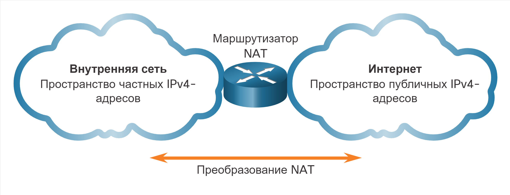
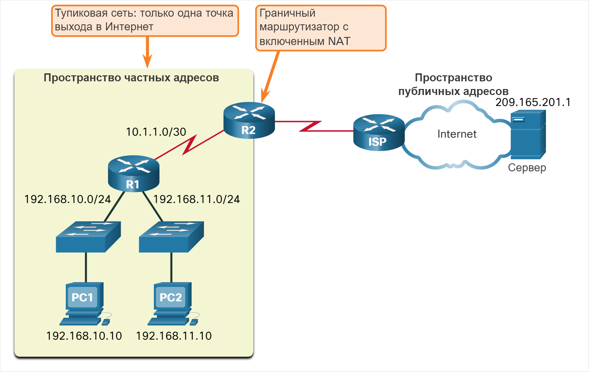
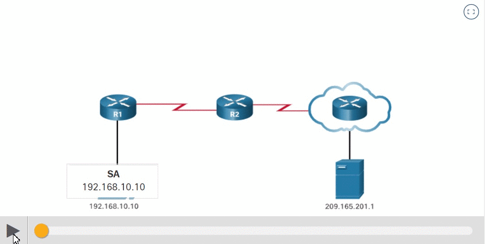
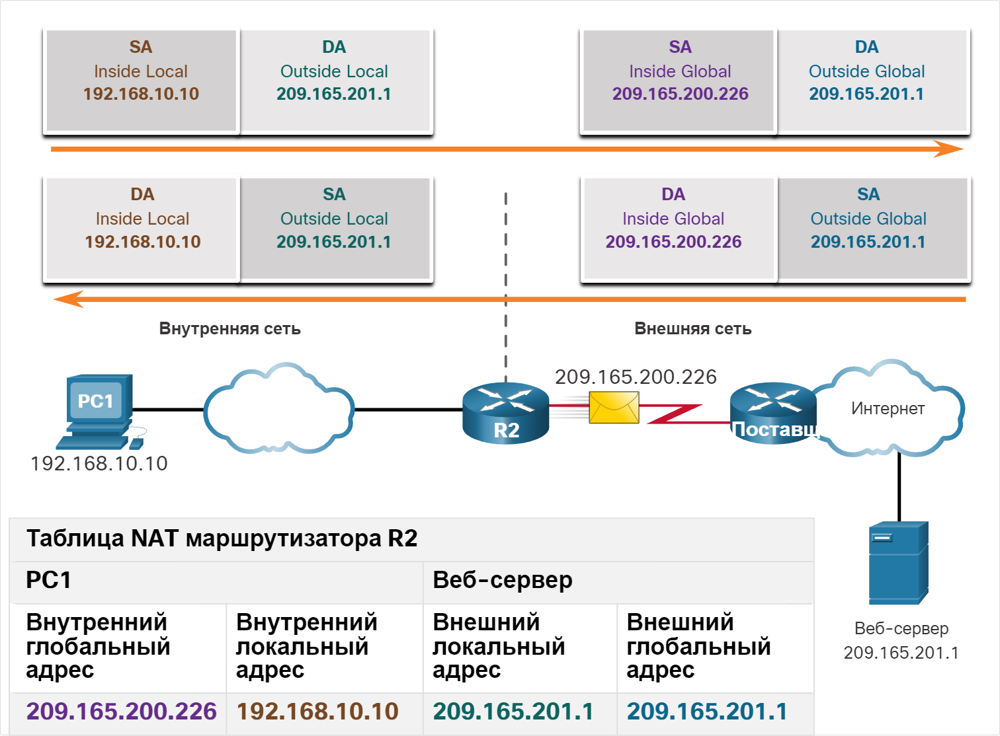
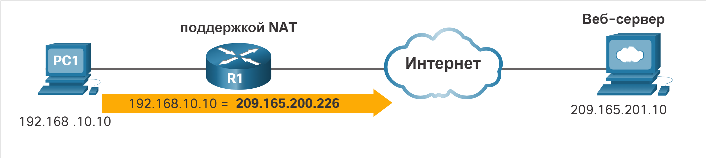

# Характеристики технологии NAT

<!-- 6.1.1 -->
## Пространство частных адресов IPv4
Как вы знаете, количества публичных IPv4-адресов недостаточно, чтобы назначить уникальные адреса всем устройствам, подключенным к Интернету. В большинстве случаев сети реализуются с использованием частных IPv4-адресов в соответствии с RFC 1918. Диапазон адресов, включенных в RFC 1918, включен в следующую таблицу. Вероятнее всего, компьютеру, на котором вы сейчас просматриваете материал учебного курса, назначен частный адрес.

**Класс** | **Диапазон внутренних адресов (RFC 1918)** | **Префикс**
--------------|--------------|--------------
A | 10.0.0.0 - 10.255.255.255 | 10.0.0.0/8
B | 172.16.0.0 - 172.31.255.255 | 172.16.0.0/12
C | 192.168.0.0 - 192.168.255.255 | 192.168.0.0/16

Эти частные адреса используются в рамках организации или объекта с целью обеспечения взаимодействия устройств на локальном уровне. Но поскольку эти адреса не определяют конкретную компанию или организацию, частные IPv4-адреса нельзя использовать для маршрутизации через Интернет. Для того чтобы разрешить устройству с частным IPv4-адресом получать доступ к устройствам и ресурсам вне локальной сети, частный адрес сначала необходимо преобразовать в публичный адрес.

NAT обеспечивает преобразование частных адресов в публичные адреса. Это позволяет устройству с частным IPv4-адресом получать доступ к ресурсам вне своей частной сети, включая ресурсы в Интернете. В сочетании с частными IPv4-адресами NAT стал основным методом в отношении экономии публичных IPv4-адресов. Один публичный IPv4-адрес может совместно использоваться сотнями, даже тысячами устройств, для каждого из которых настроен уникальный частный IPv4-адрес.

Без использования NAT адресное пространство IPv4 было бы исчерпано задолго до наступления 2000 года. Несмотря на свои преимущества, NAT имеет ряд ограничений, которые будут подробно рассматриваться далее в этом модуле. Решением проблемы исчерпания пространства IPv4-адресов и ограничений NAT является окончательный переход на IPv6.

<!-- 6.1.2 -->
## Что такое NAT
Преобразование NAT используется в различных целях, однако основной задачей данного механизма является экономия публичных IPv4-адресов. Это достигается за счет того, что для внутреннего взаимодействия в сетях используются частные IPv4-адреса, а преобразование в публичные адреса происходит только в случае необходимости. Дополнительное преимущество NAT — повышение степени конфиденциальности и безопасности сети — объясняется тем, что данный механизм скрывает внутренние IPv4-адреса от внешних сетей.

Для маршрутизатора с поддержкой NAT можно настроить один или несколько действующих публичных IPv4-адресов. Эти публичные адреса известны как пул адресов NAT. Если внутреннее устройство отправляет трафик за пределы сети, маршрутизатор с поддержкой NAT преобразует внутренний IPv4-адрес устройства в публичный адрес из пула NAT. Внешним устройствам кажется, что весь трафик, входящий в сеть и выходящий из нее, использует публичные IPv4-адреса из предоставленного пула адресов.

Маршрутизатор NAT обычно работает на границе тупиковой сети. Тупиковая сеть — это сеть, у которой есть только одно подключение к соседней сети, и, как следствие, единственный путь наружу и единственный путь до этой сети. В примере, показанном на рисунке, R2 является граничным маршрутизатором. С точки зрения интернет-провайдера, маршрутизатор R2 создает тупиковую сеть.

Когда устройству в тупиковой сети требуется подключение к устройству вне его сети, пакет пересылается граничному маршрутизатору. Граничный маршрутизатор выполняет процесс NAT, преобразуя внутренний частный адрес устройства в публичный, внешний, маршрутизируемый адрес.

**Примечание:** Подключение к сети интернет-провайдера может использовать частный адрес или публичный адрес, совместно используемый заказчиками провайдера. В рамках рассматриваемой темы в качестве примера приведен публичный адрес.

<!-- 6.1.3 -->
## Принцип работы NAT
В этом примере компьютеру ПК 1 с частным адресом 192.168.10.10 нужно связаться с внешним веб-сервером с публичным адресом 209.165.201.1.

Для просмотра анимации нажмите кнопку «Воспроизведение».

<!-- 6.1.4 -->
## Терминология NAT
В терминологии NAT под «внутренней сетью» подразумевается набор сетей, чьи адреса будут транслироваться. Термин «внешняя сеть» относится ко всем остальным сетям.

При использовании NAT IPv4-адреса представляют разные точки назначения в зависимости от того, где они находятся: в частной или в публичной сети (Интернет), а также от того, является ли трафик входящим или исходящим.

В NAT предусмотрено 4 типа адресов:

Внутренний локальный адрес
Внутренний глобальный адрес
Внешний локальный адрес
Внешний глобальный адрес

При определении используемого типа адреса важно помнить, что терминология NAT всегда применяется с точки зрения устройства, адрес которого будет транслироваться:

**Внутренний адрес** — это адрес устройства, преобразуемый механизмом NAT.
**Внешний адрес** — это адрес устройства назначения.

В рамках NAT по отношению к адресам также используется понятие локальности или глобальности:

**Локальный адрес** — это любой адрес, появляющийся во внутренней части сети.
**Глобальный адрес** — это любой адрес, появляющийся во внешней части сети.
Термины «внутренний» и «внешний» используются в сочетании с терминами «локальный» и «глобальный», когда речь идет о конкретных адресах. NAT маршрутизатор (R2 на рисунке) представляет собой точку разграничения между внутренней и внешней сетями. R2 настроен с использованием пула публичных адресов, назначаемых внутренним узлам. Следующее описание каждого из типов адресов NAT см. в таблице сети и NAT на рисунке.

**Внутренний локальный**

Это адрес источника, видимый из внутренней сети. Обычно это частный IPv4 адрес. На рисунке ПК 1 назначен IPv4-адрес 192.168.10.10. Это внутренний локальный адрес ПК 1.

**Внутренний глобальный**

Это адрес источника, видимый из внешней сети. Обычно это глобально маршрутизируемый IPv4 адрес. На рисунке, если ПК 1 отправляет трафик веб-серверу с адресом 209.165.201.1, R2 преобразует внутренний локальный адрес во внутренний глобальный адрес. В этом случае R2 меняет IPv4-адрес источника с 192.168.10.10 на 209.165.200.226. В терминологии NAT внутренний локальный адрес 192.168.10.10 преобразуется во внутренний глобальный адрес 209.165.200.226.

**Внешний глобальный**

Это адрес назначения, видимый из внешней сети. Это глобально маршрутизируемый IPv4-адрес, назначенный узлу в Интернете. Например, веб-сервер доступен по IPv4-адресу 209.165.201.1. В большинстве случаев внешний локальный и внешний глобальный адреса совпадают.

**Внешний локальный**

Это адрес назначения, видимый из внутренней сети. В этом примере ПК 1 отправляет трафик веб-серверу с IPv4-адресом 209.165.201.1. В редких случаях этот адрес может отличаться от глобально маршрутизируемого адреса назначения.

Внутренним локальным адресом ПК 1 является 192.168.10.10. С точки зрения ПК 1 веб-сервер использует внешний адрес 209.165.201.1. Если пакеты отправляются от ПК 1 на глобальный адрес веб-сервера, внутренний локальный адрес ПК 1 преобразуется в 209.165.200.226 (внутренний глобальный адрес). Адрес внешнего устройства обычно не преобразуется, так как этот адрес обычно уже является публичным IPv4-адресом.

Обратите внимание, что для ПК 1 используются разные локальный и глобальный адреса, а для веб-сервера в обоих случаях используется один публичный IPv4-адрес. С точки зрения веб-сервера трафик, исходящий от ПК 1, представляется поступающим с внутреннего глобального адреса 209.165.200.226.

<!-- 6.1.5 -->
## Проверьте ваше понимание - характеристики NAT

<!-- осталось квиз 6.1.5 -->