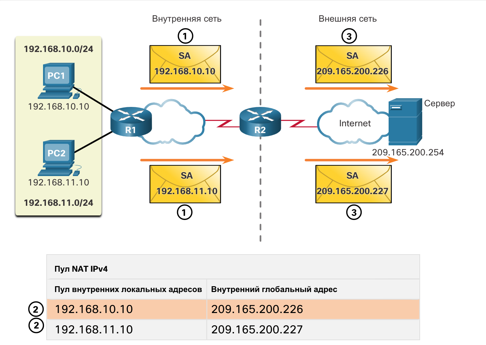

<!-- 6.5.1 -->
## Динамический сценарий NAT

В этом разделе вы узнаете, как настроить и проверить динамический NAT. Включает задание в Packet Tracer для проверки ваших навыков и знаний. В то время как статическое преобразование NAT обеспечивает постоянное соответствие между внутренним локальным адресом и внутренним глобальным адресом, динамическое преобразование NAT поддерживает автоматическое сопоставление внутренних локальных адресов внутренним глобальным адресам. Эти внутренние глобальные адреса обычно являются публичными IPv4-адресами. Для динамического NAT, как и для статического NAT, требуется настройка внутреннего и внешнего интерфейсов, участвующих в преобразовании NAT с использованием команд **ip nat inside** и **ip nat outside**. Однако если статическое преобразование NAT создает постоянное сопоставление с одним адресом, для динамического NAT используется пул адресов.

В примере топологии, показанном на рисунке, внутренняя сеть использует адреса из пространства частных адресов, определенного в RFC 1918. К маршрутизатору R1 подключены две локальных сети — 192.168.10.0/24 и 192.168.11.0/24. Граничный маршрутизатор R2 настроен на динамическое преобразование NAT с использованием пула публичных IPv4-адресов от 209.165.200.226 до 209.165.200.240.


<!-- /courses/ensa-dl/ae8e8c86-34fd-11eb-ba19-f1886492e0e4/aeb54e62-34fd-11eb-ba19-f1886492e0e4/assets/c63964c1-1c46-11ea-af56-e368b99e9723.svg -->

<!--
На рисунке изображен перевод «один к одному» для NAT. Два компьютера во внутренней сети подключены к маршрутизатору R1 в двух сетях 192.168.10.0/24 и 192.168.11.0/24. Один компьютер — адрес 192.168.101.0, а другой — 192.168.11.10. R1 подключается через соединение S0/1/0 к маршрутизатору R2. R2 затем подключается через S0/1/1 к Интернету и серверу с адресом 209.165.200.254. Динамический NAT используется для преобразования между внутренней и внешней сетью через R2.
-->

Пул публичных IPv4-адресов (внутренний пул глобальных адресов) доступен любому устройству во внутренней сети по принципу очереди («первым пришел — первым обслужили»). При динамическом преобразовании NAT один внутренний адрес преобразуется в один внешний адрес. Для этого типа преобразования в пуле должно быть достаточно адресов, чтобы охватить все внутренние устройства, которым требуется параллельный доступ к внешней сети. Если использованы все адреса пула, устройство должно дождаться доступного адреса, чтобы получить доступ к внешней сети.

**Примечание**: Преобразование между публичными и частными IPv4-адресами является самым распространенным применением NAT. Тем не менее, преобразования NAT могут возникать между парами IPv4-адресов.

<!-- 6.5.2 -->
## Настройка динамического преобразования NAT

На рисунке показан пример топологии, где конфигурация NAT позволяет выполнять преобразование для всех узлов в сети 192.168.0.0/16. Это включает в себя сети 192.168.10.0 и 192.168.11.0, когда узлы генерируют трафик, входящий в интерфейс S0/1/0 и выходящий из S0/1/1. Внутренние локальные адреса этих узлов преобразуются в доступный адрес из пула в диапазоне от 209.165.200.226 до 209.165.200.240.


<!-- /courses/ensa-dl/ae8e8c86-34fd-11eb-ba19-f1886492e0e4/aeb54e62-34fd-11eb-ba19-f1886492e0e4/assets/c63a2812-1c46-11ea-af56-e368b99e9723.svg -->

<!--
На рисунке изображен перевод «один к одному» для NAT. Два компьютера во внутренней сети подключены к маршрутизатору R1 в двух сетях 192.168.10.0/24 и 192.168.11.0/24. Один компьютер — адрес 192.168.101.0, а другой — 192.168.11.10. R1 подключается через соединение S0/1/0 к маршрутизатору R2. R2 затем подключается через S0/1/1 к Интернету и серверу с адресом 209.165.200.254. Динамический NAT используется для преобразования между внутренней и внешней сетью через R2. Рисунок демонстрирует, как настроить статический NAT.
-->

**Шаг 1**

С помощью команды **ip nat pool** определите пул адресов, которые будут использоваться для преобразования. Данный пул адресов обычно является группой публичных адресов. Эти адреса определяются с помощью указания начального и конечного IPv4-адресов пула. Ключевое слово **netmask** или **prefix-length** указывает, какие биты адреса относятся к сети, а какие — к диапазону адресов узлов.

В этом сценарии определите пул публичных адресов IPv4 под именем пула NAT-POOL1.

```
R2(config)# ip nat pool NAT-POOL1 209.165.200.226 209.165.200.240 netmask 255.255.255.224
```

**Шаг 2**

Настройте стандартный ACL, чтобы определить (разрешить) только те адреса, которые должны быть преобразованы. Список контроля доступа со слишком большим количеством разрешающих инструкций может привести к непредсказуемым результатам. Помните, что в конце каждого ACL подразумевается строка **deny all**.

В сценарии определите, какие адреса могут быть преобразованы.

```
R2(config)# access-list 1 permit 192.168.0.0 0.0.255.255
```

**Шаг 3**

Привяжите ACL к пулу, используя следующий синтаксис команды:

Router(config)# **ip nat inside source list** {_access-list-number_ | _access-list-name_} **pool** _pool-name_

Эта настройка используется маршрутизатором, чтобы определить, какие устройства (**list**) получают какие адреса (**pool**). В этом случае привязать NAT-POOL1 с ACL 1.

```
R2(config-if)# ip nat inside source list 1 pool NAT-POOL1
```

**Шаг 4**

Определите интерфейсы, являющиеся внутренними по отношению к NAT, т.е. все интерфейсы, подключенные к внутренней сети.

Устанавите интерфейс serial 0/1/0 в качестве внутреннего интерфейса NAT.

```
R2(config)# interface serial 0/1/0 
R2(config-if)# ip nat inside
```

**Шаг 5**

Определите интерфейсы, являющиеся внешними по отношению к NAT, т.е. все интерфейсы, подключенные к внешней сети.

Устанавите интерфейс serial 0/1/1 в качестве внешнего интерфейса NAT.

```
R2(config)# interface serial 0/1/1
R2(config-if)# ip nat outside
```

<!-- 6.5.3 -->
## Анализ динамического NAT

На следующих приведенных двух рисунках показан процесс динамического преобразования NAT между двумя клиентами и веб-сервером с использованием предыдущей настройки.

На рисунке ниже показан поток трафика от внутренней сети к внешней.


<!-- /courses/ensa-dl/ae8e8c86-34fd-11eb-ba19-f1886492e0e4/aeb54e62-34fd-11eb-ba19-f1886492e0e4/assets/c63b6090-1c46-11ea-af56-e368b99e9723.svg -->

1.  Узлы с IPv4-адресами источника 192.168.10.10 (PC1) и 192.168.11.10 (PC2) отправляют пакеты, запрашивающие подключение к серверу на публичный IPv4-адрес 209.165.200.254.
2.  Маршрутизатор R2 получает первый пакет от узла 192.168.10.10. Поскольку этот пакет был получен на интерфейс, настроенный как внутренний интерфейс NAT, R2 проверяет конфигурацию NAT, чтобы определить, следует ли выполнять преобразование для данного пакета. ACL разрешает этот пакет, поэтому R2 выполняет его преобразование. Маршрутизатор R2 проверяет свою таблицу NAT. Поскольку для данного IPv4-адреса нет записей преобразования, R2 решает, что для адреса источника 192.168.10.10 требуется преобразование. Маршрутизатор R2 выбирает доступный глобальный адрес из динамического пула адресов и создает запись преобразования — 209.165.200.226. Первоначальный IPv4-адрес источника 192.168.10.10 — это внутренний локальный адрес, а используемый для преобразования адрес — это внутренний глобальный адрес 209.165.200.226 в таблице NAT. R2 повторяет процедуру для второго узла, 192.168.11.10, выбирая следующий доступный глобальный адрес из динамического пула адресов и создавая вторую запись преобразования, 209.165.200.227.
3.  R2 заменяет внутренний локальный адрес источника ПК 1 (192.168.10.10) используемым для преобразования внутренним глобальным адресом (209.165.200.226) и пересылает пакет. Те же действия выполняются для пакета, отправленного ПК 2, с использованием для преобразования адреса, соответствующего 209.165.200.227.

<!--
На рисунке изображено преобразование «один к одному». Два компьютера во внутренней сети подключены к маршрутизатору R1 в двух сетях 192.168.10.0/24 и 192.168.11.0/24. Один компьютер — адрес 192.168.101.0, а другой — 192.168.11.10. R1 подключается через соединение S0/1/0 к маршрутизатору R2. R2 затем подключается через S0/1/1 к Интернету и серверу с адресом 209.165.200.254. Динамический NAT используется для преобразования между внутренней и внешней сетью через R2.
-->

<!-- 6.5.4 -->
## Анализ динамического NAT 

На рисунке ниже показана оставшаяся часть потока трафика между клиентами и сервером из внешнего во внутреннее направление.


<!-- /courses/ensa-dl/ae8e8c86-34fd-11eb-ba19-f1886492e0e4/aeb54e62-34fd-11eb-ba19-f1886492e0e4/assets/c63baeb3-1c46-11ea-af56-e368b99e9723.svg -->

4.  Сервер получает пакет от ПК 1 и отвечает, используя IPv4-адрес назначения 209.165.200.226. Получив второй пакет, сервер отвечает ПК 2, используя IPv4-адрес назначения 209.165.200.227.
5.  (a) Получив пакет с IPv4-адресом назначения 209.165.200.226, маршрутизатор R2 выполняет поиск в таблице NAT. С помощью сопоставления из таблицы маршрутизатор R2 выполняет преобразование адреса обратно во внутренний локальный адрес 192.168.10.10 и пересылает пакет ПК 1. 
    (b) Получив пакет с IPv4-адресом назначения 209.165.200.227, маршрутизатор R2 выполняет поиск в таблице NAT. С помощью сопоставления из таблицы маршрутизатор R2 выполняет преобразование адреса обратно во внутренний локальный адрес 192.168.11.10 и пересылает пакет ПК 2.
6.  ПК 1 с адресом 192.168.10.10 и ПК 2 с адресом 192.168.11.10 получают пакеты и продолжают диалог. Маршрутизатор NAT выполняет шаги 2-5 для каждого пакета (шаг 6 не приводится на рисунках).

<!--
На рисунке изображено преобразование «один к одному». Два компьютера во внутренней сети подключены к маршрутизатору R1 в двух сетях 192.168.10.0/24 и 192.168.11.0/24. Один компьютер — адрес 192.168.101.0, а другой — 192.168.11.10. R1 подключается через соединение S0/1/0 к маршрутизатору R2. R2 затем подключается через S0/1/1 к Интернету и серверу с адресом 209.165.200.254. Динамический NAT используется для преобразования между внутренней и внешней сетью через R2.
-->

<!-- 6.5.5 -->
## Проверка динамического NAT

Команда **show ip nat translations** отображает все настроенные статические преобразования адресов и все динамические преобразования, созданные в результате обработки трафика.

```
R2# show ip nat translations
Pro Inside global      Inside local       Outside local      Outside global
--- 209.165.200.228    192.168.10.10      ---                ---
--- 209.165.200.229    192.168.11.10      ---                ---
R2#
```

Добавление ключевого слова **verbose** выводит дополнительную информацию о каждом преобразовании, включая время, прошедшее после создания и использования записи.

```
R2# show ip nat translation verbose
Pro Inside global      Inside local       Outside local      Outside global
tcp 209.165.200.228    192.168.10.10      ---                ---
    create 00:02:11, use 00:02:11 timeout:86400000, left 23:57:48, Map-Id(In): 1, 
    flags: 
none, use_count: 0, entry-id: 10, lc_entries: 0
tcp 209.165.200.229    192.168.11.10      ---                ---
    create 00:02:10, use 00:02:10 timeout:86400000, left 23:57:49, Map-Id(In): 1, 
    flags: 
none, use_count: 0, entry-id: 12, lc_entries: 0
R2#
```

По умолчанию срок действия записей преобразования истекает через 24 часа, если настройка таймеров не была изменена с помощью команды режима глобальной конфигурации **ip nat translation timeout** _timeout-seconds_

Для удаления динамических записей до истечения их времени действия используйте команду привилегированного режима EXEC **clear ip nat translation**.

```
R2# clear ip nat translation *
R2# show ip nat translation
```

При проведении проверки настройки NAT рекомендуется удалять динамические записи. Как показано в таблице, команду **clear ip nat translation** можно использовать с ключевыми словами и переменными, чтобы определить удаляемые записи. Удаление конкретных записей нужно для того, чтобы не нарушить работу активных сеансов. Для удаления всех преобразований из таблицы используйте команду привилегированного режима EXEC  **clear ip nat translation \*** 

| **Команда** | **Описание** |
| --- | --- |
| **clear ip nat translation \*** | Удаляет все записи динамического преобразования из таблицы преобразования NAT. |
| **clear ip nat translation inside** *global-ip local-ip* [**outside** *local-ip global-ip*] | записи преобразовния, которые содержат преобразование внутренних адресов или преобразования и внешних, и внутренних адресов |
| **clear ip nat translation** *protocol* **inside** *global-ip global-port local-ip local-port* [**outside** *local-ip local-port global-ip global-port*] | Удаляет расширенную запись динамического преобразования. |

**Примечание**:  Из таблицы удаляются только динамические преобразования. Статические адреса нельзя убрать из таблицы преобразований.

Еще одна полезная команда **show ip nat statistics**, которая выводит сведения о суммарном количестве активных преобразований, параметрах настройки NAT, числе адресов в пуле и числе выделенных адресов.

```
R2# show ip nat statistics 
Total active translations: 4 (0 static, 4 dynamic; 0 extended)
Peak translations: 4, occurred 00:31:43 ago
Outside interfaces:
  Serial0/1/1
Inside interfaces: 
  Serial0/1/0
Hits: 47  Misses: 0
CEF Translated packets: 47, CEF Punted packets: 0
Expired translations: 5
Dynamic mappings:
-- Inside Source
[Id: 1] access-list 1 pool NAT-POOL1 refcount 4
 pool NAT-POOL1: netmask 255.255.255.224
	start 209.165.200.226 end 209.165.200.240
	type generic, total addresses 15, allocated 2 (13%), misses 0
(output omitted)
R2#
```

В качестве альтернативы можно воспользоваться командой **show running-config** или найти команды NAT, ACL, интерфейса или пула с нужными значениями. Внимательно изучите результаты и исправьте все обнаруженные ошибки. В примере показана конфигурация пула NAT.

```
R2# show running-config | include NAT
ip nat pool NAT-POOL1 209.165.200.226 209.165.200.240 netmask 255.255.255.224
ip nat inside source list 1 pool NAT-POOL1
```

<!-- 6.5.6 -->
## Работа в симуляторе: Настройка динамического NAT

В рамках данного упражнения Packet Tracer необходимо решить следующие задачи:

* Настройка динамического преобразования NAT
* Проверьте реализацию NAT

[Настройка динамического NAT (pdf)](./assets/6.5.6-packet-tracer---configure-dynamic-nat_ru-RU.pdf)

[Настройка динамического NAT (pka)](./assets/6.5.6-packet-tracer---configure-dynamic-nat_ru-RU.pka)

