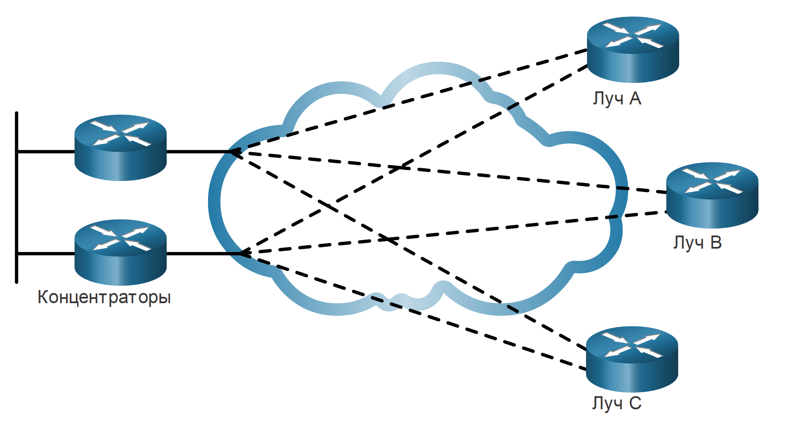
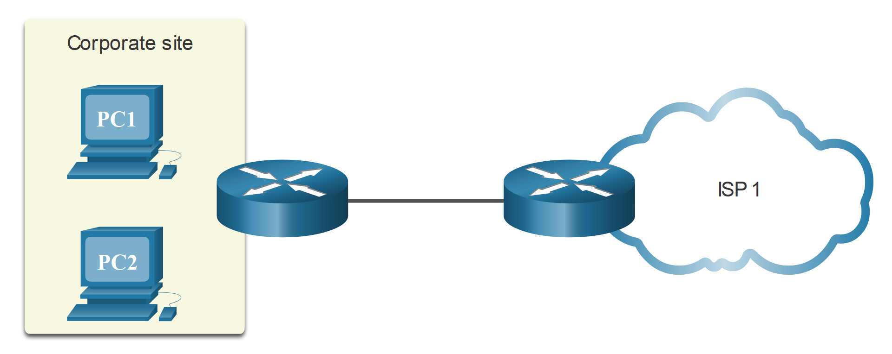
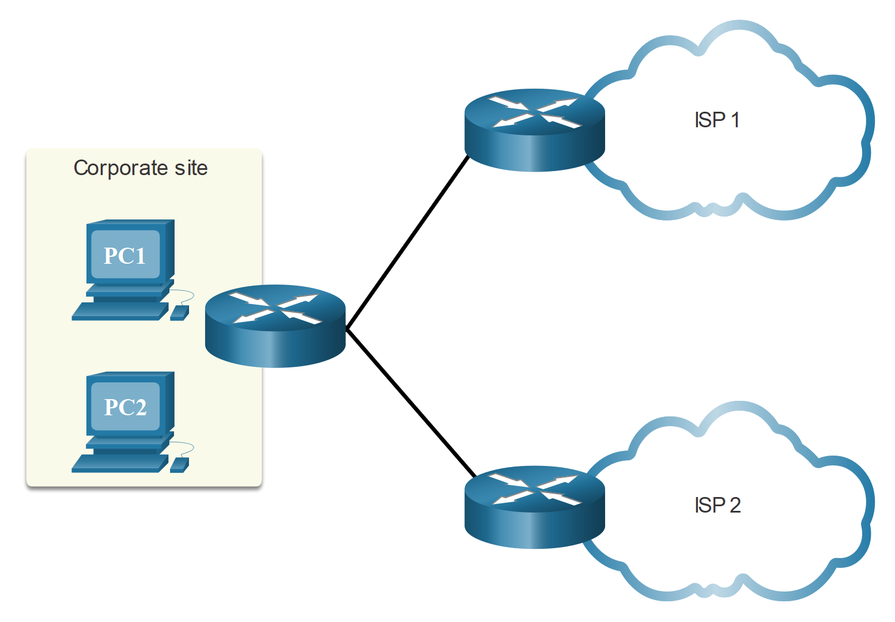
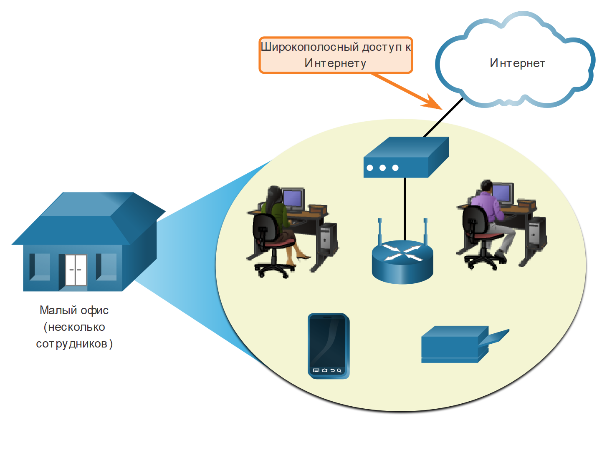
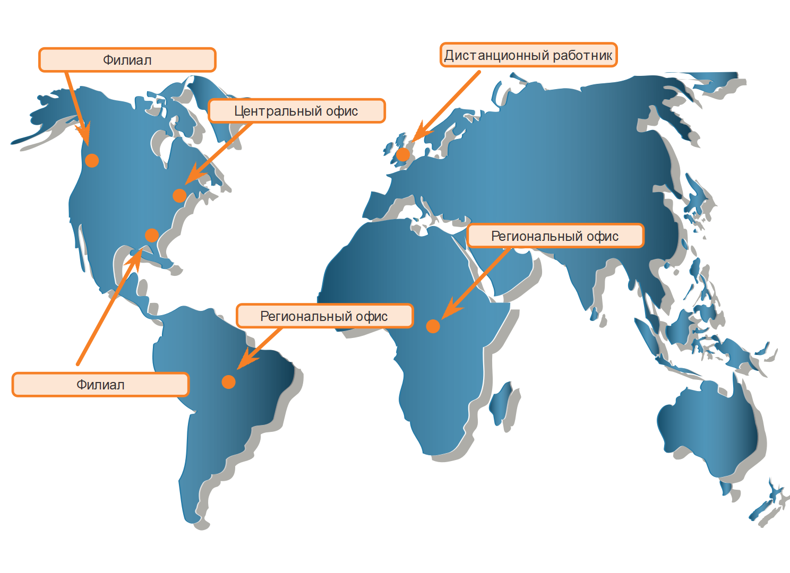

<!-- 7.1.1 -->
## Сети LAN и WAN

На работе или дома мы все используем локальные сети (LAN). Однако локальные сети ограничены небольшим географическим районом.

Для подключения за пределами локальной сети требуется глобальная сеть (WAN). WAN — это телекоммуникационная сеть, которая охватывает относительно большой географический район. Глобальная сеть работает за пределами географической области сети LAN.

На рисунке, службы WAN необходимы для подключения корпоративной сети кампуса к удаленным локальным сетям на филиалах, узлах телекоммутеров и удаленных пользователях.

<!-- /courses/ensa-dl/ae8e8c88-34fd-11eb-ba19-f1886492e0e4/aeb57574-34fd-11eb-ba19-f1886492e0e4/assets/c6476e81-1c46-11ea-af56-e368b99e9723.svg -->

<!--
показывает схему корпоративного кампуса с несколькими зданиями, маршрутизаторами, коммутаторами и сетями, подключенными к глобальной сети Интернет, которая затем подключается к различным удаленным сайтам и пользователям
-->

В таблице показаны различия между LAN и WAN.

| **Локальные сети (LAN)** | **Глобальные сети (WAN)** |
| --- | --- |
| LAN предоставляют сетевые услуги в пределах небольшой географической зоны (например, домашняя сеть, офисная сеть, сеть здания или кампусная сеть). | WAN предоставляют сетевые услуги в крупных географических районах (например, и между городами, странами и континентами). |
| LAN используются для соединения локальных компьютеров, периферийных устройств и других Meraki. | WAN используются для соединения удаленных пользователей, сетей и сайтов. |
| LAN принадлежит и управляется организацией или домашним пользователем. | WAN принадлежат и управляются провайдерами интернет-сервисов, телефонии, провадной и спутниковой связи. |
| За исключением расходов на сетевую инфраструктуру, не нужно платить за использование LAN. | Услуги WAN предоставляются за отдельную плату. |
| LAN обеспечивают высокую пропускную способность благодаря проводным сетям Ethernet и Wi-Fi сервисам. | Поставщики WAN предлагают низко- и высокоскоростную полосу пропускания на больших расстояниях с использованием сложных физических сетей. |

<!-- 7.1.2 -->
## Частные и общественные WAN

WAN могут создаваться различными типами организаций, а именно:

* Организация, которая хочет подключить пользователей в разных местах
* Интернет-провайдер, который хочет подключить клиентов к Интернету
* Интернет-провайдер или телекоммуникации, которые хотят соединить Интернет-провайдеров

Частная WAN — это соединение, предназначенное для одного клиента. Это предусматривает следующее:

* Гарантированный уровень обслуживания
* Согласованная полоса пропускания
* Безопасность

Общедоступная WAN связь обычно предоставляется провайдером услуг Интернета или провайдером телекоммуникационных услуг, использующим Интернет. В этом случае уровни обслуживания и пропускная способность могут отличаться, а общие подключения не гарантируют безопасности.

<!-- 7.1.3 -->
## Топологии глобальных сетей (WAN)

Физические топологии описывают инфраструктуру физической сети, используемую данными при переходе от источника к месту назначения. Физическая топология WAN, используемая в WAN, является сложной и по большей части неизвестной пользователям. Рассмотрим пользователя в Нью-Йорке, США, устанавливающего видеоконференцию с пользователем в Токио, Япония. Помимо подключения пользователя к Интернету в Нью-Йорке, было бы нецелесообразно определить все фактические физические соединения, необходимые для поддержки видеозвонка.

Вместо этого топологии WAN описываются с помощью логической топологии. Логические топологии описывают виртуальное соединение между источником и пунктом назначения. Например, видеоконференция между пользователем в Нью-Йорке и Японии будет логичным соединением «точка-точка».

WAN реализованы с использованием следующих логических схем топологии:

* Топология «точка-точка» (Point-to-Point)
* Топология типа «звезда» (Hub-and-Spoke)
* Топология с двумя интерфейсами (Dual-homed)
* Полносвязная топология (Fully Meshed)
* Частичносвязанная топология топология (Partially Meshed)

**Примечание**: Большие сети обычно развертывают комбинацию этих топологий.

**Двухточечная топология**

В топологии типа «точка-точка», как показано на рисунке, используется прямой канал между двумя оконечными устройствами.

Связь «точка-точка» часто включает выделенные, арендованные линии подключения от корпоративной точки на границе сети к сетям поставщика. Для соединения «точка-точка» обычно используется транспортный сервис уровня 2 в сети оператора связи. Пакеты, отправленные с одного узла, доставляются на другой узел и наоборот. Соединение «точка-точка» прозрачно для сети клиентов. Кажется, что существует прямая физическая связь между двумя конечными точками.

Если требуется много соединений «точка-точка», то такое решение может стать дорогостоящим.

<!-- /courses/ensa-dl/ae8e8c88-34fd-11eb-ba19-f1886492e0e4/aeb57574-34fd-11eb-ba19-f1886492e0e4/assets/c64831d2-1c46-11ea-af56-e368b99e9723.svg -->

<!--
На рисунке показано облако с подключением «точка-точка» через облако от площадки A до площадки B.
-->

**Топология типа «звезда»**

В топология типа «звезда» один интерфейс на маршрутизаторе-концентраторе может совместно использоваться всеми соединениями-лучами. Например, конечные маршрутизаторы могут быть связаны между собой через концентратор посредством виртуальных соединений и маршрутизируемых подинтерфейсов. На рисунке показан пример топологии типа «звезда» с тремя маршрутизаторами: центральный маршрутизатор соединен через облако WAN.

Топология типа «звезда»— пример опологии с одним подключением (single-homed). Существует только один маршрутизатор концентратора, и вся связь должна проходить через него. Таким образом, оконечные маршрутизаторы могут взаимодействовать друг с другом только через маршрутизатор концентратора. Следовательно, маршрутизатор концентратора представляет собой единую точку отказа. В этом слкчае связь между лучами также не пропадет.

<!-- /courses/ensa-dl/ae8e8c88-34fd-11eb-ba19-f1886492e0e4/aeb57574-34fd-11eb-ba19-f1886492e0e4/assets/c64858e4-1c46-11ea-af56-e368b99e9723.svg -->

<!--
На рисунке показано облако с маршрутизатором концентратора на одной площадке, который подключается отдельно к трем маршрутизаторам: Spoke A, Spoke B и Spoke C через облако.
-->

**Топология с двумя интерфейсами (Dual-homed)**

Топология с двумя подключениями обеспечивает резервирование. На рисунке показаны два центральных маршрутизатора, которые имеют два подключения и резервированные соединения с тремя лучевыми маршрутизаторами через облако WAN.

Преимуществом топологии с двумя интерфейсами является то, что она предлагает расширенное резервирование сети, распределение нагрузки, распределенные вычисления и обработку, а также возможность реализации резервных подключений оператора связи.

Недостатком топологии с двумя интерфейсами является то, что ее внедрение обходится дороже, чем развертывание топологии с одним интерфейсом. Это связано с тем, что для топологии с двумя интерфейсами требуется дополнительное сетевое оборудование, например дополнительные маршрутизаторы и коммутаторы. Внедрение топологий с двумя интерфейсами является более трудоемким, поскольку они требуют дополнительной и более сложной настройки.

<!-- /courses/ensa-dl/ae8e8c88-34fd-11eb-ba19-f1886492e0e4/aeb57574-34fd-11eb-ba19-f1886492e0e4/assets/c648a701-1c46-11ea-af56-e368b99e9723.svg -->

<!--
На рисунке показана топология с двумя узлами, облако с двумя узловыми маршрутизаторами на одной площадке, каждый из которых подключается отдельно к трем оконечным маршрутизаторам: Spoke A, Spoke B и Spoke C через облако. 
-->

**Полносвязная топология (Fully Meshed)**

Полносвязная топология использует несколько виртуальных каналов для подключения всех площадок, как показано на рисунке.

Это наиболее отказоустойчивая топология из пяти показанных. Например, если узел B потерял связь с сайтом A, он может отправить данные либо через сайт C, либо через сайт D.

<!-- /courses/ensa-dl/ae8e8c88-34fd-11eb-ba19-f1886492e0e4/aeb57574-34fd-11eb-ba19-f1886492e0e4/assets/c6491c30-1c46-11ea-af56-e368b99e9723.svg -->

<!--
На рисунке показаны 4 маршрутизатора: сайт A, сайт B, сайт C и сайт D. Каждый маршрутизатор подключается ко всем трем другим маршрутизаторам через облако.
-->

**Частичносвязанная топология топология (Partially Meshed)**

Частичносвязанная топология предоставляет  больше соединений чем звезда, но меньше чем полносвязанная. Например, на рисунке участки A, B, C все еще в полносвязанной топологии. Участок D должен быть подключен к площадке A, чтобы достичь площадок B и C.

<!-- /courses/ensa-dl/ae8e8c88-34fd-11eb-ba19-f1886492e0e4/aeb57574-34fd-11eb-ba19-f1886492e0e4/assets/c6499161-1c46-11ea-af56-e368b99e9723.svg -->

<!--
На рисунке показаны 4 маршрутизатора: сайт A, сайт B, сайт C и сайт D. Маршрутизаторы подключаются к другим маршрутизаторам через облако, но не ко всем маршрутизаторам. 
-->

<!-- 7.1.4 -->
## Оператор связи 

Еще один аспект проектирования WAN заключается в том, как организация подключается к Интернету. Организация обычно подписывает соглашение об уровне обслуживания (SLA) с поставщиком услуг. Соглашение об уровне обслуживания описывает ожидаемые услуги, связанные с надежностью и доступностью подключения. Поставщик услуг может быть, а может и не может быть фактическим оператором связи. Оператор связи владеет и поддерживает физическую связь и оборудование между поставщиком и клиентом. Как правило, организация выбирает подключение  к WAN между  однокональным или многоканальным.

**WAN-соединение с одним каналом (Single-carrier)**

Подключение с одним каналом  — это когда организация подключается только к одному поставщику услуг, как показано на рисунке. Соглашение об уровне обслуживания согласовывается между организацией и поставщиком услуг. Недостатком этой модели  является то, что соединение оператора связи и поставщика услуг являются едиными точками отказа. Подключение к Интернету будет потеряно в случае сбоя канала связи оператора или маршрутизатора поставщика.

<!-- /courses/ensa-dl/ae8e8c88-34fd-11eb-ba19-f1886492e0e4/aeb57574-34fd-11eb-ba19-f1886492e0e4/assets/c64a2da2-1c46-11ea-af56-e368b99e9723.svg -->

<!--
На рисунке показан маршрутизатор корпоративной площадки, подключающийся к маршрутизатору ISP. 
-->

**WAN-соединение с двумя каналами (Dual-carrier)**

Соединение с двумя каналами обеспечивает избыточность и повышает доступность сети, как показано на рисунке. Организация согласовывает отдельные соглашения об уровне обслуживания с двумя различными поставщиками услуг. Организация должна обеспечить, чтобы оба поставщика использовали разных операторов связи. Несмотря на то, что реализация этого подключения является более дорогостоящим, второе подключение может использоваться для резервирования. Он также может быть использован для повышения производительности сети и балансировки нагрузки интернет-трафика.

<!-- /courses/ensa-dl/ae8e8c88-34fd-11eb-ba19-f1886492e0e4/aeb57574-34fd-11eb-ba19-f1886492e0e4/assets/c64a7bc2-1c46-11ea-af56-e368b99e9723.svg -->

<!--
На рисунке показан маршрутизатор корпоративной площадки, подключенный отдельно к двум различным маршрутизаторам ISP.
-->

<!-- 7.1.5 -->
## Развивающиеся сети

Требования компании к сети могут значительно изменяться по мере роста компании с течением времени. Распределение сотрудников экономит расходы во многих отношениях, но и создает повышенные требования к сети. Сеть не только должна удовлетворять повседневные рабочие потребности предприятия, но должна быть способна адаптироваться и развиваться по мере изменения компании. В связи с этим на плечи проектировщиков и администраторов ложится задача тщательного отбора наиболее подходящих сетевых технологий, протоколов и операторов связи. Кроме того, сети требуют постоянной оптимизации, которая выполняется с использованием архитектур и методов проектирования сетей, рассматриваемых в этом курсе.

Чтобы проиллюстрировать различия между размерами сети, мы будем использовать фиктивную компанию SPAN Engineering, поскольку она растет из небольшого местного бизнеса в глобальное предприятие. SPAN Engineering, экологическая консультационная фирма, разработала специальный процесс преобразования бытовых отходов в электроэнергию и разворачивает в своей географической области небольшой пилотный проект для местного органа власти.

**Небольшая  сеть**

Первоначально компания состояла из 15 сотрудников, работающих в небольшом офисе, как показано на рисунке.

Они использовали одну локальную сеть, подключенную к беспроводному маршрутизатору для совместного использования данных и периферийных устройств. Услуга доступа к Интернету предоставляется местным оператором телефонной связи на базе распространенной широкополосной технологии DSL (Digital Subscriber Line). Для поддержки своих ИТ-требований они заключили контракт на предоставление услуг у поставщика DSL.

<!-- /courses/ensa-dl/ae8e8c88-34fd-11eb-ba19-f1886492e0e4/aeb57574-34fd-11eb-ba19-f1886492e0e4/assets/c64af0f4-1c46-11ea-af56-e368b99e9723.svg -->

<!--
На рисунке показан небольшой офис, состоящий из беспроводного маршрутизатора, принтера, трех пользователей компьютера и модема с широкополосным доступом в Интернет.
-->

**Сеть комплекса зданий**

В течение нескольких лет компания выросла и потребовала нескольких этажей здания, как показано на рисунке.

Теперь компания нуждается в сети кампуса (CAN). CAN соединяет несколько локальных сетей в пределах ограниченной географической зоны. Для сегментации различных отделов, подключающихся к нескольким коммутаторам в сетевой среде кампуса, требуется несколько локальных сетей.

В состав сети входят выделенные серверы для электронной почты, передачи данных и хранения файлов, а также работающие на основе веб-технологий средства и приложения для повышения производительности. Брандмауэр обеспечивает доступ в Интернет для корпоративных пользователей. Теперь на предприятии работают ИТ-специалисты, поддерживающие работу сети и выполняющие ее техническое обслуживание.

<!-- /courses/ensa-dl/ae8e8c88-34fd-11eb-ba19-f1886492e0e4/aeb57574-34fd-11eb-ba19-f1886492e0e4/assets/c64b3f10-1c46-11ea-af56-e368b99e9723.svg -->

<!--
На рисунке показан многоэтажный дизайн бизнес-городка с несколькими маршрутизаторами, коммутаторами, точками беспроводного доступа и устройствами конечных точек, которые подключаются к Интернету через брандмауэр маршрутизатора.
-->

**Сеть филиала**

Несколько лет спустя компания расширила и добавила филиал в городе, а также удаленные и региональные сайты в других городах, как показано на рисунке.

В настоящее время компании требуется сеть  (MAN) для объединения объектов в пределах города. MAN больше локальной сети, но меньше глобальной сети.

В филиалах в ближайших городах используются частные выделенные линии, предоставляемые местным оператором связи. Офисы в других городах и странах нуждаются в услугах глобальной сети или могут использовать интернет-сервисы для подключения удаленных местоположений. Хотя установление связи между офисами с использованием Интернета экономично, этот вариант влечет за собой риски, связанные с безопасностью и конфиденциальностью, и подразделению ИТ предстоит заняться этими вопросами.

<!-- /courses/ensa-dl/ae8e8c88-34fd-11eb-ba19-f1886492e0e4/aeb57574-34fd-11eb-ba19-f1886492e0e4/assets/c64bb440-1c46-11ea-af56-e368b99e9723.svg -->

<!--
На рисунке показана сеть филиалов, состоящая из центрального офиса, филиала, удаленного офиса и регионального офиса, которые взаимосвязаны через облако глобальной сети.
-->

**Распределенная сеть**

Теперь компания SPAN Engineering существует уже 20 лет, и ее штат вырос до тысяч сотрудников, работающих в офисах по всему миру, как показано на рис. 1.

Для повышения производительности и сокращения затрат используются веб-приложения, включая веб-конференции, электронное обучение и средства для совместной работы через Интернет. Виртуальные частные сети (VPN) межфилиального типа и с удаленным доступом позволяют компании использовать Интернет для удобной и безопасной связи с сотрудниками и производственными объектами по всему миру.

<!-- /courses/ensa-dl/ae8e8c88-34fd-11eb-ba19-f1886492e0e4/aeb57574-34fd-11eb-ba19-f1886492e0e4/assets/c64c0264-1c46-11ea-af56-e368b99e9723.svg -->

<!--
На рисунке показана международная компания с распределенной сетью, которая пересекает национальные границы и континенты.
-->

<!-- 7.1.6 -->
<!-- quiz -->

