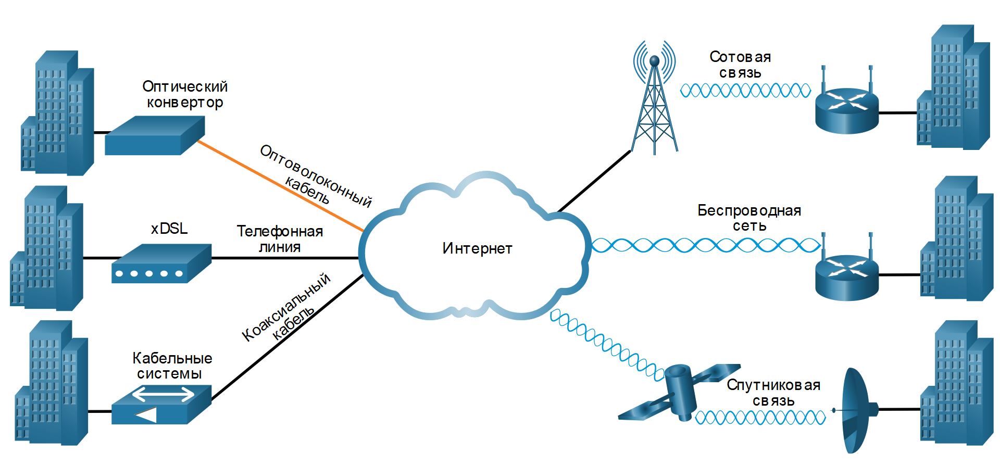

<!-- 7.4.1 -->
## Современные WAN

Современные WANS имеют больше возможностей подключения, чем традиционные WAN. Предприятиям теперь требуются более быстрые и гибкие варианты подключения к глобальной сети. Традиционные варианты подключения к глобальной сети быстро сокращаются, поскольку они либо больше не доступны, либо являются слишком дорогостоящими, либо имеют ограниченную полосу пропускания.

На рисунке показаны локальные  петли, наиболее вероятно встречающиеся сегодня.

<!-- /courses/ensa-dl/ae8e8c88-34fd-11eb-ba19-f1886492e0e4/aeb5757a-34fd-11eb-ba19-f1886492e0e4/assets/c6577412-1c46-11ea-af56-e368b99e9723.svg -->

<!--
На рисунке показано, что современное подключение WAN состоит из подключения к сети Интернет через сотовую, беспроводную, спутниковую, оптоволоконную, телефонную линию и коаксиальный кабель
-->

<!-- 7.4.2 -->
## Современные варианты подключения WAN

Постоянно появляются новые технологии. На рисунке представлены современные варианты подключения к глобальной сети.

<!-- /courses/ensa-dl/ae8e8c88-34fd-11eb-ba19-f1886492e0e4/aeb5757a-34fd-11eb-ba19-f1886492e0e4/assets/c657e943-1c46-11ea-af56-e368b99e9723.svg -->

<!--
На рисунке показаны современные варианты подключения к глобальной сети, такие как выделенные, коммутируемые и интернет-проводные и беспроводные услуги, такие как темное волокно, MPLS, xDSL и муниципальный Wi-Fi соответственно
-->

**Выделенный широкополосный доступ**

В конце 1990-х годов многие телекоммуникационные компании построили оптоволоконные сети с достаточным количеством волокна для удовлетворения прогнозируемых потребностей следующего поколения. Тем не менее, были разработаны оптические технологии, такие как мультиплексирование длины волны (WDM), что значительно увеличило передающую способность одного  оптического волокна. Следовательно, многие волоконно-оптические кабели не используются. Волоконно-оптический кабель, который не используется, и поэтому «неосвещенный» (т.е. темный) называется темным волокном.

Волоконно может устанавливаться организацией независимо для непосредственного подключения удаленных местоположений. Тем не менее, темное волокно также может быть арендовано или приобретено у поставщика. Аренда темного волокна обычно дороже, чем любой другой вариант глобальной сети, доступный сегодня. Тем не менее, он обеспечивает максимальную гибкость, контроль, скорость и безопасность.

**Пакетная коммутация**

Доступны два варианта сети WAN с коммутацией пакетов.

Достижения в технологии Ethernet LAN позволили расширить ее охват в области MAN и WAN. Metro Ethernet обеспечивает высокоскоростные каналы связи и отвечает за замену многих традиционных вариантов подключения WAN.

Многопротокольная коммутация меток (MPLS) позволяет сети поставщика глобальной сети передавать любой протокол (например, пакеты IPv4, пакеты IPv6, Ethernet, DSL) в качестве данных полезной нагрузки. Это позволяет различным площадкам подключаться к сети провайдера независимо от технологий доступа.

**Широкополосный доступ в Интернет**

В настоящее время организации обычно используют глобальную интернет-инфраструктуру для подключения к глобальной сети. Для решения проблем безопасности варианты подключения часто комбинируются с технологиями VPN.

Допустимые параметры сети WAN включают цифровую абонентскую линию (DSL), кабель, беспроводную связь и оптоволоконную связь.

**Примечание:** Существует несколько вариантов подключения для получения доступа к глобальной сети, которые интернет-провайдеры могут использовать для подключения местной сети к границе предприятия. Эти варианты доступа к глобальной сети различаются по технологии, скорости и стоимости. Каждый из них имеет свои преимущества и недостатки. Знакомство с этими технологиями является важным этапом проектирования сети.

<!-- 7.4.3 -->
## WAN на основе Ethernet

Ethernet изначально была разработана как технология доступа к локальной сети и не подходит в качестве технологии доступа к глобальной сети из-за ограниченного расстояния, обеспечиваемого медными носителями.

Однако со временем появились новые стандарты Ethernet на основе оптоволоконного кабеля, вполне подходящие для сетей WAN. В частности, стандарты IEEE 1000BASE-LX и IEEE 1000BASE-ZX предусматривают поддержку оптоволоконных кабелей длиной до 5 и 70 км соответственно.

В настоящее время поставщики услуг предлагают сервис WAN на основе Ethernet с подключением по оптоволоконному кабелю. Служба Ethernet WAN может использоваться многими именами, включая следующие:

* Metropolitan Ethernet (Metro E) 
* Ethernet over MPLS (EoMPLS)
* Служба виртуальной локальной частной сети (VPLS)

На рисунке показан пример простой топологии Metro Ethernet.

<!-- /courses/ensa-dl/ae8e8c88-34fd-11eb-ba19-f1886492e0e4/aeb5757a-34fd-11eb-ba19-f1886492e0e4/assets/c65948d2-1c46-11ea-af56-e368b99e9723.svg -->

<!--
Рисунок показывает головной офис и 3 филиала, подключенные к сети Metro Ethernet провайдера услуг
-->

Преимущества сетей WAN на базе Ethernet

* **Снижение затрат и объема администрирования.** WAN на основе Ethernet обеспечивает создание коммутируемой сети 2 уровня с высокой пропускной способностью, способной управлять передачей данных, голоса и видео в рамках одной и той же инфраструктуры. Эта особенность позволяет повысить пропускную способность и устраняет потребность в дорогостоящих преобразованиях, необходимых для использования других технологий глобальной сети. Таким образом, компании получают в свое распоряжение недорогую технологию для обеспечения доступа в Интернет и организации связи между различными объектами в черте города.
* **Простота интеграции с существующими сетями.** WAN на основе Ethernet легко подключить к существующим сетям LAN на основе Ethernet без больших затрат финансов и времени.
* **Повышение производительности бизнеса.** Применение технологии WAN на основе Ethernet позволяет использовать приложения IP, повышающие производительность, которые сложно внедрить в сетях TDM или Frame Relay, например связь по IP, VoIP и потоковое и широковещательное видео.

**Примечание**: Популярность подключений с использованием технологии WAN на основе Ethernet выросла, и в настоящее время они широко используются для замены традиционных каналов WAN на основе Frame Relay и ATM.

<!-- 7.4.4 -->
## MPLS

Многопротокольная коммутация меток (MPLS) — это высокопроизводительная технология маршрутизации WAN поставщика услуг для соединения клиентов без учета метода доступа или полезной нагрузки. MPLS поддерживает различные методы клиентского доступа (например, Ethernet, DSL, Cable, Frame Relay). MPLS может инкапсулировать все типы протоколов, включая IPv4 и IPv6 трафик.

См. пример топологии простой сети с поддержкой MPLS.

<!-- /courses/ensa-dl/ae8e8c88-34fd-11eb-ba19-f1886492e0e4/aeb5757a-34fd-11eb-ba19-f1886492e0e4/assets/c659be02-1c46-11ea-af56-e368b99e9723.svg -->

<!--
На рисунке показано, что клиенты могут подключаться к облаку MPLS поставщика услуг через DSL, Cable, Metro Ethernet или Frame Relay
-->

Маршрутизатор MPLS может быть пограничным маршрутизатором клиента (CE), пограничным маршрутизатором поставщика (PE) или внутренним маршрутизатором поставщика (P). Обратите внимание, что MPLS поддерживает различные подключения клиентского доступа.

Маршрутизаторы MPLS являются маршрутизаторами с коммутацией меток (LSR). Это означает, что они присоединяют метки к пакетам, которые затем используются другими маршрутизаторами MPLS для пересылки трафика. Когда трафик покидает CE, маршрутизатор MPLS PE добавляет короткую метку фиксированной длины между заголовком кадра и заголовком пакета. Маршрутизаторы MPLS P используют метку для определения следующего перехода пакета. Метка удаляется выходным маршрутизатором PE, когда пакет выходит из сети MPLS.

MPLS также предоставляет услуги по поддержке QoS, проектированию трафика, резервированию и VPN.

<!-- 7.4.5 -->
<!-- quiz -->

