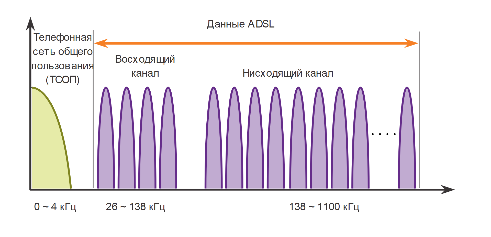
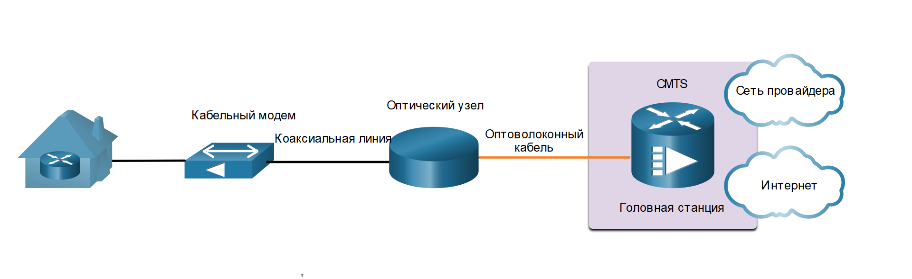
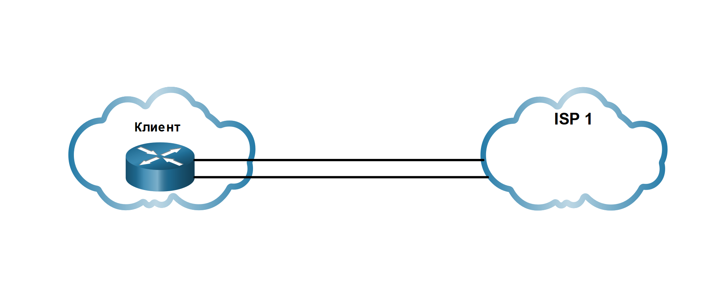
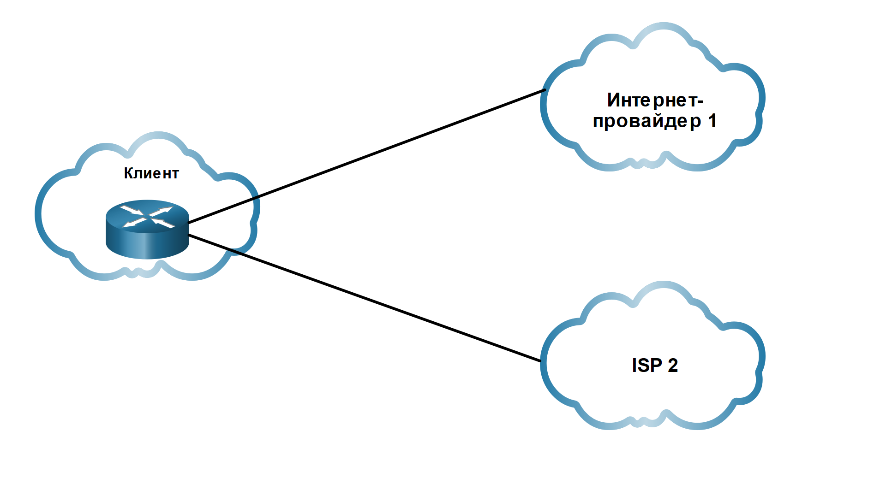

<!-- 7.5.1 -->
## Варианты подключения через Интернет

Современные варианты подключения к глобальной сети не заканчиваются Ethernet WAN и MPLS. Сегодня существует множество сетевых проводных и беспроводных вариантов, из которых можно выбрать. Широкополосное подключение через Интернет является альтернативой использованию выделенных вариантов глобальной сети.

На рисунке перечислены параметры подключения через Интернет.

<!-- /courses/ensa-dl/ae8e8c88-34fd-11eb-ba19-f1886492e0e4/aeb5757c-34fd-11eb-ba19-f1886492e0e4/assets/c65b1d92-1c46-11ea-af56-e368b99e9723.svg -->

<!--
На рисунке показано, что соединения WAN на основе Интернета состоят из проводных и беспроводных широкополосных сетей VPN, таких как xDSL, кабель, оптическое волокно, муниципальный Wi-Fi, сотовый и спутниковый Интернет
-->

Подключение через Интернет можно разделить на проводные и беспроводные варианты.

**Проводной вариант**

Проводные опции используют постоянный кабель (например, медный или волоконный) для обеспечения согласованной полосы пропускания и снижения частоты ошибок и задержек. Примерами проводного широкополосного подключения являются цифровая абонентская линия (DSL), кабельные соединения и оптоволоконные сети.

**Беспроводные варианты**

Варианты беспроводного подключения менее дорогостоящими по сравнению с другими вариантами подключения к глобальной сети, поскольку для передачи данных используются радиоволны вместо проводных носителей. Однако на беспроводные сигналы могут негативно влиять такие факторы, как расстояние от радиовышки, помехи от других источников, погода и количество пользователей, обращающихся к общему пространству. Примеры беспроводного широкополосного доступа включают услуги сотовой связи 3G/4G/5G или спутникового Интернета. Варианты беспроводных носителей варьируются в зависимости от местоположения.

<!-- 7.5.2 -->
## Технология DSL

Технология DSL обеспечивает постоянное соединение, которое использует существующие телефонные линии на основе витой пары для широкополосной передачи данных и предоставляет абонентам IP-сервисов. В настоящее время DSL является популярным решением среди ИТ-подразделений предприятий для поддержки своих сотрудников, работающих на дому.

На рисунке показана схема распределения полосы пропускания в медном проводнике при использовании технологии ADSL.

<!-- /courses/ensa-dl/ae8e8c88-34fd-11eb-ba19-f1886492e0e4/aeb5757c-34fd-11eb-ba19-f1886492e0e4/assets/c65bb9d2-1c46-11ea-af56-e368b99e9723.svg -->

<!--
Рисунок показывает, что ADSL использует различные диапазоны частот по телефонным линиям для разделения данных вверх и вниз по течению от голосовых данных
-->

Область с подписью ТСОП (сеть общего назначения) соответствует диапазону частот голосовой телефонной связи. Область, обозначенная как ADSL, представляет диапазон частот, используемый восходящими и нисходящими сигналами DSL. Область, которая включает и область обычной телефонной сети, и область ADSL, представляет весь диапазон частот, поддерживаемый медной проводной парой.

Существует несколько разновидностей xDSL, предлагающих различные скорости передачи и загрузки. Однако все формы DSL классифицируются как асимметричный DSL (ADSL) или симметричный DSL (SDSL). ADSL и ADSL2+ обеспечивает более высокую пропускную способность нисходящих каналов, идущих по направлению к пользователю, по сравнению с восходящими каналами. SDSL обеспечивает одинаковую пропускную способность в обоих направлениях.

Скорость передачи данных зависит от фактической длины местной линии, а также от типа и состояния кабелей. Например, для гарантированного качества сигнала контур ADSL должен быть менее 5,46 км (3,39 мили).

Этот процесс сопряжен с рисками безопасности, но их можно снизить с помощью мер безопасности.

<!-- 7.5.3 -->
## Подключения DSL

Операторы связи развертывают DSL-соединения в пределах местной линии. Как показано на рисунке, соединение устанавливается между DSL-модемом и мультиплексором доступа DSL (DSLAM).

<!-- /courses/ensa-dl/ae8e8c88-34fd-11eb-ba19-f1886492e0e4/aeb5757c-34fd-11eb-ba19-f1886492e0e4/assets/c65c5610-1c46-11ea-af56-e368b99e9723.svg -->

<!--
На рисунке показан домашний маршрутизатор, подключенный к DSL-модему, который подключается по телефонной линии к DSLAM и Интернету
-->

DSL-модем преобразует сигналы Ethernet от устройства клиента в сигнал DSL, который передается мультиплексору доступа DSL (DSLAM) в местоположении поставщика.

DSLAM — это устройство, расположенное в центральном офисе поставщика, собирающее подключения нескольких абонентов DSL. DSLAM часто встраивается в маршрутизатор агрегации.

Преимущество DSL по сравнению с кабельной технологией заключается в том, что DSL не является коллективно используемой средой. Каждый пользователь имеет отдельное прямое подключение к DSLAM. Добавление пользователей не влияет на производительность до тех пор, пока подключение к Интернету DSLAM у интернета-провайдера, или подключение к Интернету, не достигает предельных значений нагрузки.

<!-- 7.5.4 -->
## DSL и РРР

Протокол «точка-точка» (PPP) — это протокол уровня 2, который обычно используется поставщиками телефонных услуг для установления соединений между маршрутизатором и узлом и сетью через сети удаленного доступа и доступа ISDN.

Интернет-провайдеры по-прежнему используют PPP в качестве протокола уровня 2 для широкополосных DSL-подключений из-за следующих факторов:

* PPP может использоваться для аутентификации подписчика.
* PPP может назначить публичный IPv4 адрес абоненту.
* PPP предоставляет функции управления качеством канала.

DSL-модем имеет интерфейс DSL для подключения к сети DSL и интерфейс Ethernet для подключения к клиентскому устройству. Однако каналы Ethernet изначально не поддерживают PPP.

**Хост с клиентом PPPoE**

Как показано на рисунке, узел запускает клиент PPPoE для получения общего IP-адреса от сервера PPPoE, расположенного на сайте поставщика. Клиентское программное обеспечение PPPoE взаимодействует с DSL-модемом с помощью PPPoE, а модем взаимодействует с ISP с помощью PPP. В этой топологии подключение может использовать только один клиент. Кроме того, обратите внимание, что нет маршрутизатора для защиты внутренней сети.

<!-- /courses/ensa-dl/ae8e8c88-34fd-11eb-ba19-f1886492e0e4/aeb5757c-34fd-11eb-ba19-f1886492e0e4/assets/c65cf252-1c46-11ea-af56-e368b99e9723.svg -->

<!--
На рисунке показан компьютер в качестве клиента PPPoE, который подключается непосредственно к DSL-модему, а затем к DSLAM и Интернету. 
-->

**Маршрутизатор как клиент PPPoE**

Другим решением является настройка маршрутизатора в качестве клиента PPPoE, как показано на рисунке. Маршрутизатор является клиентом PPPoE и получает конфигурацию от поставщика. Клиенты взаимодействуют с маршрутизатором, используя только Ethernet и не знают о DSL-соединении. В этой топологии несколько клиентов могут совместно использовать DSL-соединение.

<!-- /courses/ensa-dl/ae8e8c88-34fd-11eb-ba19-f1886492e0e4/aeb5757c-34fd-11eb-ba19-f1886492e0e4/assets/c65e2ad1-1c46-11ea-af56-e368b99e9723.svg -->

<!--
На рисунке показан компьютер, подключенный к маршрутизатору PPPoE клиента, подключенный к DSL-модему, а затем к мультиплексору DSLAM, а затем к Интернету.
-->

<!-- 7.5.5 -->
## Кабельная технология

Кабельная технология является высокоскоростной всегда на технологии подключения, которая использует коаксиальный кабель кабельной компании для предоставления IP-услуг пользователям. В настоящее время DSL является популярным решением среди ИТ-подразделений предприятий для поддержки своих сотрудников, работающих на дому.

Современные кабельные системы позволяют реализовать расширенный набор телекоммуникационных услуг, включая высокоскоростной доступ к Интернету, цифровое кабельное телевидение и домашние телефонные линии.

Спецификация DOCSIS представляет собой международный стандарт для реализации услуг высокоскоростной передачи данных на основе имеющейся кабельной системы.

Операторы кабельной связи обычно развертывают гибридные волоконно-коаксиальные сети (HFC) для высокоскоростной передачи данных на кабельные модемы, расположенные в малых и домашних офисах. В кабельной сети используется коаксиальный кабель, по которому радиочастотные (РЧ) сигналы проходят через всю сеть.

HFC использует волоконно-оптический и коаксиальный кабель в различных частях сети. Например, соединение кабельного модема и оптического узла является коаксиальным кабелем, как показано на рисунке.

<!-- /courses/ensa-dl/ae8e8c88-34fd-11eb-ba19-f1886492e0e4/aeb5757c-34fd-11eb-ba19-f1886492e0e4/assets/c65f1530-1c46-11ea-af56-e368b99e9723.svg -->

<!--
На рисунке показан домашний маршрутизатор, подключенный к кабельному модему, который подключается к коаксиальному кабелю, а затем оптический узел, который подключается к оптическому волокну, и на головной CMTS и выход в Интернет
-->

Оптический узел выполняет преобразование оптического сигнала в РЧ. В частности, он преобразует радиочастотные сигналы в световые импульсы по оптоволоконному кабелю. Волоконные среды передачи данных  позволяют передавать сигналы на большие расстояния к головному офису поставщика, где расположена система терминации кабельного модема (CMTS).

Заголовок содержит базы данных, необходимые для обеспечения доступа в Интернет, в то время как CMTS отвечает за связь с кабельными модемами.

Все местные абоненты совместно используют пропускную способность кабельного соединения. При увеличении количества пользователей пропускная способность может падать ниже ожидаемого уровня.

<!-- 7.5.6 -->
## Оптическое волокно

Многие муниципалитеты, города и провайдеры устанавливают волоконно-оптический кабель к месту расположения пользователя. Это обычно называют  (FTTx) и включает в себя следующее:

* **Волокно в дом (FTTH)** - Волокно достигает границы резиденции. Пассивные оптические сети и сеть «точка-точка» Ethernet представляют собой архитектуры, которые могут предоставлять услуги кабельного телевидения, Интернета и телефонной связи по сетям FTTH непосредственно из центрального офиса поставщика услуг.
* **Волокно до здания  (FTTB)** - волокно достигает границы здания, например, подвал в многожильном блоке, при этом окончательное соединение с отдельным жилым пространством осуществляется с помощью альтернативных средств, таких как бордюр или столб технологий.
* **Волоконно к Узлу/Соседству (FTTN)** — оптический кабель достигает оптического узла, который преобразует оптические сигналы в формат, приемлемый для витой пары или коаксиального кабеля в помещение.

FTTx может обеспечить максимальную пропускную способность всех вариантов широкополосного доступа.

<!-- 7.5.7 -->
## Беспроводная широкополосная связь на основе Интернета

В беспроводных технологиях для отправки и приема данных используются нелицензированные полосы радиочастот. Нелицензированные полосы доступны всем, кто использует устройство, имеющее беспроводный маршрутизатор и поддерживающее беспроводную технологию.

До недавнего времени существовало одно ограничение на беспроводной доступ — необходимость находиться в небольшой зоне действия (обычно менее 30 метров) беспроводного маршрутизатора или беспроводного модема, имеющего проводное подключение к Интернету.

**Городские сети Wi-Fi**

Во многих городах началась установка муниципальных беспроводных сетей. Некоторые из этих сетей обеспечивают высокоскоростной доступ к Интернету бесплатно или по значительно более низкой цене, чем цена других широкополосных сервисов. Другие сети предназначены для использования только в центре города, позволяя полиции и отделениям пожарной охраны, а также другим служащим в системе городского хозяйства выполнять определенную часть своей работы в удаленном режиме. Для подключения к муниципальной сети Wi-Fi абоненту обычно требуется беспроводной модем, имеющий более чувствительную и направленную антенну, чем традиционные беспроводные адаптеры. Большинство операторов связи предоставляют требуемое оборудование бесплатно или за определенную плату, так же, как это делают с модемами DSL или кабельными модемами.

**Сотовая связь**

Все чаще для подключения пользователей из удаленных мест, где недоступны никакие другие технологии глобальной сети, используются услуги сотовой связи — еще одна технология беспроводного доступа к глобальной сети. Множество пользователей могут с помощью смартфонов и планшетов использовать сотовую систему передачи данных для отправки сообщений электронной почты, обзора Интернета, загрузки приложений и просмотра видео.

Телефоны, планшетные компьютеры, ноутбуки и даже некоторые маршрутизаторы могут обмениваться данными через Интернет, используя технологию сотовой связи. Эти устройства используют радиоволны для обмена данными посредством ближайшей вышки мобильной телефонной связи. Устройство имеет небольшую радиоантенну, а антенна оператора связи, имеющая гораздо большие размеры, находится наверху вышки, расположенной на расстоянии нескольких километров от телефона.

Применительно к сотовым сетям чаще всего употребляются следующие два термина.

* **3G/4G/5G Wireless** - Это аббревиатуры для 3-го поколения, 4-го поколения и новых мобильных беспроводных технологий 5-го поколения. Эти технологии поддерживают беспроводный доступ к Интернету. Стандарты 4G поддерживают пропускную способность до 450 Мбит/с и 100 Мбит/с. Порождающийся стандарт 5G должен поддерживать 100 Мбит/с до 10 Гбит/с и более.
* **Long-Term Evolution (LTE)** - Относится к новым технологиям, обеспечивающим высокие скорости передачи данных, и считается частью технологии четвертого поколения (4G).

**Спутниковый Интернет**

Обычно используется в сельской местности, где кабель и DSL недоступны. Для получения доступа к спутниковым интернет-сервисам абонентам требуется спутниковая антенна, два модема (восходящий и нисходящий канал) и коаксиальные кабели, соединяющие антенну и модем.

Маршрутизатор подключается к спутниковой тарелке, которая направлена на спутник оператора связи. Спутник находится в космосе на геосинхронной орбите. Сигналы должны преодолеть расстояние приблизительно в 35 786 километров по направлению к спутнику и обратно.

Важнейшее требование к установке антенны — это наличие хорошей видимости по направлению к экватору, где размещено большинство орбитальных спутников. Деревья и проливные дожди могут отрицательно влиять на прием сигналов.

VSAT обеспечивает двунаправленную (отправка и получение) передачу данных. Скорость передачи трафика в восходящем направлении приблизительно в десять раз ниже скорости загрузки (т. е. передачи в нисходящем направлении). Скорость загрузки составляет от 5 до 25 Мбит/с.

**WiMAX**

Новая технология беспроводного доступа в микроволновом диапазоне, внедрение которой только начинается. Она описана в стандарте IEEE 802.16. Технология WiMAX предлагает высокоскоростной широкополосный сервис с беспроводным доступом и обеспечивает широчайший охват, сравнимый с охватом сети мобильной телефонной связи, и не идущий ни в какое сравнение с охватом, предоставляемым посредством точек доступа небольших сетей Wi-Fi.

Сеть WiMAX функционирует подобно сети Wi-Fi, но на более высоких скоростях, на больших расстояниях и для большего числа пользователей. Она использует сеть вышек WiMAX, подобных вышкам сети мобильной телефонной связи. Для получения доступа к сети WiMAX абонентам требуется подписаться на услуги интернет-провайдера, чья вышка WiMAX находится в пределах 30 километров от местоположения абонента. Также им требуется определенный тип приемника WiMAX и специальный код шифрования, чтобы получить доступ к базовой станции.

Вместо WiMAX широко применяются системы на основе LTE (мобильные сети) и кабельный или DSL-доступ (фиксированные сети).

<!-- 7.5.8 -->
## Технология создания виртуальных частных сетей

Конфигурация, при которой удаленные работники или офисы получают доступ к корпоративной сети WAN через широкополосное интернет-соединение, подразумевает определенные риски безопасности.

Для решения проблем безопасности широкополосные службы обеспечивают подключения виртуальных частных сетей (VPN) к сетевому устройству, принимающим VPN-подключения. Сетевое устройство обычно находится на корпоративной площадке.

VPN представляет собой шифрованное подключение между частными сетями посредством общедоступной сети, например Интернета. Вместо использования выделенного соединения уровня 2, например арендованной линии, VPN использует виртуальные соединения, называемые туннелями VPN. VPN-туннели маршрутизируются через Интернет из частной сети компании на удаленный сайт или хост сотрудника.

Преимущества VPN

* **Сокращение затрат** — Сети VPN позволяют подключить удаленных пользователей к головному объекту компании и соединить удаленные офисы через глобальный Интернет. Таким образом, можно отказаться от дорогостоящих выделенных WAN-соединений и модемных банков.
* **Безопасность** — Подключения VPN обеспечивают самый высокий уровень безопасности с помощью усовершенствованных механизмов шифрования и протоколов аутентификации, которые защищают данные от несанкционированного доступа.
* **Масштабируемость** — Поскольку для подключений VPN используются принадлежащие интернет-провайдерам инфраструктура Интернета и устройства, добавлять новых пользователей очень легко. Корпорации могут существенно наращивать пропускную способность сети без существенного расширения своей инфраструктуры.
* **Совместимость с широкополосными технологиями** — Операторы связи предлагают широкополосный доступ с поддержкой VPN, включая DSL и кабельный доступ. Благодаря сетям VPN мобильные и удаленные сотрудники могут получать доступ в корпоративную сеть через высокоскоростные домашние интернет-сервисы. Высокоскоростные широкополосные подключения бизнес-класса могут оказаться экономичным решением для подключения удаленных офисов.

VPN обычно реализуются следующим образом:

* **Site-to-site VPN (от узла до узла)** — настройки VPN настраиваются на маршрутизаторах. Клиенты не знают, что их данные шифруются.
* **Удаленный доступ** — пользователь знает и инициирует подключение удаленного доступа. Например, используя HTTPS в браузере для подключения к вашему банку. Кроме того, пользователь может запустить программное обеспечение VPN-клиента на своем хосте для подключения к конечному устройству и проверки подлинности с ним.

**Примечание:** VPN обсуждаются более подробно позже в этом курсе.

<!-- 7.5.9 -->
## Варианты подключения к интернет-провайдеру

**Одно подключение к сети (Single-homed)**

Подключение к интернет-провайдеру с одним подключением используется организацией, когда доступ к Интернету не имеет важного значение для работы. Как показано на рисунке, клиент подключается к поставщику услуг Интернета по одному каналу. Топология не обеспечивает избыточности. Это наименее дорогостоящее решение из четырех показанных.

<!-- /courses/ensa-dl/ae8e8c88-34fd-11eb-ba19-f1886492e0e4/aeb5757c-34fd-11eb-ba19-f1886492e0e4/assets/c660e9f2-1c46-11ea-af56-e368b99e9723.svg -->

<!--
На рисунке показан  клиентский маршрутизатор с одним подключением к ISP-1.
-->

**С двумя интерфейсами (dual-homed)**

Подключение к интернет-провайдеру с двумя подключениями используется организацией, когда доступ к Интернету имеет определенное значение для работы. Как показано на рисунке, клиент подключается к одному и тому же поставщику услуг Интернета по двум каналам. Топология обеспечивает как избыточность, так и балансировку нагрузки. Если один канал выходит из строя, другой канал может нести трафик. Если оба канала работают, трафик может быть сбалансирован по ним. Тем не менее организация теряет подключение к Интернету, если интернет-провайдер сталкивается с отключением.

<!-- /courses/ensa-dl/ae8e8c88-34fd-11eb-ba19-f1886492e0e4/aeb5757c-34fd-11eb-ba19-f1886492e0e4/assets/c6613812-1c46-11ea-af56-e368b99e9723.svg -->

<!--
На рисунке показан  клиентский маршрутизатор с двумя подключениями к ISP-1.
-->

**С несколькими подключениями к сети (Multihomed)**

Подключение к  интернет-провайдеру используется организацией, когда доступ к Интернету имеет решающее значение для работы. Клиент подключается к двум различным интернет-провайдерам, как показано на рисунке. Такая конструкция обеспечивает повышенную избыточность и обеспечивает балансировку нагрузки, но она может быть дорогостоящей.

<!-- /courses/ensa-dl/ae8e8c88-34fd-11eb-ba19-f1886492e0e4/aeb5757c-34fd-11eb-ba19-f1886492e0e4/assets/c6618632-1c46-11ea-af56-e368b99e9723.svg -->

<!--
На рисунке показан  клиентский маршрутизатор с одним подключением к ISP-1 и другим подключением к ISP-2.
-->

**С несколькими подключениями к нескольким сетям (Dual-multihomed)**

Такое подключение является наиболее устойчивой топологией из четырех показанных. Клиент подключается с избыточными каналами к нескольким провайдерам Интернета, как показано на рисунке. Эта топология обеспечивает максимально возможную избыточность. Это самый дорогой вариант из четырех.

<!-- /courses/ensa-dl/ae8e8c88-34fd-11eb-ba19-f1886492e0e4/aeb5757c-34fd-11eb-ba19-f1886492e0e4/assets/c661d452-1c46-11ea-af56-e368b99e9723.svg -->

<!--
На рисунке показан  клиентский маршрутизатор с двумя соединениями с ISP-1 и двумя соединениями с ISP-2.
-->

<!-- 7.5.10 -->
## Сравнение широкополосных решений

Каждое решение широкополосного доступа имеет свои преимущества и недостатки. Идеальный вариант — подключение оптоволоконного кабеля непосредственно к сети малого или домашнего офиса. В некоторых местах поддерживается только один способ подключения: кабельный или DSL. В некоторых местах поддерживаются только варианты широкополосной беспроводной связи для доступа к Интернету.

При наличии нескольких широкополосных решений необходимо провести анализ соотношения затрат и преимуществ для определения оптимального решения.

К числу факторов, которые следует учитывать, относятся следующие:

* **Кабель** - Пропускная способность разделяется многими пользователями. В часы пиковой нагрузки при чрезмерном количестве пользователей заметно снижается скорость передачи данных в восходящем направлении.
* **DSL**  - Ограниченная пропускная способность, зависящая от расстояния (по отношению к центральному офису интернет-провайдера). Скорость загрузки пропорционально ниже по сравнению со скоростью загрузки.
* **Оптоволокно до дома** - Требуется прокладка оптоволоконного кабеля непосредственно до дома.
* **Сотовая/мобильная связь** - Во многих случаях покрытие оставляет желать лучшего и может быть неравномерным даже в пределах одного малого или домашнего офиса, что приводит к снижению пропускной способности.
* **Городская сеть Wi-Fi** - В большинстве муниципалитетов не развернуты ячеистые сети. Но если он доступен и в рабочем  диапазоне, то это жизнеспособный вариант.
* **Спутниковая связь** - Высокая стоимость, ограниченная пропускная способность на одного абонента Обычно используется, когда нет другого варианта.

<!-- 7.5.11 -->
## Исследовательская работа: Изучение технологий широкополосного доступа в Интернет

В этой лабораторной работе вы выполните следующие задачи.

* Часть 1: Исследование распространенности широкополосных решений
* Часть 2: Сравнительный анализ вариантов широкополосного доступа для конкретных ситуаций

[Изучение технологий широкополосного доступа в Интернет (lab)](./assets/7.5.11-lab---research-broadband-internet-access-technologies_ru-RU.pdf)

