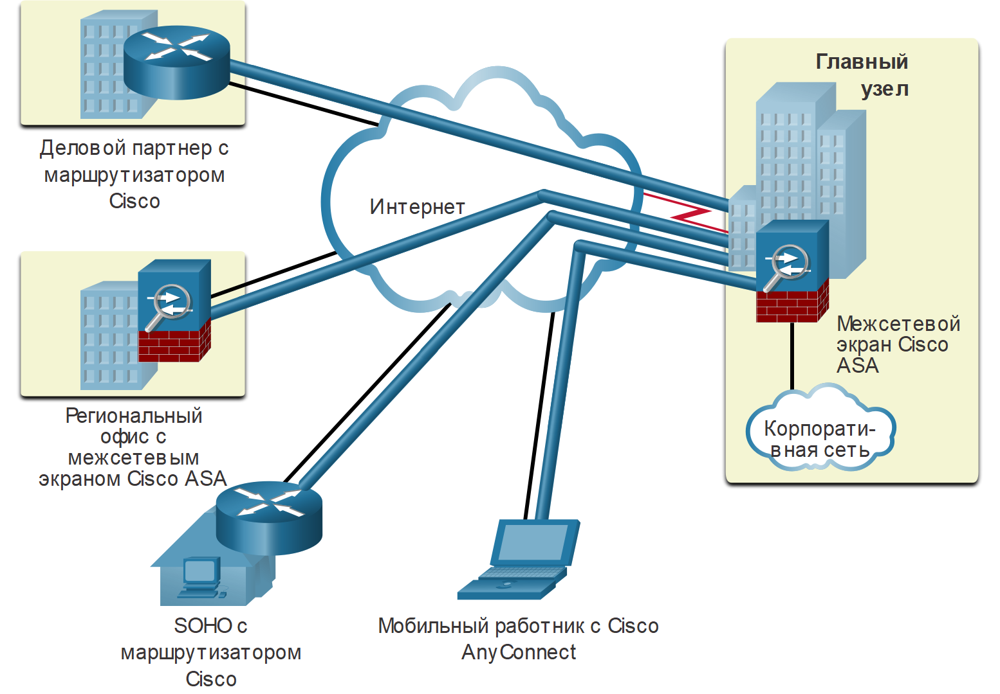
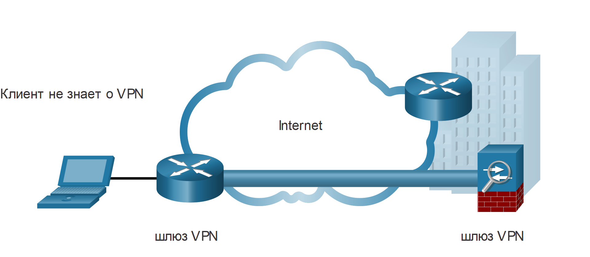
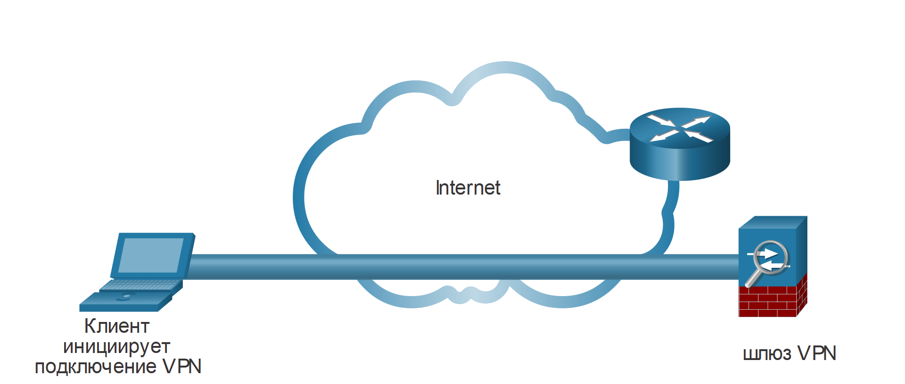
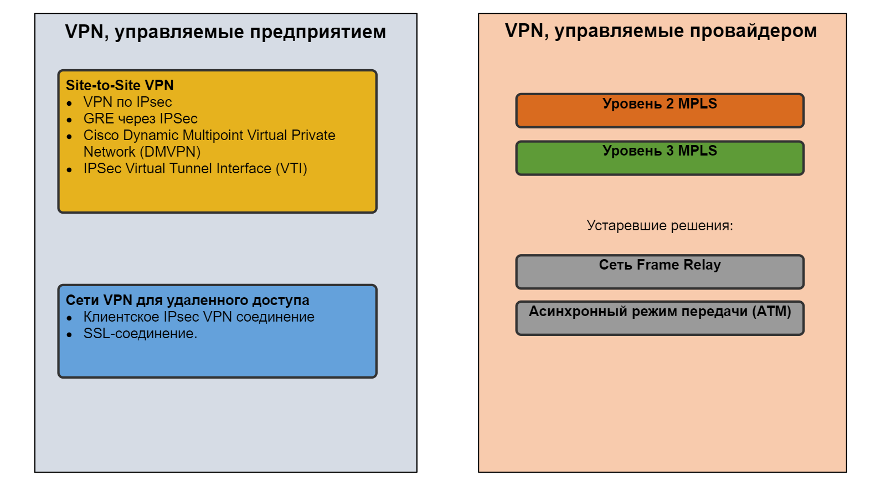

<!-- 8.1.1 -->
## Виртуальные частные сети

Чтобы защитить сетевой трафик между сайтами и пользователями, организации используют VPN для создания сквозных подключений к частной сети. Сеть VPN является виртуальной в том смысле, что информация в ней находится в пределах частной сети, но фактически эта информация передается по общедоступной сети. Сеть VPN является частной в том смысле, что трафик в ней шифруется для сохранения конфиденциальности данных при их передаче через общедоступную сеть.

На рисунке показаны различные типы VPN, управляемых основным сайтом предприятия. Туннель позволяет удаленным сайтам и пользователям получить безопасный доступ к сетевым ресурсам основного сайта.

<!-- /courses/ensa-dl/ae8e8c8a-34fd-11eb-ba19-f1886492e0e4/aeb59c80-34fd-11eb-ba19-f1886492e0e4/assets/c666b650-1c46-11ea-af56-e368b99e9723.svg -->

* Межсетевой экран Cisco Adaptive Security Appliance (ASA) помогает организациям предоставлять безопасные высокопроизводительные подключения, включая VPN и постоянный доступ для удаленных филиалов и мобильных пользователей.
* SOHO (small office/home office) - где VPN-маршрутизатор может обеспечить VPN подключения к корпоративному основному сайту.
* Решение Cisco AnyConnect - это программное обеспечение, которое удаленные работники могут использовать для установления клиентского VPN-соединения с основным сайтом.

<!--
На рисунке показаны различные типы VPN, управляемых основным сайтом предприятия. На главном сайте показан межсетевой экран Cisco ASA, подключенный к корпоративной сети, а также через Интернет
к маршрутизатору Cisco для бизнес-партнеров, межсетевому экрану Cisco ASA для региональных офисов, маршрутизатору Cisco для небольшого офиса/домашнего офиса и мобильному работнику, удаленно подключающемуся через Cisco AnyConnect.
-->

Первые сети VPN представляли собой обычные IP-туннели, в которых аутентификация или шифрование данных не выполнялись. Например, Generic Routing Encapsulation (GRE) - это протокол туннелирования, разработанный Cisco и не включающий службы шифрования. Он используется для инкапсуляции трафика IPv4 и IPv6 в туннеле IP для создания виртуального канала точка-точка.

<!-- 8.1.2 -->
## Преимущество сети VPN

Современные VPN теперь поддерживают функции шифрования, такие как Internet Protocol Security (IPsec) и Secure Sockets Layer (SSL), для защиты сетевого трафика между сайтами.

Основные преимущества VPN показаны в таблице.

| **Преимущество** | **Описание** |
| --- | --- |
| **Сокращение затрат** | Благодаря появлению экономически эффективных, высокоскоростных технологий организации могут использовать сети VPN для сокращения своих затрат на подключение к сети при одновременном повышении пропускной способности удаленных подключений. |
| **Безопасность** | Сети VPN обеспечивают максимально возможный уровень безопасности благодаря применению сложных протоколов шифрования и аутентификации, защищающих данные от несанкционированного доступа. |
| **Масштабируемость** | Сети VPN позволяют организациям использовать Интернет, упрощая процесс добавления новых пользователей без существенного усложнения существующей инфраструктуры. |
| **Совместимость** | Сети VPN могут быть реализованы с использованием каналов WAN различного типа, включая все популярные широкополосные технологии. Удаленные сотрудники могут пользоваться возможностями таких высокоскоростных подключений для получения безопасного доступа к своим корпоративным сетям. |

<!-- 8.1.3 -->
## Site-to-Site VPN и VPN для удаленного доступа

VPN обычно развертываются в одной из следующих конфигураций: site-to-site или удаленный доступ.

**Site-to-site VPN**

Site-to-site VPN создается, когда устройства, также называемые VPN-шлюзами, на обеих сторонах VPN-подключения заранее знают конфигурацию VPN. VPN трафик шифруется только между этими устройствами. Внутренние узлы не знают о существовании VPN.

<!-- /courses/ensa-dl/ae8e8c8a-34fd-11eb-ba19-f1886492e0e4/aeb59c80-34fd-11eb-ba19-f1886492e0e4/assets/c667a0b0-1c46-11ea-af56-e368b99e9723.svg -->

<!--
На рисунке показано VPN-соединение типа site-to-site. Клиентский ноутбук подключается к сетевому шлюзу VPN, показанному как маршрутизатор. Шлюз VPN подключен через Интернет, который изображен как 
облако, к другому шлюзу VPN, показанному как межсетевой экран ASA.
-->

**Сеть VPN удалённого доступа**

VPN с удаленным доступом динамически создается для установления безопасного соединения между клиентом и оконечным устройством VPN. Например, SSL VPN с удаленным доступом используется при онлайн-проверке банковской информации.

<!-- /courses/ensa-dl/ae8e8c8a-34fd-11eb-ba19-f1886492e0e4/aeb59c80-34fd-11eb-ba19-f1886492e0e4/assets/c66815e0-1c46-11ea-af56-e368b99e9723.svg -->

<!--
На рисунке показано VPN-соединение удалённого доступа. Клиентский ноутбук подключен через Интернет, который изображен как облако, к шлюзу VPN, показанному как межсетевой экран ASA.
-->

<!-- 8.1.4 -->
## VPN для крупных компаний и операторов связи

Существует много вариантов защиты корпоративного трафика. Эти решения различаются в зависимости от того, кто управляет VPN.

VPN можно управлять и развертывать как: 

* **VPN для крупных компаний** - корпоративные VPN являются распространенным решением для защиты корпоративного трафика через Интернет. VPN типа site-to-site и удаленный доступ создаются и управляются предприятием с использованием IPsec и SSL VPN.
* **VPN операторов связи** - управляемые провайдером VPN-сервисы создаются и управляются через сеть провайдера. Провайдер использует многопротокольную коммутацию по меткам (MPLS) на уровне 2 или уровне 3 для создания безопасных каналов между сайтами предприятия. Multiprotocol Label Switching (MPLS) - это технология маршрутизации, которую провайдер использует для создания виртуальных путей между сайтами. Эта технология эффективно разделяет трафик от разных клиентов. Старые решения включают в себя Frame Relay и режим асинхронной передачи (ATM) VPN.

На рисунке перечислены различные типы развертываний VPN под управлением предприятия и сервис-провайдера, которые будут обсуждаться более подробно в этом модуле.

<!-- /courses/ensa-dl/ae8e8c8a-34fd-11eb-ba19-f1886492e0e4/aeb59c80-34fd-11eb-ba19-f1886492e0e4/assets/c6688b12-1c46-11ea-af56-e368b99e9723.svg -->

<!--
На рисунке показаны два столбца, в которых перечислены различные типы развертываний VPN, управляемых предприятием, и VPN, управляемых сервис-провайдером. В столбце VPN, управляемые предприятием, VPN типа Site-to-site это:
IPsec VPN, GRE over IPsec, Cisco Dynamic Multipoint Virtual Private Network (DMVPN), и IPsec Virtual Tunnel Interface (VTI). VPN для удаленного доступа: клиентское VPN-соединение IPsec и 
Бесклиентное SSL-соединение. В столбце VPN-сервисы, управляемые провайдером, указаны MPLS уровня 2 и 3, а устаревшими решениями являются Frame Relay и режим асинхронной передачи (ATM).
-->

<!-- 8.1.5 -->
<!-- quiz -->

