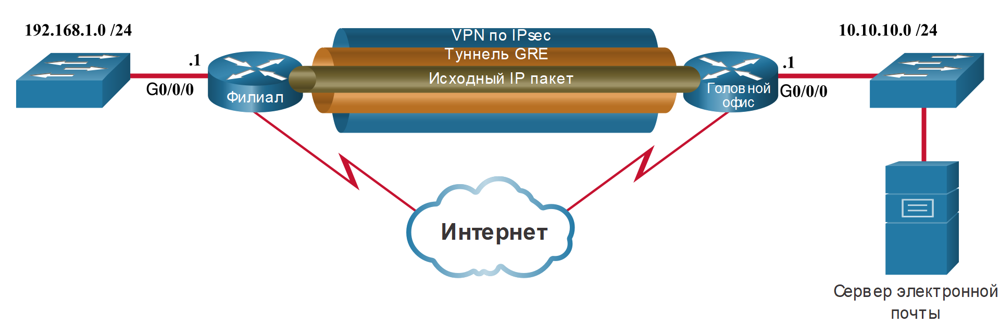
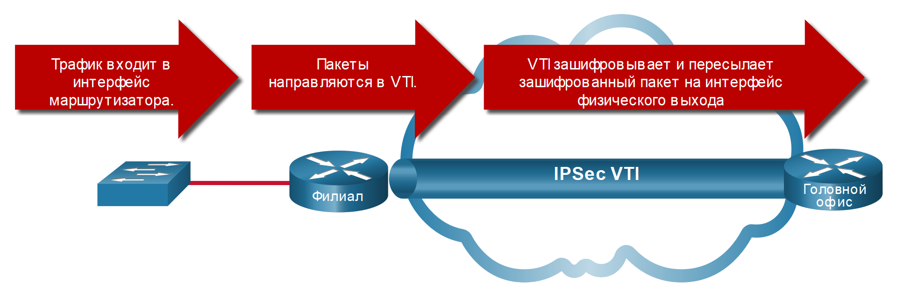

<!-- 8.2.1 -->
## Сети VPN удалённого доступа

В предыдущей теме вы узнали об основах VPN технологии. Здесь вы узнаете подробнее о типах VPN.

VPN стали логическим решением для подключения удаленного доступа по многим причинам. Как показано на рисунке, VPN с удаленным доступом позволяют удаленным и мобильным пользователям безопасно подключаться к предприятию, создавая зашифрованный туннель. Удаленные пользователи могут безопасно копировать свой корпоративный доступ для обеспечения безопасности, включая электронную почту и сетевые приложения. VPN для удаленного доступа также позволяют подрядчикам и партнерам иметь ограниченный доступ к определенным серверам, веб-страницам или файлам по мере необходимости. Это означает, что эти пользователи могут способствовать повышению эффективности бизнеса без ущерба для безопасности сети.

Сети VPN для удаленного доступа обычно включаются пользователем динамически, когда это необходимо. VPN для удаленного доступа могут быть созданы с использованием IPsec или SSL. Как показано на рисунке, удаленный пользователь должен инициировать VPN-подключение удаленного доступа.

На рисунке изображены два способа, с помощью которых удаленный пользователь может инициировать VPN-подключение удаленного доступа: бесклиентное VPN и клиентское VPN.

<!-- /courses/ensa-dl/ae8e8c8a-34fd-11eb-ba19-f1886492e0e4/aeb59c82-34fd-11eb-ba19-f1886492e0e4/assets/c66a5fd1-1c46-11ea-af56-e368b99e9723.svg -->

* **Бесклиентное VPN-соединение** \-Соединение защищено с помощью SSL-соединения через веб-браузер. SSL в основном используется для защиты HTTP-трафика (HTTPS) и почтовых протоколов, таких как IMAP и POP3. Например, HTTPS на самом деле HTTP с использованием туннеля SSL. Сначала устанавливается SSL-соединение, а затем по нему происходит обмен данными HTTP.
* **Клиентское VPN-соединение** \- Программное обеспечение VPN-клиента, такое как Cisco AnyConnect Secure Mobility Client, должно быть установлено на конечном устройстве удаленного пользователя. Пользователи должны инициировать VPN-соединение с помощью VPN-клиента, а затем пройти аутентификацию на целевом VPN-шлюзе. Когда удаленные пользователи аутентифицируются, они получают доступ к корпоративным файлам и приложениям. Программное обеспечение VPN-клиента шифрует трафик с использованием IPsec или SSL и передает его через Интернет на целевой VPN-шлюз.

<!--
На рисунке показаны два способа, с помощью которых удаленный пользователь может инициировать VPN-подключение удаленного доступа: бесклиентное VPN и клиентское VPN. Ноутбук одного пользователя подключен к Центральному офису через туннель SSL VPN
через Интернет с помощью пользовательского веб-браузера. Второй ноутбук подключен к Центральному офису через Интернет с помощью Cisco AnyConnect Secure Mobility Client.
-->

<!-- 8.2.2 -->
## SSL VPN

Когда клиент договаривается о соединении SSL VPN с шлюзом VPN, он фактически соединяется, используя Transport Layer Security (TLS). TLS является более новой версией SSL и иногда выражается как SSL/TLS. Однако оба термина часто используются взаимозаменяемо.

SSL использует инфраструктуру открытых ключей и цифровые сертификаты для аутентификации партнеров. Технологии IPsec и SSL VPN делают возможным доступ практически к любому сетевому приложению или ресурсу. Однако, когда безопасность является проблемой, IPsec является лучшим выбором. Если первоочередными задачами являются поддержка и простота развёртывания, то следует иметь в виду протокол SSL. Используемый метод создания сети VPN основан на требованиях к доступу пользователей, а также процедурах ИТ в организации. В таблице сравниваются развертывания удаленного доступа IPsec и SSL.

| Функция | Протокол IPsec | SSL |
| --- | --- | --- |
| **Поддержка приложений** | **Обширная** - все IP-приложения поддерживаются. | **Ограниченная** - поддерживаются только веб-приложения и обмен файлами. |
| **Сила аутентификации** | **Сильная** - использование двусторонней аутентификации с общими ключами или цифровыми сертификатами. | **Умеренная** - Использование односторонней или двусторонней аутентификации. |
| **Сила шифрования** | **Сильная** - использует длину ключа от 56 до 256 бит. | **От умеренного до сильного** - С длиной ключа от 40 бит до 256 бит. |
| **Сложность подключения** | **Средняя** - для этого требуется предварительно установленный VPN-клиент на хосте. | **Низкий** - требуется только веб-браузер на хосте. |
| **Варианты подключения** | **Ограниченный** - только определенные устройства с определенными конфигурациями могут подключаться. | **Обширный** - любое устройство с веб-браузером может подключиться. |

Важно понимать, что IPsec и SSL VPN не являются взаимоисключающими. Вместо этого они дополняют друг друга; обе технологии решают разные проблемы, и организация может использовать IPsec, SSL или и то, и другое, в зависимости от потребностей своих сотрудников.

<!-- 8.2.3 -->
## Site-to-Site IPSec VPN

Site-to-site VPN используются для подключения сетей через другую недоверенную сеть, такую как Интернет. В site-to-site VPN конечные хосты отправляют и получают обычный незашифрованный трафик TCP/IP через оконечное устройство VPN. Оконечное устройство VPN обычно называется шлюзом VPN. Устройство шлюза VPN может быть маршрутизатором или межсетевым экраном, как показано на рисунке. Например, как показано на рисунке, Cisco Adaptive Security Appliance (ASA) — это автономный межсетевой экран, который объединяет в пределах одного образа программного обеспечения функции межсетевого экрана, концентратора VPN, а также системы предотвращения вторжений в один образ программного обеспечения.

<!-- /courses/ensa-dl/ae8e8c8a-34fd-11eb-ba19-f1886492e0e4/aeb59c82-34fd-11eb-ba19-f1886492e0e4/assets/c66bbf60-1c46-11ea-af56-e368b99e9723.svg -->

<!--
На рисунке показано соединение VPN типа site-to-site с использованием туннеля IPsec. Клиентский ноутбук подключается к сетевому шлюзу VPN, показанному как маршрутизатор. Шлюз VPN подключен через Интернет, который изображен как
облако, к другому шлюзу VPN, показанному как межсетевой экран ASA. Соединение между двумя VPN-шлюзами использует IPsec для защиты VPN-туннеля.
-->

Шлюз VPN отвечает за инкапсуляцию и шифрование исходящего трафика для всего трафика, поступающего с конкретного объекта. Затем шлюз VPN передает этот трафик через туннель VPN по Интернету в равноправный соседний шлюз VPN на стороне приема. При получении данных соседний шлюз VPN удаляет заголовки, расшифровывает содержимое и передает пакет в узел назначения по своей частной сети.

Site-to-site VPN обычно создается и защищается с использованием IP-безопасности (IPsec).

<!-- 8.2.4 -->
## GRE через IPSec

Универсальная инкапсуляция маршрутизации (Generic Routing Encapsulation, GRE) — это незащищенный протокол создания туннелей для сети VPN типа site-to-site. Он может инкапсулировать различные протоколы сетевого уровня. Он также поддерживает многоадресный и широковещательный трафик, который может быть необходим, если организации требуется протоколы маршрутизации для работы через VPN. Однако GRE по умолчанию не поддерживает шифрование; и, следовательно, он не обеспечивает безопасный VPN-туннель.

Стандартный IPsec VPN (не GRE) может создавать безопасные туннели только для одноадресного трафика. Поэтому протоколы маршрутизации не будут обмениваться информацией о маршрутизации через IPsec VPN.

Чтобы решить эту проблему, мы можем инкапсулировать трафик протокола маршрутизации с использованием пакета GRE, а затем инкапсулировать пакет GRE в пакет IPsec для безопасной пересылки его на VPN-шлюз назначения.

Как показано на рисунке, термины, используемые для описания инкапсуляции GRE через туннель IPsec, представляют собой "протокол-пассажир", несущий протокол и транспортный протокол.

<!-- /courses/ensa-dl/ae8e8c8a-34fd-11eb-ba19-f1886492e0e4/aeb59c82-34fd-11eb-ba19-f1886492e0e4/assets/c66c3493-1c46-11ea-af56-e368b99e9723.svg -->

* **"Протокол-пассажир"** – Это оригинальный пакет, который должен быть инкапсулирован GRE. Это может быть пакет IPv4 или IPv6, обновление маршрутизации и многое другое.
* **Несущий протокол** – GRE является несущим протоколом, который инкапсулирует исходный пассажирский пакет.
* **Транспортный протокол** – Это протокол, который фактически будет использоваться для пересылки пакета. Это может быть IPv4 или IPv6.

<!--
На рисунке показана инкапсуляция GRE через туннель IPsec. В пакете IPSec есть 5 полей: IP, GRE, IP, TCP и Data. IP - это Транспортный протокол GRE - это несущий протокол
IP, TCP и данные - "протокол-пассажир"
-->

Например, на рисунке, отображающем топологию, Branch и HQ хотели бы обмениваться информацией о маршрутизации OSPF через IPsec VPN. Однако IPsec не поддерживает многоадресный трафик. Поэтому GRE через IPsec используется для поддержки трафика протокола маршрутизации через IPsec VPN. В частности, пакеты OSPF (то есть протокол-пассажир) будут инкапсулированы GRE (то есть несущим протоколом) и впоследствии инкапсулированы в VPN-туннель IPsec.

<!-- /courses/ensa-dl/ae8e8c8a-34fd-11eb-ba19-f1886492e0e4/aeb59c82-34fd-11eb-ba19-f1886492e0e4/assets/c66cf7e0-1c46-11ea-af56-e368b99e9723.svg -->

<!--
На рисунке показана топология, маршрутизатор филиала и маршрутизатор HQ обмениваются информацией о маршрутизации OSPF через IPsec VPN. Коммутатор подключается к маршрутизатору филиала. Маршрутизатор филиала подключен к
маршрутизатору HQ через Интернет с использованием туннеля IPsec VPN GRE. Маршрутизатор HQ подключен к коммутатору, коммутатор подключен к серверу электронной почты.
-->

Снимок экрана Wireshark на рисунке отображает пакет Hello OSPF, который был отправлен с использованием GRE через IPsec. В этом примере исходный многоадресный пакет Hello OSPF (то есть, пассажирский протокол) был инкапсулирован в заголовок GRE (то есть, в несущий протокол), который впоследствии инкапсулируется другим IP-заголовком (то есть транспортным протоколом). Тогда этот IP-заголовок будет пересылается через туннель IPsec.

<!-- /courses/ensa-dl/ae8e8c8a-34fd-11eb-ba19-f1886492e0e4/aeb59c82-34fd-11eb-ba19-f1886492e0e4/assets/c66d9420-1c46-11ea-af56-e368b99e9723.svg -->

<!--
На рисунке показан снимок экрана Wireshark пакета Hello OSPF, отправленного с использованием GRE через IPSec. Транспортная часть выходных данных обведена прямоугольником и показывает Internet Protocol Version 4,
Источник: 192.168.12.1, Назначение: 192.168.23.3. Часть несущего протокола в выходных данных обведена прямоугольником и показывает общую инкапсуляцию маршрутизации, флаг и версию и тип протокола,
IP. Протокольная часть выходных данных обведена прямоугольником и показывает IPv4 Источник: 192.168.13.1, Назначение: 224.0.0.5 и указывается Open Shortest Path First
(OSPF).
-->

<!-- 8.2.5 -->
## Динамическая многоточечная VPN-сеть (DMVPN)

Site-to-site IPSec VPN и GRE через IPSec подходят для использования, когда для безопасного соединения существует всего несколько сайтов. Однако их недостаточно, когда предприятие добавляет больше сайтов. Это связано с тем, что для каждого сайта требуются статические конфигурации всех других сайтов или центрального сайта.

Динамическая многоточечная VPN-сеть (DMVPN) — это программное решение Cisco, обеспечивающее удобство, оперативность и масштабируемость при создании большого количества VPN. Как и другие типы VPN, DMVPN использует протокол IPsec для обеспечения безопасной передачи через общедоступные сети, такие как Интернет.

DMVPN упрощает настройку VPN-туннеля и предоставляет гибкую возможность подключения центрального сайта к сайтам филиалов. Он использует конфигурацию звезда для установления полносвязанной топологии. Филиалы устанавливают безопасные VPN туннели до центра топологии.

**Туннели DMVPN типа «звезда»**

<!-- /courses/ensa-dl/ae8e8c8a-34fd-11eb-ba19-f1886492e0e4/aeb59c82-34fd-11eb-ba19-f1886492e0e4/assets/c66de243-1c46-11ea-af56-e368b99e9723.svg -->

<!--
На рисунке представлены туннели DMVPN  в топологии звезда. Центральный  маршрутизатор имеет три канала связи до Филиала А, Филиала В и Филиала С.
-->

Каждый сайт конфигурируется с использованием технологии Multipoint Generic Routing Encapsulation (mGRE). Туннельный интерфейс mGRE позволяет одному GRE интерфейсу поддерживать несколько динамических IPsec туннелей. Следовательно, когда нужно установить новое безопасное соединение с центральным маршрутизатором, будет использоваться та же конфигурация для создания туннеля. Дополнительная конфигурация не требуется.

Вся информация в филиал поступает от центрального маршрутизатора. И как показано на рисунке, они могут использовать эту информацию для установления прямых VPN туннелей.

**Туннели DMVPN типа «звезда» и «луч-луч»**

<!-- /courses/ensa-dl/ae8e8c8a-34fd-11eb-ba19-f1886492e0e4/aeb59c82-34fd-11eb-ba19-f1886492e0e4/assets/c66e3060-1c46-11ea-af56-e368b99e9723.svg -->

<!--
На рисунке представлены туннели DMVPN в топологии звезда с туннелями филиал-филиал (луч-луч). Центральный маршрутизатор имеет три канала связи до Филиала А, Филиала В и Филиала С.
Где пунктирная линия  показывает соединения одного филиала с другими.  
-->

<!-- 8.2.6 -->
## Интерфейс виртуальных туннелей IPsec

Как и DMVPN, интерфейс виртуального туннеля IPsec (VTI) упрощает процесс настройки, необходимый для поддержки нескольких сайтов и удаленного доступа. Конфигурации IPsec VTI применяются к виртуальному интерфейсу вместо статического сопоставления сеансов IPsec с физическим интерфейсом.

IPsec VTI способен отправлять и получать как одноадресный, так и многоадресный зашифрованный трафик. Поэтому протоколы маршрутизации поддерживаются автоматически без необходимости настройки туннелей GRE.

IPsec VTI может быть настроен между сайтами или в топологии hub-and-spoke.

<!-- /courses/ensa-dl/ae8e8c8a-34fd-11eb-ba19-f1886492e0e4/aeb59c82-34fd-11eb-ba19-f1886492e0e4/assets/c66e7e80-1c46-11ea-af56-e368b99e9723.svg -->

<!--
На рисунке показано, как интерфейс виртуального туннеля IPSec (VTI) упрощает процесс настройки, необходимый для поддержки нескольких сайтов и удаленного доступа. Трафик поступает в интерфейс маршрутизатора от
коммутатора, пакеты направляются на VTI, VTI шифрует и пересылает зашифрованный пакет на физический интерфейс выхода.
-->

<!-- 8.2.7 -->
## MPLS VPN уровня провайдера

Традиционные решения WAN для провайдеров, такие как выделенные линии, Frame Relay и соединения ATM, изначально были безопасными в своей конструкции. Сегодня провайдеры используют MPLS в своей сети ядра. Трафик передается через магистраль MPLS с использованием меток, которые ранее были распределены между основными маршрутизаторами. Как и в случае устаревших WAN-соединений, трафик защищен, потому что клиенты поставщика услуг не могут видеть трафик друг друга.

MPLS может предоставлять клиентам управляемые решения VPN; следовательно, защита трафика между клиентскими сайтами является обязанностью поставщика услуг. Провайдеры поддерживают два типа решений MPLS VPN:

* **Уровень 3 MPLS VPN** - Провайдер участвует в маршрутизации клиентов, устанавливая пиринг между маршрутизаторами клиента и маршрутизаторами провайдера. Затем маршруты клиента, перераспределяются маршрутизатором провайдера через сеть MPLS в удаленные сети клиента.
* **Уровень 2 MPLS VPN** - Провайдер не участвует в маршрутизации клиента. Вместо этого провайдер разворачивает службу виртуальной частной локальной сети (VPLS) для эмуляции сегмента локальной сети Ethernet с множественным доступом по сети MPLS. Без участия маршрутизации. Маршрутизаторы клиента фактически принадлежат к одной и той же сети.

На рисунке показан сервис-провайдер, который предлагает MPLS VPN уровня 2 и уровня 3.

<!-- /courses/ensa-dl/ae8e8c8a-34fd-11eb-ba19-f1886492e0e4/aeb59c82-34fd-11eb-ba19-f1886492e0e4/assets/c66ecca2-1c46-11ea-af56-e368b99e9723.svg -->

<!--
На рисунке показан сервис-провайдер, который предлагает MPLS VPN уровня 2 и уровня 3. Дом с маршрутизатором, здание с маршрутизатором и группа зданий подключены к коммутатору в облаке.
-->

<!-- 8.2.8 -->
<!-- quiz -->

