# Протокол IPsec

<!-- 8.3.1 -->
## Видео - Концепции IPSec

В предыдущей теме вы узнали о типах VPN. Важно понимать, как IPsec работает с VPN.

Нажмите «Воспроизвести» на рисунке, чтобы посмотреть видео об IPSec.

[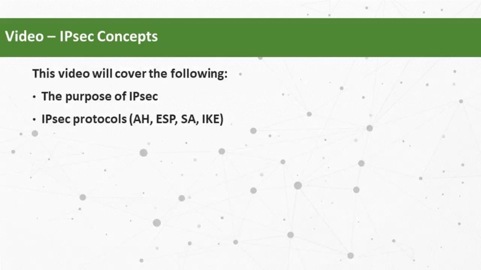](./assets/8.3.1.mp4)

<!-- 8.3.2 -->
## IPSec технологии

IPsec - это стандарт IETF (RFC 2401-2412), который определяет, как можно защитить VPN в IP-сетях. IPsec защищает и аутентифицирует IP-пакеты между источником и местом назначения. IPsec может защитить трафик от уровня 4 до уровня 7.

Благодаря структуре IPsec данный протокол выполняет следующие основные функции обеспечения безопасности:

- **Конфиденциальность** - IPsec использует алгоритмы шифрования для предотвращения чтения содержимого пакета злоумышленниками.
- **Целостность** - IPsec использует алгоритмы хеширования, чтобы гарантировать, что пакеты не были изменены между источником и назначением.
- **Аутентификация источника** - IPsec использует протокол Internet Key Exchange (IKE) источника и получателя. Методы аутентификации включают использование общих ключей (паролей), цифровых сертификатов или сертификатов RSA.
- **Диффи-Хеллман** - безопасный обмен ключами обычно различных групп алгоритма DH.

Для обеспечения безопасной связи протокол IPsec не привязан ни к каким специальным правилам. Благодаря такой гибкости структуры IPsec может легко интегрировать новые технологии обеспечения безопасности без обновления существующих стандартов IPsec. Доступные в настоящее время технологии соответствуют их конкретной функции безопасности. Открытые слоты, показанные в структуре IPsec на рисунке, могут быть заполнены любым из вариантов, доступных для этой функции IPsec, для создания уникальной ассоциации безопасности (SA).

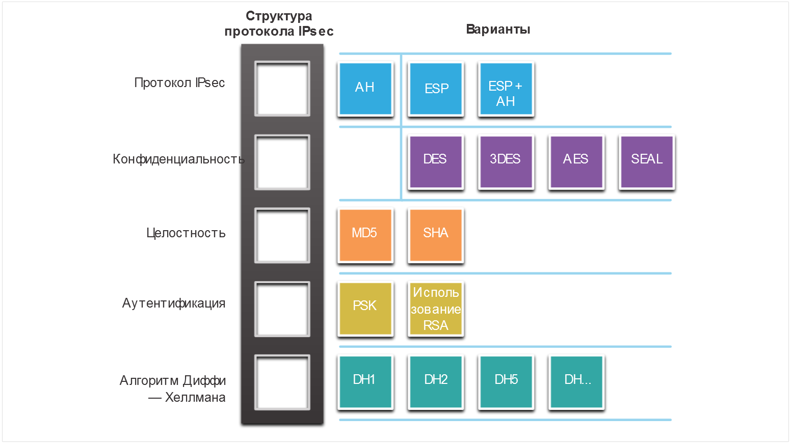

Функции безопасности перечислены в таблице.

Функция IPSec | Описание
---|--------------------
**Протокол IPsec** | Выбор протокола IPsec включает в себя Authentication Header (AH) или Encapsulation Security Protocol (ESP). AH аутентифицирует пакеты уровня 3 уровня. ESP шифрует пакет уровня 3. Примечание: ESP+AH редко используется, так как эта комбинация не будет успешно проходить через устройство NAT.
**Конфиденциальность** | Шифрование обеспечивает конфиденциальность пакета уровня 3. Варианты включают в себя Data Encryption Standard (DES), Triple DES (3DES), Advanced Encryption Standard (AES), или Software-Optimized Encryption Algorithm SEAL Доступна опция без шифрования.
**Целостность** | Гарантирует, что данные поступают в пункт назначения без изменений с использованием алгоритма хеширования, такого как, Message Digest 5 (MD5) или Secure Hash Algorithm (SHA).
**Аутентификация** | IPsec использует Internet Key Exchange (IKE) для аутентифкации пользовательских устройств которые могут независимо устанавливать связь. IKE использует несколько типов аутентификации, включая логин и пароль, одноразовый пароль, биометрические данные, предустановленные ключи (PSK) и цифровые сертификаты с использованием алгоритма RSA.
**Алгоритм Диффи — Хеллмана** | IPSec использует алгоритм DH для предоставления метода обмена публичного ключа между двумя участниками для установления общего секретного ключа. Существует несколько различный групп на выбор от DH 14, 15, 16 и DH 19, 20, 21 и 24. DH1, 2 и 5 сейчас не рекомендуются к использованию.

Рисунок показывает пример SA для двух различных реализаций. SA является основной для IPsec. При установлении VPN-соединения одноранговые узлы должны совместно использовать одну и ту же SA для согласования параметров обмена ключами, установления общего ключа, аутентификации друг друга и согласования параметров шифрования. Обратите внимание, что в Примере 1 не используется шифрование.

### Примеры ассоциации безопасности IPsec

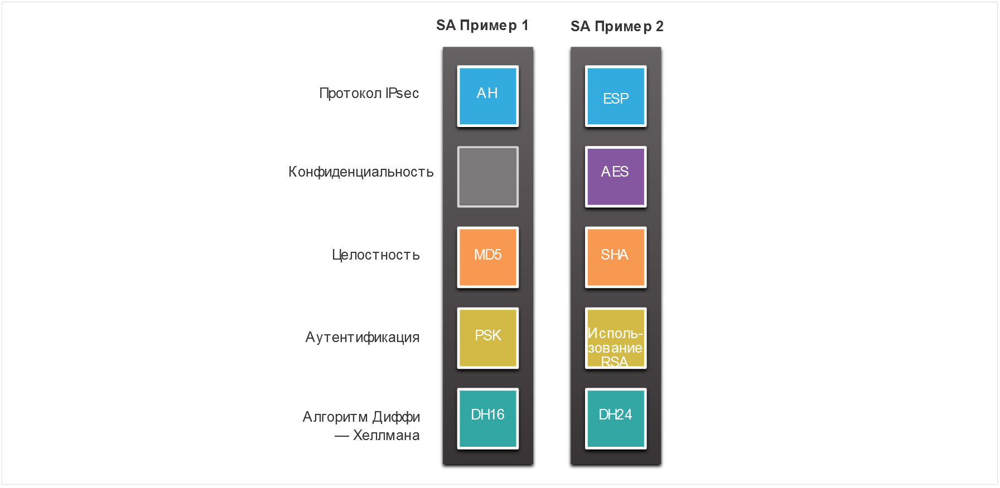

<!-- 8.3.3 -->
## Инкапсуляция протокола IPSec

Выбор инкапсуляции протокола IPsec является основой фреймворка. IPsec инкапсулирует пакеты с использованием Authentication Header (AH) или Encapsulation Security Protocol (ESP).

Выбор AH или ESP определяет, какие другие блоки доступны. Нажмите на каждый протокол IPsec на рисунке для получения дополнительной информации.

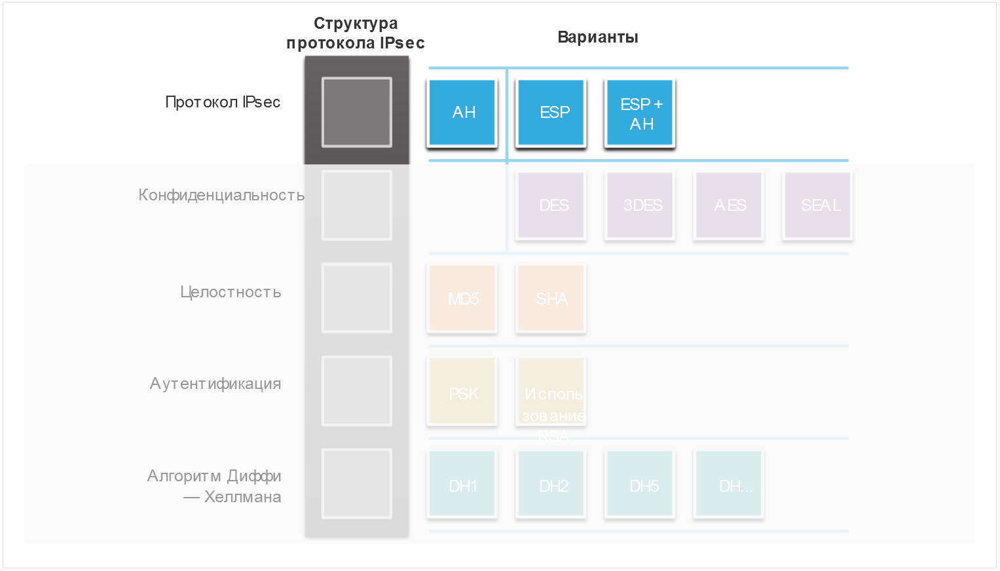

- AH уместен только тогда, когда конфиденциальность не требуется или не разрешается. Он обеспечивает аутентификацию и целостность данных, но не обеспечивает конфиденциальность данных (шифрование). Весь текст транспортируется в незашифрованном виде.
- ESP обеспечивает конфиденциальность и аутентификацию. Это обеспечивает конфиденциальность с помощью шифрование IP-пакета. ESP обеспечивает аутентификацию для внутреннего IP-пакета и заголовка ESP. Аутентификация обеспечивает проверку подлинности источника данных и целостность данных. Хотя процедуры шифрования и аутентификации не являются обязательными в ESP, необходимо выбрать как минимум одну из них.

<!-- 8.3.4 -->
## Конфиденциальность

Конфиденциальность достигается путем шифрования данных, как показано на рисунке. Степень конфиденциальности зависит от алгоритма шифрования и длины ключа, используемого в алгоритме шифрования. Если кто-то пытается взломать ключ с помощью грубой атаки, количество возможных попыток зависит от длины ключа. Время обработки всех возможностей зависит от мощности компьютера атакующего устройства. Поэтому чем короче ключ, тем проще его взломать. Для расшифровки 64-битного ключа понадобится около одного года, используя относительно мощный компьютер. Для расшифровки 128-битного ключа на той же машине может потребоваться приблизительно 10 в степени 19 или 10 квинтиллионов лет.

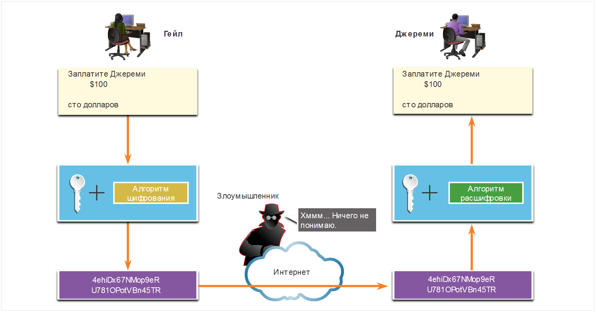

Все алгоритмы шифрования, выделенные на рисунке, представляют собой криптосистемы с симметричным ключом.

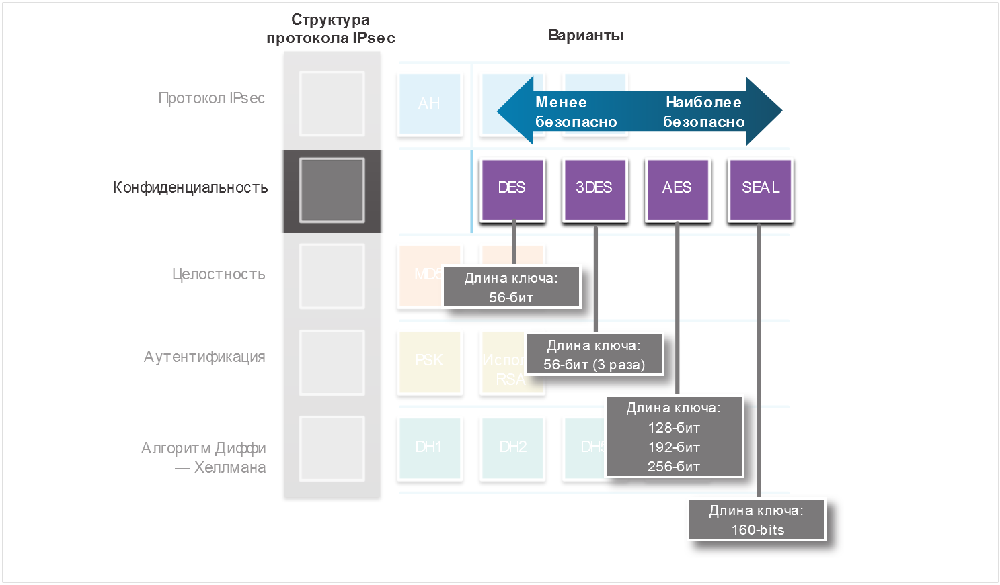

- DES использует 56-битный ключ.
- 3DES - это вариант 56-битного DES. Он использует три независимых 56-битных ключа шифрования на 64-битный блок, что обеспечивает более надежную защиту по сравнению с DES.
- AES обеспечивает более высокую безопасность, чем DES, и вычислительно более эффективен, чем 3DES. AES предлагает три разных длины ключа: 128 бит, 192 бит и 256 бит.
- SEAL - это потоковый шифр, который означает, что он непрерывно шифрует данные, а не шифрует блоки данных. SEAL использует 160-битный ключ.

<!-- 8.3.5 -->
## Целостность

Целостность данных означает, что принятые данные точно совпадают с отправленными. Теоретически, данные можно перехватить и изменить. Например, на рисунке показано, что чек на сумму 100 долларов США выписан Алексу. Затем этот чек отправляется Алексу, но перехватывается злоумышленником. Злоумышленник меняет имя, указанное в чеке, на Джереми, а также сумму чека на 1000 долларов США, и пытается обналичить данный чек. Если качество подделки в измененном чеке окажется высоким, то попытка злоумышленника может оказаться успешной.

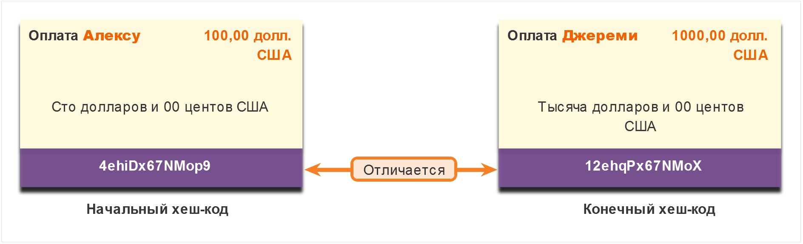

Так как передача данных сети VPN выполняется по публичному Интернету, требуется специальный метод обеспечения целостности данных, гарантирующий сохранность передаваемого контента. Hashed Message Authentication Code (HMAC) – это алгоритм обеспечения целостности данных, который гарантирует целостность сообщения с помощью хеш-значения. На рисунке представлены два наиболее распространенных алгоритма HMAC. Щелкните каждый алгоритм, чтобы получить дополнительные сведения.

**Примечание:** Сегодня корпорация Cisco считает алгоритм SHA-1 устаревшим и рекомендует применять для обеспечения целостности, по крайней мере, алгоритм SHA-256.

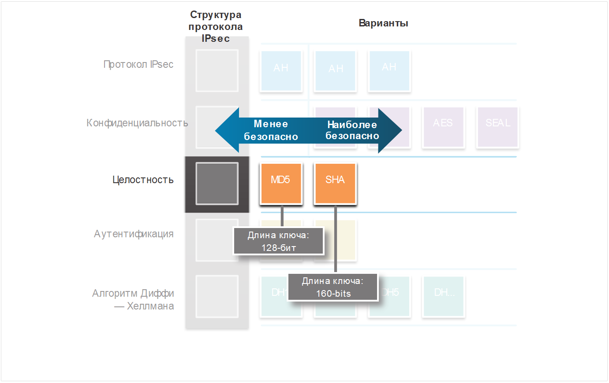

- Message-Digest 5 (MD5) использует 128-битный общий секретный ключ. Сообщение произвольной длины и 128-битовый общий секретный ключ объединяются друг с другом и обрабатываются алгоритмом хеширования HMAC-MD5. В результате создаётся 128-битовый хеш-код.
- Secure Hash Algorithm (SHA) использует 160-битный секретный ключ. Сообщение переменной длины и 160-битный общий секретный ключ объединяются и выполняются по алгоритму HMAC-SHA-1. В результате создаётся 160-битовый хеш-код.

<!-- 8.3.6 -->
## Аутентификация

При ведении бизнеса с удаленными партнерами важно знать, с кем вы общаетесь по телефону, электронной почте или факсу. Это же справедливо и для сетей VPN. Устройство на другом конце VPN-туннеля необходимо сначала аутентифицировать, только после этого коммуникационный тракт можно считать безопасным. На рисунке показаны два метода аутентификации.

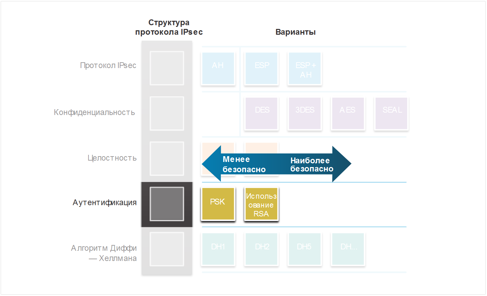

- Значение общего секретного ключа (PSK) вводится в каждый узел вручную. PSK объединяется с другой информацией для формирования ключа аутентификации. PSK легко настраиваются вручную, но они плохо масштабируются, потому что каждый узел IPsec должен быть настроен с PSK каждого другого узла, с которым он связывается.
- Аутентификация Rivest, Shamir и Adleman (RSA) использует цифровые сертификаты для аутентификации партнеров. Локальное устройство создаёт хеш-код и шифрует его с помощью своего закрытого ключа. Зашифрованный хеш прикрепляется к сообщению и пересылается на удаленный конец и действует как подпись. На удалённой стороне зашифрованный хеш-код расшифровывается с помощью открытого ключа локальной стороны. Если расшифрованный хеш-код совпадает с расчётным значением, это означает, что подпись является подлинной. Каждый узел должен подтвердить подлинность своего противоположного узла, прежде чем туннель будет считаться безопасным.

На рисунке показан пример аутентификации PSK. На локальном устройстве ключ аутентификации и идентификационная информация отправляются с помощью алгоритма хеширования, чтобы сформировать хеш для локального узла (Hash_L). Односторонняя аутентификация устанавливается путем отправки Hash_L на удаленное устройство. Если удаленное устройство может независимо создать один и тот же хеш, локальное устройство проходит проверку подлинности. После того как удаленное устройство аутентифицирует локальное устройство, процесс аутентификации начинается в обратном направлении, и все шаги повторяются с удаленного устройства на локальное устройство.

### Аутентификаця PSK

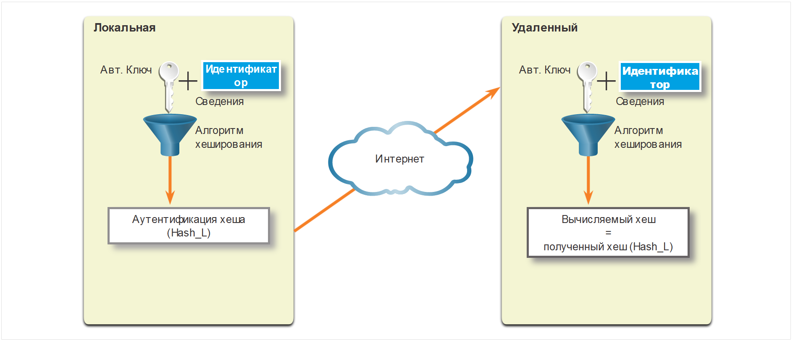

На рисунке показан пример аутентификации PSA. На локальном устройстве ключ аутентификации и идентификационная информация отправляются с помощью алгоритма хеширования, чтобы сформировать хеш для локального узла (Hash_L). Затем Hash_L шифруется с использованием личного ключа шифрования локального устройства. Это создает цифровую подпись. Цифровая подпись и цифровой сертификат пересылаются на удаленное устройство. Открытый ключ шифрования для расшифровки подписи включен в цифровой сертификат. Удаленное устройство проверяет цифровую подпись, расшифровывая ее с помощью открытого ключа шифрования. В результате получается Hash_L. Затем удаленное устройство самостоятельно создает Hash_L из сохраненной информации. Если вычисленный Hash_L равен расшифрованному Hash_L, локальное устройство аутентифицируется. После того как удаленное устройство аутентифицирует локальное устройство, процесс аутентификации начинается в обратном направлении, и все шаги повторяются с удаленного устройства на локальное устройство.

### Аутентификация RSA

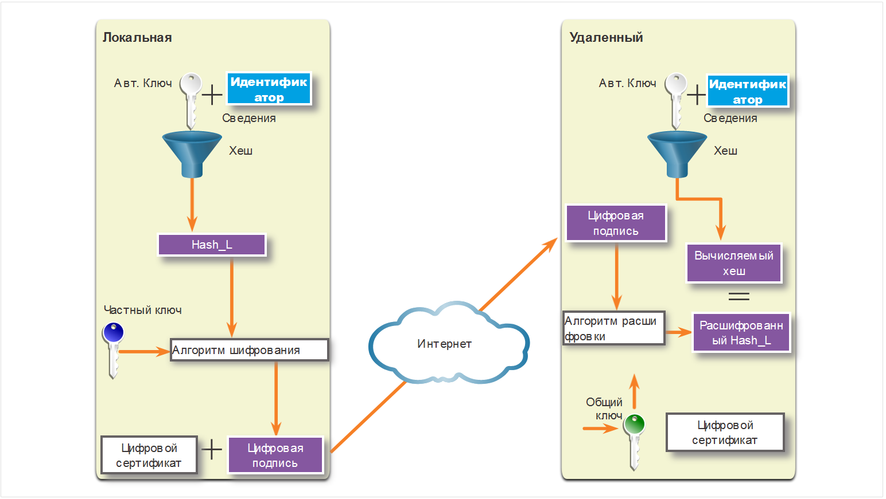

<!-- 8.3.7 -->
## Безопасный обмен ключами с Диффи-Хеллманом

Алгоритмы шифрования требуют симметричного общего секретного ключа для выполнения шифрования и дешифрования. Каким образом зашифровывающее и расшифровывающее устройства могут получить информацию об общем секретном ключе? Самый простой метод обмена ключами - это использование метода обмена открытыми ключами, такого как Диффи-Хеллман (DH), как показано на рисунке.

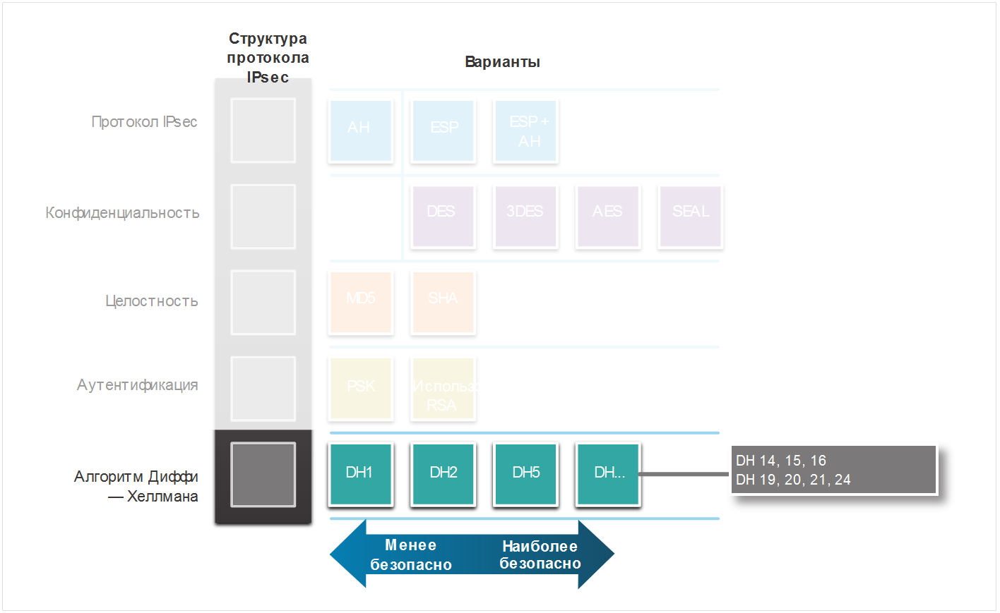

DH предоставляет возможность двум партнерам установить общий секретный ключ, который знают только они, даже если они обмениваются данными по небезопасному каналу. Варианты обмена ключами DH указаны как группы DH:

- группы DH 1, 2 и 5 больше не должны использоваться. Эти группы поддерживают размер ключа 768 бит, 1024 бит и 1536 бит соответственно.
- Группы DH 14, 15 и 16 используют ключи больших размеров с 2048 битами, 3072 битами и 4096 битами соответственно и рекомендуются для использования до 2030 года.
- Группы DH 19, 20, 21 и 24 с соответствующими размерами ключей 256 бит, 384 бит, 521 бит и 2048 бит поддерживают криптографию с эллиптической кривой (ECC), которая сокращает время, необходимое для генерации ключей. DH группа 24 является предпочтительным шифрованием следующего поколения.

Выбранная вами группа DH должна быть достаточно сильной или иметь достаточно битов для защиты ключей IPsec во время согласования. Например, группа DH 1 достаточно сильна, чтобы поддерживать шифрование DES и 3DES, но не AES. Например, если в алгоритмах шифрования или аутентификации используется 128-битный ключ, используйте группу 14, 19, 20 или 24. Однако, если в алгоритмах шифрования или аутентификации используется 256-битный ключ или выше, используйте группу 21 или 24.

<!-- 8.3.8 -->
## Видео - Транспортный и туннельный режим IPSec

Нажмите «Воспроизвести» на рисунке, чтобы посмотреть видео о транспортном и туннельном режиме IPSec.

[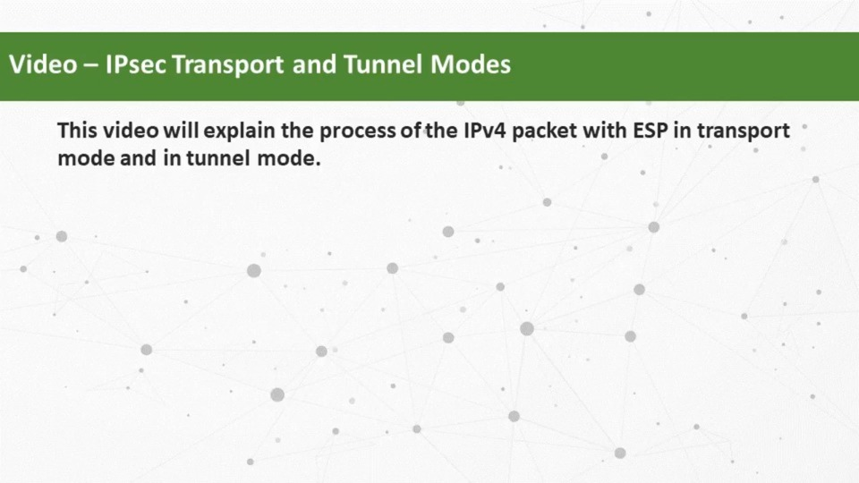](./assets/8.3.8.mp4)
