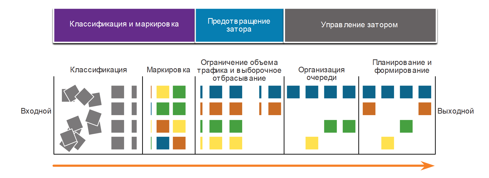
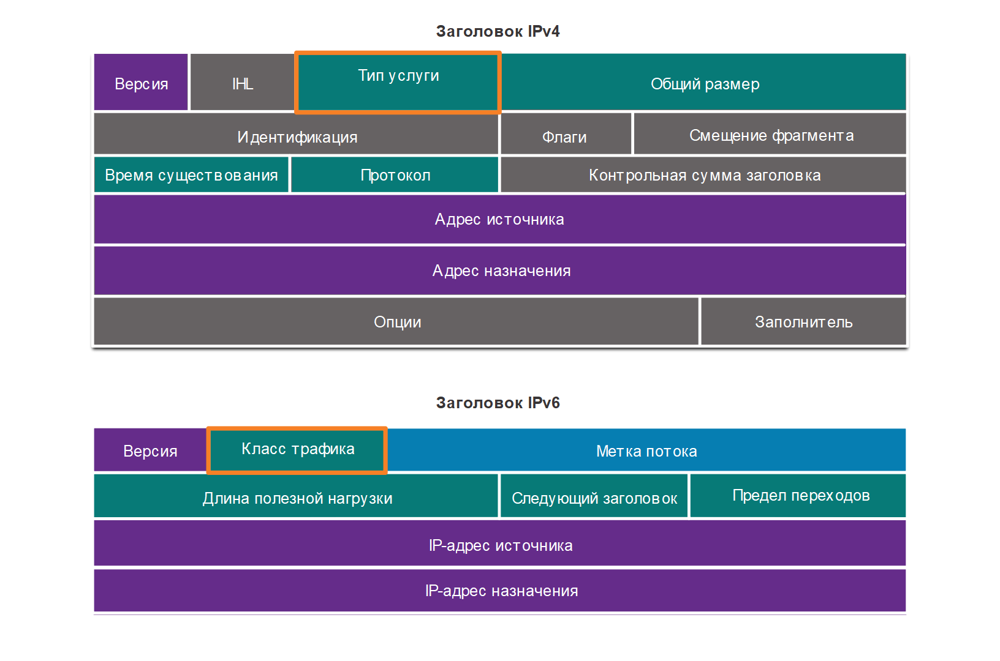
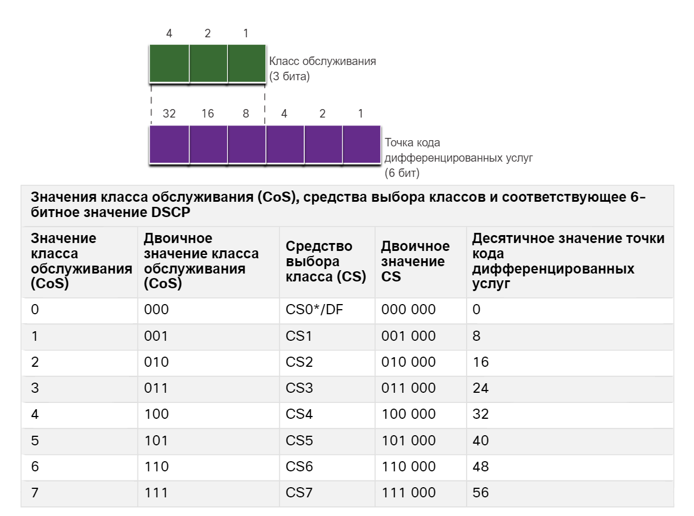
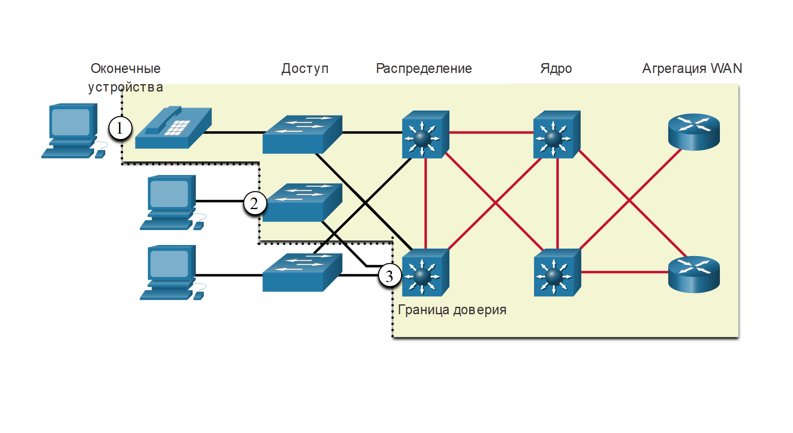

<!-- 9.5.1 -->
## Обучающее видео. Методы внедрения QoS

Нажмите кнопку «Воспроизведение», чтобы просмотреть обзор классификации, маркировки, границ доверия, предотвращения заторов, профилирования и ограничения объема трафика.

<!-- 9.5.2 -->
## Предотвращение потери пакетов

Теперь, когда вы узнали о характеристиках трафика, алгоритмах очередей и моделях QoS, пришло время узнать о методах реализации QoS.

Начнем с потери пакетов. Потеря пакетов обычно возникает из-за заторов на интерфейсе. Большинство приложений, использующих TCP, сталкиваются с замедлением работы, поскольку при заторах в сети автоматически происходит регулировка TCP-трафика. Потерянные сегменты TCP приводят к увеличению размеров окон сеансов TCP. Некоторые приложения не используют TCP и не могут обрабатывать потерянные сегменты (уязвимые потоки).

Можно предотвратить потери пакетов для важных приложений, используя следующие методы.

* Увеличение пропускной способности канала для уменьшения или предотвращения заторов.
* Резервирование достаточной пропускной способности и увеличение объема буфера, чтобы гарантировать обработку всплесков трафика в уязвимых потоках. WFQ, CBWFQ и LLQ могут гарантировать пропускную способность и обеспечить приоритетную переадресацию в приложения, чувствительные к отбросу.
* Сокращение объема трафика за счет отбрасывания пакетов с низким приоритетом. Cisco IOS QoS предоставляет механизмы организации очередей, такие как взвешенное случайное раннее обнаружение (WRED), которые начинают отбрасывать пакеты с более низким приоритетом до того, как происходит перегрузка.

<!-- 9.5.3 -->
## Инструменты QoS

Существует три категории инструментов качества обслуживания, которые описываются в таблице:

* Инструменты для классификации и маркировки
* Инструменты для предотвращения заторов
* Инструменты для управления заторами

**Tools for Implementing QoS**

| **Инструменты QoS** | **Описание** |
| --- | --- |
| Инструменты для классификации и маркировки | <ul><li>Сеансы или потоки анализируются на принадлежность определенному классу трафика.</li><li>При определении класса трафика пакеты маркируются.</li></ul> |
| Инструменты для предотвращения заторов | <ul><li>Классам трафика выделяются фрагменты сетевых ресурсов в соответствии с политикой качества обслуживания.</li><li>Политика QoS также определяет порядок отбрасывания или перемаркировки некоторого трафика для предотвращения заторов.</li><li>Основным инструментом предотвращения перегрузок является WRED, который используется для регулирования трафика данных TCP с эффективным использованием полосы пропускания до того, как возникнут отвалы, вызванные переполнением очереди.</li></ul> |
| Инструменты для управления заторами | <ul><li>Когда объем трафика превышает доступные сетевые ресурсы, трафик ставится в очередь ожидания доступных ресурсов.</li><li>Для управления заторами в Cisco IOS обычно используются алгоритмы CBWFQ и LLQ. Алгоритмы LLQ.</li></ul> |

Рисунок поможет понять последовательность использования этих инструментов при применении политики качества обслуживания к потокам пакетов.

**Последовательность QoS**

<!-- /courses/ensa-dl/ae8eb390-34fd-11eb-ba19-f1886492e0e4/aeb5c394-34fd-11eb-ba19-f1886492e0e4/assets/c68e6290-1c46-11ea-af56-e368b99e9723.svg -->

<!--
На рисунке показана последовательность инструментов для реализации QoS. Три инструмента для внедрения QoS: Классификация и маркировка, Предотвращение заторов и Управление заторами. Рисунок начинается в разделе «Классификация и маркировка» с входящими пакетами, эти пакеты классифицируются и организуются до их пометки. Затем пакеты перемещаются в раздел «Предотвращение заторов». Затем пакеты распределяются на основе определенных политик, а некоторые из них отбрасываются выборочно. Наконец, пакеты перемещаются в раздел Управление заторами. После этого пакеты ставятся в очередь и пересылаются из выходного интерфейса на основании заданной политики качества обслуживания, шейпинга и полисинга.
-->

Как показано на рисунке, входные пакеты (серые квадраты) классифицируются, а их IP-заголовки помечаются (цветные квадраты). Чтобы избежать заторов, пакетам назначаются ресурсы на основании заданных политик. После этого пакеты ставятся в очередь и пересылаются из выходного интерфейса на основании заданной политики качества обслуживания, шейпинга и полисинга.

**Примечание**: Классификацию и маркировку можно проводить и на входе и на выходе, а другие действия, связанные с качеством обслуживания, например постановку в очередь и формирование трафика, обычно выполняют на выходе.

<!-- 9.5.4 -->
## Классификация и маркировка

Чтобы применить политику качества обслуживания к пакету, пакет нужно классифицировать. Классификация и маркировка позволяют идентифицировать или «маркировать» типы пакетов. Классификация определяет класс трафика, к которому относятся пакеты или кадры. Применять политики можно только к маркированному трафику.

Классификация пакета зависит от реализации политики качества обслуживания. При классификации потоков трафика на уровне 2 и 3 используются интерфейсы, списки контроля доступа и карты классов. Трафик также можно классифицировать на уровнях с 4-го по 7-й с помощью распознавания приложений по параметрам сетевого трафика (Network Based Application Recognition, NBAR).

**Примечание:** NBAR — это функция операционной системы Cisco IOS для классификации и обнаружения протоколов, используемая совместно с функциями QoS. NBAR в рамках данного курса не рассматривается.

Маркировка означает добавление некоторого значения в заголовок пакета. Устройства, принимающие пакет, сравнивают значение этого поля со значением, определенным политикой. Маркировку необходимо проводить максимально близко к исходному устройству. Она устанавливает границы доверия.

Маркировка трафика обычно зависит от используемой технологии передачи данных. В таблице на рисунке описываются некоторые поля маркировки, используемые в различных технологиях. Решение о маркировке трафика на уровне 2 и 3 (или на обоих уровнях) непростое и должно приниматься с учетом следующих факторов.

* Маркировку уровня 2 для кадров можно выполнять для трафика, отличного от IP-трафика.
* Маркировка уровня 2 для кадров является единственным возможным вариантом реализации качества обслуживания для коммутаторов, не поддерживающих IP.
* Маркировка уровня 3 обеспечивает сквозную передачу данных о качества обслуживания.

**Traffic Marking for QoS**

| **Инструменты QoS** | **Уровень**  | **Поле маркирования**  | **Ширина в битах**  |
| --- | --- | --- | --- |
| Ethernet (802.1Q, 802.1p) | 2 | Класс обслуживания (CoS) | 3 |
| 802.11 (Wi-Fi) | 2 | Идентификатор трафика беспроводной сети (TID) | 3 |
| MPLS | 2 | Экспериментальное (EXP) | 3 |
| IPv4 и IPv6 | 3 | Приоритет IP (IPP) | 3 |
| IPv4 и IPv6 | 3 | Точка кода дифференцированных сервисов (DSCP) | 6 |

<!-- 9.5.5 -->
## Маркировка на уровне 2

802.1Q — стандарт IEEE, который поддерживает маркировку трафика VLAN на уровне 2 в сетях Ethernet. При использовании стандарта 802.1Q в кадр Ethernet добавляются 2 поля. Как показано на рисунке, эти два поля вставляются в кадр Ethernet после поля MAC-адреса источника.

**Значения класса обслуживания (CoS) Ethernet**

<!-- /courses/ensa-dl/ae8eb390-34fd-11eb-ba19-f1886492e0e4/aeb5c394-34fd-11eb-ba19-f1886492e0e4/assets/c68f4cf0-1c46-11ea-af56-e368b99e9723.svg -->

<!--
На рисунке показаны поля кадра Ethernet и кадра 802.1Q. Кадр Ethernet состоит из семи полей: Преамбула, SFD, DA, SA, T/L, Data и FCS. Когда реализован 802.1Q, в кадр Ethernet добавляются два дополнительных поля: TPID и TCI, каждое по 2 байта. Внутри этих двух полей находится 3-битное поле приоритета, 1-битное поле CFI и 12-битное поле VLAN ID. 3 бита, используемые в поле приоритета, предназначены для маркировки класса обслуживания (CoS).
-->

Стандарт 802.1Q также включает схему установки приоритетов QoS, известную как IEEE 802.1p. Стандарт 802.1p использует первые три бита в поле контрольных данных тега (TCI). Это трехбитное поле называется полем приоритета (PRI) и определяет маркировку класса обслуживания (CoS). Маркировка CoS позволяет маркировать кадр Ethernet уровня 2 приоритетом одного из восьми уровней (значения 0–7), как показано на рисунке.

**Ethernet Class of Service (CoS) Values**

| **Значение класса обслуживания (CoS)** | **Двоичное значение класса обслуживания (CoS)** | **Описание** |
| --- | --- | --- |
| 0 | 000 | Данные с низким приоритетом |
| 1 | 001 | Данные со средним приоритетом |
| 2 | 010 | Данные с высоким приоритетом |
| 3 | 011 | Сигнализация вызовов |
| 4 | 100 | Видео-конференц-связь |
| 5 | 101 | Голосовой канал (трафик голосовых данных) |
| 6 | 110 | Зарезервировано |
| 7 | 111 | Зарезервировано |

<!-- 9.5.6 -->
## Маркировка на уровне 3

В протоколах IPv4 и IPv6 имеется 8-битное поле в заголовке пакета, позволяющее маркировать пакеты. Как показано на рисунке, оба протокола IPv4 и IPv6 поддерживают 8-битное поле для маркировки, поле типа обслуживания (ToS) для IPv4 и поле класса трафика для IPv6.

**Заголовки пакетов IPv4 и IPv6**

<!-- /courses/ensa-dl/ae8eb390-34fd-11eb-ba19-f1886492e0e4/aeb5c394-34fd-11eb-ba19-f1886492e0e4/assets/c6901042-1c46-11ea-af56-e368b99e9723.svg -->

<!--
На рисунке показаны заголовки пакетов IPv4 и IPv6. Заголовок IPv4 состоит из следующих полей: Версия, IHL, Тип службы, Общая длина, Идентификация, Флаги, Смещение фрагмента, Время работы, Протокол, Контрольная сумма заголовка, Адрес источника, Адрес назначения, Параметры и Заполнение. Поле Тип сервиса обрисовывается прямоугольником. На рисунке показан заголовок IPv6 со следующими полями: версия, класс трафика, метка потока, длина полезной нагрузки, следующий заголовок, предел переходов, адрес источника и адрес назначения. Поле «Класс трафика» обрисовывается прямоугольником.
-->

<!-- 9.5.7 -->
## Поле «Тип обслуживания / Класс трафика»

Тип службы (IPv4) и класс трафика (IPv6) несут маркировку пакетов, назначенную средствами классификации QoS. Получающие устройства сверяются с этим полем для пересылки пакетов на основании соответствующей назначенной политики качества обслуживания.

На рисунке показано содержимое 8-битного поля. В RFC 791 оригинальный стандарт для IP определяет поле приоритета IP (IPP), используемое для маркировки QoS. Однако на практике эти три бита не обеспечивают достаточную детализацию для реализации качества обслуживания.

RFC 2474 заменяет RFC 791 и переопределяет поле типа обслуживания (ToS) через переименование и расширение поля IPP. Новое поле, как показано на рисунке, выделяет для качества обслуживания 6 бит. Оно называется полем точки кода дифференцирования трафика (DSCP) и за счет этих 6 бит предлагает до 64 возможных классов обслуживания. Остальные 2 бита расширенного уведомления о перегрузке IP (ECN) могут использоваться маршрутизаторами, поддерживающими расширение ECN, для маркировки пакетов вместо их удаления. Маркировка ECN сообщает нижестоящим маршрутизаторам о наличии перегрузки потока пакетов.

<!-- /courses/ensa-dl/ae8eb390-34fd-11eb-ba19-f1886492e0e4/aeb5c394-34fd-11eb-ba19-f1886492e0e4/assets/c6916fd2-1c46-11ea-af56-e368b99e9723.svg -->

<!--
На рисунке показано старое и текущее поле Тип службы и Класс трафика в заголовке пакета. Старое поле состояло из 3 бита для IP Precedence (IPP) и 5 неиспользуемых битов. Текущее поле состоит из 6 бит для кода дифференциальных служб (DSCP) и 2 бит для расширенного уведомления о перегрузке (ECN).
-->

<!-- 9.5.8 -->
## Значения DSCP

64 значения DSCP организованы в три категории.

* **Без гарантированной доставки (BE)** — это категория по умолчанию для всех IP-пакетов. Значение DSCP равно 0. Пошаговое обслуживание (PHB) является нормальной маршрутизацией. Когда на маршрутизаторе возникает затор, эти пакеты отбрасываются. Никакой схемы качества обслуживания не применяется.
* **Ускоренная пересылка (EF)** — RFC 3246 defines EF as the DSCP decimal value 46 (binary **101**110). Первые 3 бита (101) сопоставляются со значением 5 CoS уровня 2, используемого для трафика голосовых данных. На уровне 3 Cisco рекомендует использование EF только для маркировки пакетов голосовых данных.
* **Гарантированная пересылка (Assured Forwarding)** — RFC 2597 выделяет для AF пять самых старших битов DSCP для определения очереди и приоритета отбрасывания. Определение AF проиллюстрировано на рисунке.

**Значения гарантированной пересылки (AF)**

<!-- /courses/ensa-dl/ae8eb390-34fd-11eb-ba19-f1886492e0e4/aeb5c394-34fd-11eb-ba19-f1886492e0e4/assets/c6920c11-1c46-11ea-af56-e368b99e9723.svg -->

**AFxy** Формула задается следующим образом:

* Первые три самых старших бита используются для определения класса. Класс 4 означает очередь с самым высоким приоритетом, класс 1 — с самым низким приоритетом.
* 4-й и 5-й (самые старшие биты) используются для определения приоритета отбрасывания.
* 6-й (самый старший бит) устанавливается равным нулю.

Например, AF32 принадлежит классу 3 (двоичный код 011), и для нее устанавливается средний приоритет отбрасывания (двоичный код 10). Полное значение DSCP равно 28, поскольку в него включается нулевое значение 6-го (самого старшего) бита (двоичный код 011100).

<!--
На рисунке показаны гарантированные значения пересылки дифференциальных служб (DSCP) и формула AFxy. Гарантированные значения пересылки состоят из четырех классов. Класс 4 означает очередь с самым высоким приоритетом, класс 1 — с самым низким приоритетом. Каждый класс имеет значения пересылки, основанные на низком, среднем или высоком приоритетом отбрасывания. Низкая вероятность отбрасывания  класса 4 обозначается AF41 со значением DSCP 34, средняя вероятность отбрасывания AF42 со значением DSCP 36, а высокая вероятность отбрасывания — AF43 со значением DSCP 38. Низкая вероятность отбрасывания класса 3  обозначается AF31 со значением DSCP 26, средняя вероятность отбрасывания AF32 со значением DSCP 28, высокая вероятность отбрасывания падение — AF33 со значением DSCP 30. Низкая вероятность отбрасывания класса 2 обозначается AF21 со значением DSCP 18, средняя вероятность отбрасывания падение AF22 со значением DSCP 20, а высокая вероятность отбрасывания — AF23 со значением DSCP 22. Низкая вероятность отбрасывания класса 1 обозначается AF11 со значением DSCP 10, средняя вероятность отбрасывания AF12 со значением DSCP 12 и высокая вероятность отбрасывания AF13 со значением DSCP 14. Формула для определения числа AF основана на поле DSCP, первые три наиболее значимых бита используются для обозначения класса, четвертый и пятый наиболее значимые биты используются для обозначения предпочтения падения, а шестой бит устанавливается равным нулю. Пример для AF32 имеет первые три наиболее значимых бита как 011, а биты предпочтения падения - 10 с шестым битом как 0. Это приводит к двоичному 011100 или при преобразовании в десятичную, 28. Первые три бита обозначают класс. Биты класса для AF32 являются 011, преобразованы в десятичный 011 равно 3. Поэтому AF32 является классом 3 со значением DSCP 28.
-->

<!-- 9.5.9 -->
## Средство выбора класса (CS)

Поскольку первые три самые старшие бита поля точки кода дифференцированных услуг определяют класс, эти биты также называются битами селектора класса (Class Selector). Как показано на риунке, эти три бита точно соответствуют трем битам полей CoS ​​и IPP для обеспечения совместимости со стандартами 802.1p и RFC 791.

**Класс обслуживания уровня 2 и тип обслуживания уровня 3**

<!-- /courses/ensa-dl/ae8eb390-34fd-11eb-ba19-f1886492e0e4/aeb5c394-34fd-11eb-ba19-f1886492e0e4/assets/c6931d83-1c46-11ea-af56-e368b99e9723.svg -->

<!--
На рисунке показаны биты сектора классов в DSCP, приоритет класса обслуживания (CoS) и IPP поля сопоставлены для обеспечения совместимости с 802.1p. Кадр 802.1Q отображается с тремя отдельными полями: Priority CoS, CFI и 12 битов VLAN ID. Ниже кадра 802.1Q находится старое поле Тип службы с 2 отдельными полями: IPP с 3 битами, второе поле имеет 5 неиспользуемых битов. Под старым полем Тип обслуживания находится текущее поле Тип обслуживания. Текущее поле Тип обслуживания состоит из 2 отдельных полей: DSCP с 6 битами и ECN с 2 битами. Первый 3-бит поля DSCP помечен как CS. Первые 3 бита поля 802.1Q, старый тип обслуживания и текущий тип обслуживания обозначены пунктирными линиями, чтобы обозначить их непосредственно.
-->

В таблице  показано, как значения CoS сопоставляются с селекторами класса и соответствующим 6-битным значением точки кода дифференцированных услуг. Эту ту же таблицу можно использовать для сопоставления значений IPP и селекторов класса.

**Сопоставление класса обслуживания со средствами выбора классов в точке кода дифференцированных услуг (DSCP)**

<!-- /courses/ensa-dl/ae8eb390-34fd-11eb-ba19-f1886492e0e4/aeb5c394-34fd-11eb-ba19-f1886492e0e4/assets/c693b9c0-1c46-11ea-af56-e368b99e9723.svg -->

<!--
На рисунке показано, как значения класса обслуживания (CoS) сопоставляются с селекторами классов в DSCP. Значение CoS имеет три бита, помеченные знаками битов 4, 2 и 1. Ниже бит CoS находится DSCP с шестью битами. Эти биты помечены знаками битов 32, 16, 8, 4, 2 и 1. 3 бита CoS и первые 3 бита DSCP связаны пунктирными линиями, указывающими на то, что они отображаются.
-->

<!-- 9.5.10 -->
## Границы доверия

Где следует применять маркировку? Трафик нужно классифицировать и маркировать настолько близко к источнику, насколько это оправдано с технической и административной точки зрения. Это определяет границу доверия, как показано на рисунке.

1.  Доверенные оконечные устройства могут и умеют маркировать трафик приложений соответствующими значениями CoS уровня 2 и значениями DSCP уровня 3. К доверенным оконечным устройствам относятся IP-телефоны, точки беспроводного доступа, шлюзы и системы видео-конференц-связи, станции IP-конференций и многое другое.
2.  Защищенные оконечные устройства могут работать с трафиком, маркированным на коммутаторе уровня 2.
3.  Трафик также можно маркировать на коммутаторах и маршрутизаторах уровня 3.

Перемаркировка трафика, например, перемаркировка значений CoS в прецедент IP или значения DSCP, как правило, необходима.

**Различные границы доверия**

<!-- /courses/ensa-dl/ae8eb390-34fd-11eb-ba19-f1886492e0e4/aeb5c394-34fd-11eb-ba19-f1886492e0e4/assets/c6947d10-1c46-11ea-af56-e368b99e9723.svg -->

<!--
На рисунке приведены три примера различных границ доверия в сети. На рисунке показаны пять категорий устройств в сети: конечные точки, доступ, распределение, агрегирование ядра и глобальной сети. Устройства конечных точек на рисунке - 3 ПК и один IP телефон, уровень доступа на рисунке состоит из 3 коммутаторов, уровень распределения имеет 2 многослойных коммутатора, а уровень агрегации WAN имеет 2 маршрутизатора. Первый пример границы доверия останавливается между ПК и IP-телефоном, что означает, что ПК не является доверенной конечной точкой. Однако конечные точки IP-телефона, коммутаторы доступа, распределения и основные коммутаторы, а также маршрутизаторы агрегации глобальной сети являются доверенными. Второй пример доверенной границы останавливается между ПК и коммутатором, что означает, что ПК не является доверенным. Однако все коммутаторы доступа, распределения и ядра, а также маршрутизаторы агрегации глобальной сети являются доверенными. В третьем примере доверенной границы ПК подключается к коммутатору, и граница между коммутатором и коммутатором распределения останавливается, что означает, что ПК и коммутатор доступа не являются доверенными. Однако коммутаторы распределения и ядра, а также маршрутизаторы агрегации глобальной сети являются доверенными.
-->

<!-- 9.5.11 -->
## Предотвращение затора

Управление заторами предусматривает планирование и формирование очередей, предполагающих буферизацию лишнего трафика или помещение его в очередь (а иногда и удаление) на время ожидания отправки такого трафика на выходном интерфейсе. Средства предотвращения заторов проще. Они отслеживают распределения сетевого трафика, пытаясь предугадать и предотвратить заторы в типичных узких местах внутри сети и между сетями до того, как затор превратится в серьезную проблему. Эти инструменты могут отслеживать среднюю глубину очереди, как показано на рисунке. Когда заполнение очереди меньше минимального порогового значения, никакие пакеты не отбрасываются. Когда очередь заполняется до максимального порогового значения, отбрасывается небольшой процент пакетов. Если заполнение превышает максимальное пороговое значение, отбрасываются все пакеты.

**Механизмы предотвращения затора**

<!-- /courses/ensa-dl/ae8eb390-34fd-11eb-ba19-f1886492e0e4/aeb5c394-34fd-11eb-ba19-f1886492e0e4/assets/c6954060-1c46-11ea-af56-e368b99e9723.svg -->

<!--
На рисунке показаны механизмы Предотвращения заторов на различных глубинах очереди. Рисунок имеет три вертикальных поля: верхний прямоугольник помечен как «Все пакеты отбрасываются», средний прямоугольник помечен «% капли», а нижний - «Пакеты не отбрасываются». Существует четыре этапа очереди: полная очередь, максимальное пороговое значение, минимальное пороговое значение и пустая очередь. Четыре этапа очереди имеют стрелки, указывающие на соответствующие поля. Если очередь заполнена, то все пакеты отбрасываются. Между минимальным и максимальным порогом существует процент отброшенных пакетов. Если очередь пуста, пакеты не отбрасываются.
-->

Некоторые методы предотвращения заторов предлагают установку приоритетов, при которых пакеты будут отброшены. Например, система качества обслуживания в Cisco IOS включает механизм измеренного произвольного раннего обнаружения (Weighted Random Early Detection, WRED) как возможное решение для предотвращения заторов. Алгоритм WRED позволяет избегать заторов на сетевых интерфейсах за счет предоставления инструментов управления буферизацией и снижения или отбрасывания трафика TCP до того, как буфер будет переполнен. WRED помогает избежать отбрасывания последнего элемента и оптимизирует использование сетевых мощностей и производительность приложений, использующих TCP. Предотвращение заторов для трафика UDP, например голосового трафика, не предусмотрено. Для трафика UDP сократить и даже предотвратить потерю пакетов можно, используя, например, организацию очередей и сжатие.

<!-- 9.5.12 -->
## Шейпинг и ограничение трафика

Шейпинг трафика и полисинг трафика — это механизмы Cisco IOS, позволяющие предотвращать заторы.

Шейпинг трафика сохраняет лишние пакеты в очереди, а затем планирует последующую передачу этих пакетов через определенные промежутки времени. Результатом процесса формирования трафика будет более сбалансированная интенсивность отправки пакетов, как показано на рисунке.

**Пример формирования трафика**

<!-- /courses/ensa-dl/ae8eb390-34fd-11eb-ba19-f1886492e0e4/aeb5c394-34fd-11eb-ba19-f1886492e0e4/assets/c695dca2-1c46-11ea-af56-e368b99e9723.svg -->

<!--
На рисунке показан пример шейпинга трафика. На рисунке показаны два графика. Первый график показывает трафик, идущий по максимуму и ниже максимальной скорости трафика в течение определенного периода времени. Второй график показывает трафик после формирования. Трафик формируется таким образом, чтобы иметь плавную скорость вывода пакетов.
-->

Для шейпинга трафика требуется наличие очереди и достаточный объем памяти для буферизации задерживаемых пакетов, тогда как для ограничения трафика это не нужно.

При включении шейпинга трафика убедитесь в наличии достаточного объема памяти. Кроме того, для шейпинга требуется функция планирования для последующей передачи всех отложенных пакетов. Эта функция планирования позволяет разбивать трафик в очереди на несколько очередей. Функциями планирования являются, например, CBWFQ и LLQ.

Шейпинг связан с управлением исходящим трафиком. Пакеты, исходящие через интерфейс, помещаются в очередь, и к ним может применяться шейпинг. Напротив, к входящему трафику на интерфейсе может применяться только ограничение. Если скорость передачи трафика достигает установленного максимума, излишний трафик отбрасывается (или заново маркируется).

Ограничение трафика обычно применяется операторами связи для обеспечения соблюдения показателя гарантированной скорости передачи данных (CIR). Однако оператор связи может также предусмотреть превышение показателя гарантированной скорости передачи данных, если его сеть в текущий момент не перегружена.

**Пример ограничения объема трафика**

<!-- /courses/ensa-dl/ae8eb390-34fd-11eb-ba19-f1886492e0e4/aeb5c394-34fd-11eb-ba19-f1886492e0e4/assets/c6962ac3-1c46-11ea-af56-e368b99e9723.svg -->

<!--
На рисунке показан пример полисинга трафика. На рисунке показаны два графика. Первый график показывает трафик, идущий по максимуму и ниже максимальной скорости трафика в течение определенного периода времени. Второй график показывает трафик после обработки. Трафик идет на уровень или ниже, но не выше установленного, потому что избыточный трафик отбрасывается или перемаркируется.
-->

<!-- 9.5.13 -->
## Руководящие принципы политики QoS

Политика QoS должна учитывать полный путь от источника к месту назначения. Если одно устройство в пути использует политику, отличную от требуемой, то это влияет на всю политику QoS. Например, заикание при воспроизведении видео может быть результатом одного переключателя в пути, для которого значение CoS не задано соответствующим образом.

Некоторые рекомендации, которые помогают обеспечить наилучший опыт для конечных пользователей, включают следующее:

* Включите очередь на каждом устройстве в пути между источником и конечным.
* Сетевой трафик классифицируется и маркируется максимально близко к исходному устройству.
* Шейпинг  и полисинг транспортных потоков как можно ближе к их источникам.

<!-- 9.5.14 -->
<!-- quiz -->

